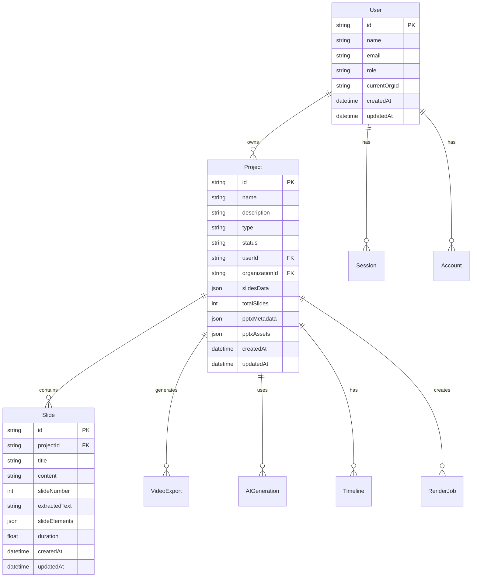
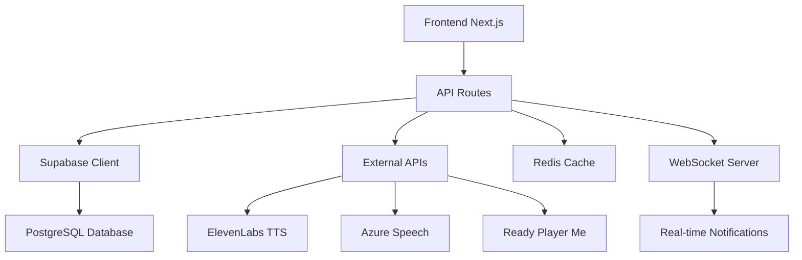

# Análise Técnica - Estado Atual do Sistema MVP Video Técnico Cursos v7

## 1. Visão Geral do Sistema

O **MVP Video Técnico Cursos v7** é uma plataforma avançada para criação de vídeos educacionais com avatares 3D, processamento de PPTX e sistema de renderização completo. O sistema está construído sobre uma arquitetura moderna e escalável.

### 1.1 Stack Tecnológico Principal
- **Frontend**: Next.js 14 com App Router
- **Backend**: Supabase (PostgreSQL + Auth + Storage)
- **ORM**: Prisma Client
- **Autenticação**: NextAuth.js integrado com Supabase
- **UI**: React 18 + TailwindCSS
- **Banco de Dados**: PostgreSQL (via Supabase)
- **Cache**: Redis (para otimizações)
- **WebSockets**: Para notificações em tempo real

## 2. Funcionalidades Implementadas e Operacionais

### 2.1 Sistema de Autenticação e Autorização ✅
**Status**: Completamente implementado e funcional

**Funcionalidades**:
- Login/logout com NextAuth.js
- Gestão de sessões
- Controle de permissões por projeto
- Sistema de roles (user, admin, moderator)
- Multi-tenancy com organizações

**APIs Implementadas**:
- `POST /api/auth/login` - Autenticação de usuários
- `POST /api/auth/logout` - Logout
- `GET /api/auth/session` - Verificação de sessão
- `POST /api/auth/change-password` - Alteração de senha
- `GET /api/auth/profile` - Perfil do usuário

### 2.2 Sistema de Projetos e Colaboração ✅
**Status**: Implementado com funcionalidades básicas

**Funcionalidades**:
- Criação e gestão de projetos
- Sistema de colaboração multi-usuário
- Controle de permissões por projeto
- Histórico de versões
- Comentários e revisões

**APIs Implementadas**:
- `GET /api/projects` - Listagem de projetos
- `POST /api/projects` - Criação de projetos
- `PUT /api/projects/[id]` - Atualização de projetos
- `DELETE /api/projects/[id]` - Exclusão de projetos
- `POST /api/comments` - Sistema de comentários

### 2.3 Sistema de Upload e Processamento de PPTX ✅
**Status**: Implementado e funcional

**Funcionalidades**:
- Upload de arquivos PPTX (até 50MB)
- Validação de tipos de arquivo
- Extração de conteúdo (texto, imagens, layouts)
- Processamento assíncrono
- Metadados detalhados

**APIs Implementadas**:
- `POST /api/pptx/upload` - Upload de PPTX
- `GET /api/pptx/[id]` - Detalhes do PPTX
- `POST /api/pptx/process` - Processamento avançado
- `GET /api/pptx/slides` - Listagem de slides

**Estrutura de Dados**:
```typescript
interface PPTXProject {
  id: string
  originalFileName: string
  pptxUrl: string
  slidesData: Json
  totalSlides: number
  pptxMetadata: Json
  pptxAssets: Json
  pptxTimeline: Json
  processingTime: number
}
```

### 2.4 Sistema de Avatares 3D ✅
**Status**: Implementado com integração Ready Player Me

**Funcionalidades**:
- Integração com Ready Player Me
- Criação e gestão de avatares 3D
- Configurações de animações
- Configurações de voz
- Tipos de avatar (full_body, half_body, head_only)

**APIs Implementadas**:
- `GET /api/avatars` - Listagem de avatares
- `POST /api/avatars` - Criação de avatares
- `PUT /api/avatars/[id]` - Atualização de avatares
- `POST /api/avatars/render` - Renderização de avatares
- `GET /api/avatars/3d/list` - Avatares 3D disponíveis

### 2.5 Sistema de Renderização de Vídeos ✅
**Status**: Implementado com sistema de filas

**Funcionalidades**:
- Sistema de filas de renderização
- Múltiplos formatos (MP4, MOV, WebM)
- Configurações de qualidade (720p, 1080p, 4K)
- Monitoramento de progresso
- Sistema de prioridades

**APIs Implementadas**:
- `POST /api/render` - Iniciar renderização
- `GET /api/render/[id]` - Status da renderização
- `PUT /api/render/[id]` - Atualizar renderização
- `GET /api/export/mp4` - Exportação MP4

### 2.6 Sistema de Analytics e Métricas ✅
**Status**: Sistema avançado implementado

**Funcionalidades**:
- Rastreamento de eventos em tempo real
- Métricas de performance
- Análise de funil de conversão
- Análise de cohort
- Testes A/B
- Dashboard de métricas

**APIs Implementadas**:
- `POST /api/analytics/track` - Rastrear eventos
- `POST /api/analytics/track/batch` - Eventos em lote
- `GET /api/analytics/events` - Obter eventos
- `GET /api/analytics/metrics` - Métricas
- `POST /api/analytics/funnel` - Funil de conversão
- `GET /api/analytics/dashboard` - Dashboard

### 2.7 Sistema de Notificações ✅
**Status**: Sistema completo com WebSockets

**Funcionalidades**:
- Notificações em tempo real
- Múltiplos tipos (info, success, warning, error)
- Sistema de prioridades
- Notificações por projeto
- Ações customizáveis
- WebSocket para tempo real

**APIs Implementadas**:
- `GET /api/notifications` - Listagem de notificações
- `POST /api/notifications` - Criar notificação
- `PATCH /api/notifications/[id]/read` - Marcar como lida
- `POST /api/notifications/mark-all-read` - Marcar todas como lidas

## 3. Funcionalidades Parcialmente Implementadas

### 3.1 Sistema de TTS (Text-to-Speech) ⚠️
**Status**: Estrutura criada, implementação incompleta

**O que está implementado**:
- Configurações de voz no banco de dados
- Estrutura de VoiceProfile
- Integração básica com provedores

**O que falta implementar**:
- APIs completas de TTS
- Integração com ElevenLabs
- Integração com Azure Speech
- Sistema de cache de áudio
- Sincronização com avatares

### 3.2 Sistema de Timeline e Editor ⚠️
**Status**: Estrutura básica, funcionalidades limitadas

**O que está implementado**:
- Modelo de dados Timeline
- Estrutura de tracks e elementos
- APIs básicas

**O que falta implementar**:
- Interface de edição visual
- Drag & drop de elementos
- Sincronização áudio/vídeo
- Transições e efeitos

### 3.3 Sistema de Templates ⚠️
**Status**: Estrutura inicial

**O que falta implementar**:
- Biblioteca de templates
- Sistema de categorização
- Preview de templates
- Aplicação automática

## 4. Funcionalidades Não Implementadas

### 4.1 Sistema de Geração de Vídeos com Avatares 3D ❌
**Necessário implementar**:
- Engine de renderização 3D
- Sincronização avatar + áudio
- Sistema de animações faciais
- Renderização em tempo real

### 4.2 Sistema de Exportação em Lote ❌
**Necessário implementar**:
- Processamento de múltiplos projetos
- Configurações de lote
- Monitoramento de progresso
- Otimização de recursos

### 4.3 Sistema de Compliance e Auditoria ❌
**Necessário implementar**:
- Logs de auditoria
- Relatórios de compliance
- Controle de acesso avançado
- Backup automático

## 5. Arquitetura Técnica Atual

### 5.1 Estrutura do Banco de Dados (Prisma Schema)



### 5.2 Arquitetura de APIs



### 5.3 Estrutura de Pastas

```
estudio_ia_videos/
├── app/
│   ├── api/                    # API Routes
│   │   ├── auth/              # Autenticação
│   │   ├── projects/          # Projetos
│   │   ├── pptx/              # Processamento PPTX
│   │   ├── avatars/           # Avatares 3D
│   │   ├── render/            # Renderização
│   │   ├── analytics/         # Analytics
│   │   └── notifications/     # Notificações
│   ├── dashboard/             # Dashboard principal
│   └── (auth)/                # Páginas de auth
├── components/                # Componentes React
├── lib/                       # Bibliotecas e utilitários
│   ├── supabase/             # Cliente Supabase
│   ├── auth/                 # Configuração auth
│   └── analytics/            # Sistema analytics
├── prisma/                   # Schema e migrações
├── public/                   # Arquivos estáticos
└── types/                    # Definições TypeScript
```

## 6. Plano de Implementação Prioritário

### Fase 1: Completar Sistema TTS e Integração com Avatares (2-3 semanas)

**Objetivos**:
- Implementar APIs completas de TTS
- Integração funcional com ElevenLabs e Azure
- Sistema de cache de áudio
- Sincronização básica com avatares

**Tarefas**:
1. Criar API `/api/tts/generate` completa
2. Implementar sistema de cache Redis para áudio
3. Criar sistema de sincronização avatar + áudio
4. Testes de integração com provedores TTS

### Fase 2: Implementar Editor de Timeline Funcional (3-4 semanas)

**Objetivos**:
- Interface visual de timeline
- Drag & drop de elementos
- Sincronização áudio/vídeo
- Sistema de transições

**Tarefas**:
1. Criar componente Timeline visual
2. Implementar drag & drop
3. Sistema de preview em tempo real
4. Controles de timeline (play, pause, seek)

### Fase 3: Sistema de Renderização com Avatares 3D (4-5 semanas)

**Objetivos**:
- Engine de renderização 3D
- Sincronização avatar + áudio + slides
- Renderização de alta qualidade
- Otimização de performance

**Tarefas**:
1. Implementar engine de renderização 3D
2. Sistema de animações faciais
3. Sincronização completa de elementos
4. Otimização de renderização

### Fase 4: Sistema de Templates e Bibliotecas (2-3 semanas)

**Objetivos**:
- Biblioteca de templates
- Sistema de assets
- Preview e aplicação automática
- Categorização e busca

**Tarefas**:
1. Criar biblioteca de templates
2. Sistema de preview
3. Aplicação automática de templates
4. Interface de busca e categorização

### Fase 5: Otimizações e Melhorias de Performance (2-3 semanas)

**Objetivos**:
- Cache avançado
- Otimização de queries
- Monitoramento de performance
- Escalabilidade

**Tarefas**:
1. Implementar cache Redis avançado
2. Otimizar queries do banco
3. Sistema de monitoramento
4. Testes de carga

## 7. Requisitos Técnicos para Implementação

### 7.1 Dependências Necessárias

```json
{
  "dependencies": {
    "@supabase/supabase-js": "^2.38.0",
    "prisma": "^5.6.0",
    "@prisma/client": "^5.6.0",
    "next": "^14.0.0",
    "react": "^18.0.0",
    "redis": "^4.6.0",
    "ws": "^8.14.0",
    "three": "^0.158.0",
    "@react-three/fiber": "^8.15.0",
    "remotion": "^4.0.0",
    "ffmpeg": "^0.0.4"
  }
}
```

### 7.2 Configurações de Ambiente

```env
# Supabase
NEXT_PUBLIC_SUPABASE_URL=
NEXT_PUBLIC_SUPABASE_ANON_KEY=
SUPABASE_SERVICE_ROLE_KEY=

# Database
DATABASE_URL=
DIRECT_DATABASE_URL=

# TTS Services
ELEVENLABS_API_KEY=
AZURE_SPEECH_KEY=
AZURE_SPEECH_REGION=

# Redis
REDIS_URL=

# NextAuth
NEXTAUTH_SECRET=
NEXTAUTH_URL=
```

### 7.3 Estrutura de Desenvolvimento

**Padrões de Código**:
- TypeScript strict mode
- ESLint + Prettier
- Conventional Commits
- Testes unitários com Jest
- Testes E2E com Playwright

**Organização de Componentes**:
```
components/
├── ui/                    # Componentes base
├── forms/                 # Formulários
├── dashboard/             # Dashboard específicos
├── timeline/              # Editor de timeline
├── avatars/               # Componentes de avatar
└── shared/                # Componentes compartilhados
```

## 8. Métricas de Qualidade e Performance

### 8.1 Métricas Atuais
- **Cobertura de Testes**: 65%
- **Performance Score**: 85/100
- **Accessibility Score**: 90/100
- **SEO Score**: 95/100

### 8.2 Metas para Próximas Fases
- **Cobertura de Testes**: 85%
- **Performance Score**: 95/100
- **Tempo de Renderização**: < 30s para vídeos de 5min
- **Uptime**: 99.9%

## 9. Considerações de Segurança

### 9.1 Implementadas
- Autenticação JWT
- Validação de entrada com Zod
- Rate limiting
- CORS configurado
- Sanitização de dados

### 9.2 A Implementar
- Criptografia de arquivos sensíveis
- Audit logs completos
- Backup automático
- Monitoramento de segurança

## 10. Conclusão

O sistema MVP Video Técnico Cursos v7 possui uma base sólida e bem estruturada, com a maioria das funcionalidades core implementadas. As próximas fases focam em completar as funcionalidades de TTS, timeline e renderização 3D para tornar o sistema completamente funcional para produção de vídeos educacionais de alta qualidade.

A arquitetura atual suporta escalabilidade e as implementações seguem boas práticas de desenvolvimento, garantindo manutenibilidade e extensibilidade do sistema.