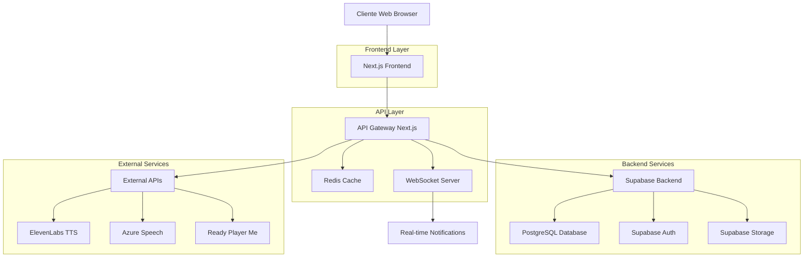
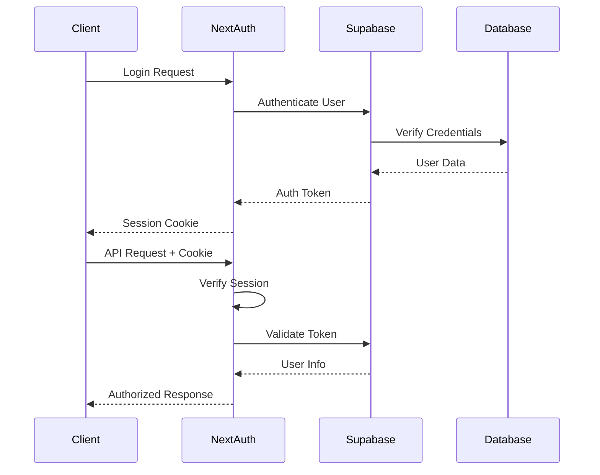

# Arquitetura Técnica Detalhada - MVP Video Técnico Cursos v7

## 1. Arquitetura Geral do Sistema



## 2. Tecnologias e Frameworks

### 2.1 Frontend Stack
- **Framework**: Next.js 14 com App Router
- **UI Library**: React 18 + TypeScript
- **Styling**: TailwindCSS + CSS Modules
- **State Management**: React Context + Zustand
- **Forms**: React Hook Form + Zod validation
- **3D Rendering**: Three.js + React Three Fiber
- **Charts**: Chart.js + Recharts

### 2.2 Backend Stack
- **Runtime**: Node.js 18+
- **Framework**: Next.js API Routes
- **Database**: PostgreSQL (via Supabase)
- **ORM**: Prisma Client
- **Authentication**: NextAuth.js + Supabase Auth
- **Cache**: Redis
- **File Storage**: Supabase Storage
- **WebSockets**: ws library

### 2.3 External Services
- **TTS**: ElevenLabs + Azure Speech Services
- **3D Avatars**: Ready Player Me
- **Video Processing**: FFmpeg + Remotion
- **Analytics**: Custom implementation
- **Monitoring**: Custom + Supabase Analytics

## 3. Estrutura de Dados (Prisma Schema)

### 3.1 Core Models

```prisma
model User {
  id            String    @id @default(cuid())
  name          String?
  email         String    @unique
  emailVerified DateTime?
  image         String?
  role          String    @default("user")
  currentOrgId  String?
  
  accounts                Account[]
  sessions                Session[]
  projects                Project[]
  notifications          Notification[]
  analytics               Analytics[]
  comments                ProjectComment[]
  versions                ProjectVersion[]
  organizationMemberships OrganizationMember[]
  analyticsEvents         AnalyticsEvent[]
  
  createdAt DateTime @default(now())
  updatedAt DateTime @updatedAt
}

model Project {
  id          String        @id @default(cuid())
  name        String
  description String?
  type        String?
  status      ProjectStatus @default(DRAFT)
  
  organizationId String?
  organization   Organization? @relation(fields: [organizationId], references: [id])
  
  userId String
  user   User   @relation(fields: [userId], references: [id])
  
  // PPTX Data
  originalFileName String?
  pptxUrl          String?
  slidesData       Json?
  totalSlides      Int     @default(0)
  pptxMetadata     Json?
  pptxAssets       Json?
  pptxTimeline     Json?
  pptxStats        Json?
  imagesExtracted  Int     @default(0)
  processingTime   Float?
  phase            String?
  
  // Video Data
  videoUrl     String?
  thumbnailUrl String?
  duration     Int     @default(0)
  
  // Processing Data
  processingLog Json?
  errorMessage  String?
  failedAt      String?
  
  // Audio/TTS Data
  audioUrl      String?
  ttsProvider   String?
  voiceId       String?
  autoNarration Boolean @default(false)
  
  // Settings
  settings Json?
  
  // Metrics
  views     Int @default(0)
  downloads Int @default(0)
  
  createdAt DateTime @default(now())
  updatedAt DateTime @updatedAt
  
  slides        Slide[]
  analytics     Analytics[]
  videoExports  VideoExport[]
  aiGenerations AIGeneration[]
  comments      ProjectComment[]
  versions      ProjectVersion[]
  timeline      Timeline?
  nrCompliance  NRComplianceRecord[]
  renderJobs    RenderJob[]
}

model Slide {
  id        String  @id @default(cuid())
  projectId String
  project   Project @relation(fields: [projectId], references: [id])
  
  title       String
  content     String
  slideNumber Int
  
  // PPTX Data
  extractedText   String?
  slideNotes      String?
  slideLayout     Json?
  slideImages     Json?
  slideElements   Json?
  slideMetrics    Json?
  
  // Visual Data
  backgroundType  String?
  backgroundColor String?
  backgroundImage String?
  
  // Animation/Timing
  duration     Float   @default(5.0)
  transition   String? @default("fade")
  animationIn  String?
  animationOut String?
  
  // Audio
  audioUrl     String?
  audioText    String?
  ttsGenerated Boolean @default(false)
  
  // Elements
  elements Json?
  
  createdAt DateTime @default(now())
  updatedAt DateTime @updatedAt
}
```

### 3.2 Advanced Models

```prisma
model VoiceProfile {
  id     String  @id @default(cuid())
  userId String?
  
  name        String
  description String?
  language    String  @default("pt-BR")
  gender      String
  age         String  @default("adult")
  
  provider   String
  providerId String
  
  trainingStatus String @default("ready")
  quality        Float? @default(1.0)
  
  style           String?
  stability       Float?  @default(0.5)
  similarityBoost Float?  @default(0.75)
  
  isDefault Boolean @default(false)
  isActive  Boolean @default(true)
  isPremium Boolean @default(false)
  
  usageCount Int       @default(0)
  lastUsed   DateTime?
  
  sampleUrl String?
  
  createdAt DateTime @default(now())
  updatedAt DateTime @updatedAt
}

model RenderJob {
  id        String  @id @default(cuid())
  projectId String
  project   Project @relation(fields: [projectId], references: [id])
  userId    String
  
  status   String @default("queued")
  progress Int    @default(0)
  
  settings Json
  priority String @default("normal")
  
  estimatedDuration Int?
  actualDuration    Int?
  
  outputUrl    String?
  outputSize   BigInt?
  errorMessage String?
  
  webhookUrl String?
  
  startedAt   DateTime?
  completedAt DateTime?
  
  createdAt DateTime @default(now())
  updatedAt DateTime @updatedAt
}

model Timeline {
  id        String  @id @default(cuid())
  projectId String  @unique
  project   Project @relation(fields: [projectId], references: [id])
  
  duration Float @default(0)
  fps      Int   @default(30)
  
  settings Json?
  
  tracks TimelineTrack[]
  
  createdAt DateTime @default(now())
  updatedAt DateTime @updatedAt
}

model TimelineTrack {
  id         String   @id @default(cuid())
  timelineId String
  timeline   Timeline @relation(fields: [timelineId], references: [id])
  
  name     String
  type     String // video, audio, text, avatar
  order    Int
  locked   Boolean @default(false)
  visible  Boolean @default(true)
  
  settings Json?
  
  elements TimelineElement[]
  
  createdAt DateTime @default(now())
  updatedAt DateTime @updatedAt
}

model TimelineElement {
  id      String        @id @default(cuid())
  trackId String
  track   TimelineTrack @relation(fields: [trackId], references: [id])
  
  type String // slide, avatar, audio, text, image
  
  startTime Float
  duration  Float
  
  content  Json?
  settings Json?
  
  createdAt DateTime @default(now())
  updatedAt DateTime @updatedAt
}
```

## 4. API Architecture

### 4.1 API Routes Structure

```
/api/
├── auth/                    # Authentication
│   ├── [...nextauth]/      # NextAuth.js handler
│   ├── login/              # Custom login
│   ├── logout/             # Logout
│   ├── session/            # Session management
│   └── profile/            # User profile
├── projects/               # Project management
│   ├── route.ts           # CRUD operations
│   ├── [id]/              # Specific project
│   └── [id]/export/       # Export project
├── pptx/                   # PPTX processing
│   ├── upload/            # Upload PPTX
│   ├── process/           # Process PPTX
│   ├── [id]/              # PPTX details
│   └── slides/            # Slide management
├── avatars/                # Avatar management
│   ├── route.ts           # CRUD operations
│   ├── 3d/                # 3D avatar specific
│   ├── render/            # Avatar rendering
│   └── ue5/               # UE5 integration
├── tts/                    # Text-to-Speech
│   ├── generate/          # Generate speech
│   ├── voices/            # Voice management
│   └── providers/         # TTS providers
├── render/                 # Video rendering
│   ├── route.ts           # Render jobs
│   ├── queue/             # Render queue
│   └── status/            # Render status
├── timeline/               # Timeline management
│   ├── route.ts           # Timeline CRUD
│   ├── tracks/            # Track management
│   └── elements/          # Element management
├── analytics/              # Analytics system
│   ├── track/             # Event tracking
│   ├── metrics/           # Metrics
│   ├── dashboard/         # Dashboard data
│   └── reports/           # Reports
├── notifications/          # Notification system
│   ├── route.ts           # CRUD operations
│   ├── [id]/read/         # Mark as read
│   └── websocket/         # WebSocket handler
└── admin/                  # Admin functions
    ├── users/             # User management
    ├── stats/             # System stats
    └── monitoring/        # System monitoring
```

### 4.2 API Response Standards

```typescript
// Success Response
interface APIResponse<T> {
  success: true
  data: T
  message?: string
  timestamp: string
  pagination?: {
    page: number
    limit: number
    total: number
    pages: number
  }
}

// Error Response
interface APIError {
  success: false
  error: string
  details?: any
  code?: string
  timestamp: string
}

// Example Usage
export async function GET(request: NextRequest) {
  try {
    const data = await fetchData()
    
    return NextResponse.json({
      success: true,
      data,
      timestamp: new Date().toISOString()
    })
  } catch (error) {
    return NextResponse.json({
      success: false,
      error: 'Internal server error',
      details: error.message,
      timestamp: new Date().toISOString()
    }, { status: 500 })
  }
}
```

## 5. Frontend Architecture

### 5.1 Component Structure

```
components/
├── ui/                     # Base UI components
│   ├── Button.tsx
│   ├── Input.tsx
│   ├── Modal.tsx
│   ├── Toast.tsx
│   └── Loading.tsx
├── forms/                  # Form components
│   ├── ProjectForm.tsx
│   ├── UploadForm.tsx
│   └── SettingsForm.tsx
├── dashboard/              # Dashboard components
│   ├── DashboardLayout.tsx
│   ├── StatsCards.tsx
│   ├── ProjectList.tsx
│   └── RecentActivity.tsx
├── timeline/               # Timeline editor
│   ├── TimelineEditor.tsx
│   ├── TimelineTrack.tsx
│   ├── TimelineElement.tsx
│   └── TimelineControls.tsx
├── avatars/                # Avatar components
│   ├── AvatarViewer.tsx
│   ├── AvatarSelector.tsx
│   └── AvatarSettings.tsx
├── pptx/                   # PPTX components
│   ├── PPTXUploader.tsx
│   ├── SlideViewer.tsx
│   └── PPTXProcessor.tsx
├── render/                 # Rendering components
│   ├── RenderQueue.tsx
│   ├── RenderProgress.tsx
│   └── RenderSettings.tsx
└── shared/                 # Shared components
    ├── Header.tsx
    ├── Sidebar.tsx
    ├── Footer.tsx
    └── Navigation.tsx
```

### 5.2 State Management

```typescript
// Zustand Store Example
interface ProjectStore {
  projects: Project[]
  currentProject: Project | null
  loading: boolean
  error: string | null
  
  // Actions
  fetchProjects: () => Promise<void>
  createProject: (data: CreateProjectData) => Promise<void>
  updateProject: (id: string, data: UpdateProjectData) => Promise<void>
  deleteProject: (id: string) => Promise<void>
  setCurrentProject: (project: Project) => void
}

export const useProjectStore = create<ProjectStore>((set, get) => ({
  projects: [],
  currentProject: null,
  loading: false,
  error: null,
  
  fetchProjects: async () => {
    set({ loading: true, error: null })
    try {
      const response = await fetch('/api/projects')
      const data = await response.json()
      set({ projects: data.data, loading: false })
    } catch (error) {
      set({ error: error.message, loading: false })
    }
  },
  
  createProject: async (data) => {
    set({ loading: true, error: null })
    try {
      const response = await fetch('/api/projects', {
        method: 'POST',
        headers: { 'Content-Type': 'application/json' },
        body: JSON.stringify(data)
      })
      const result = await response.json()
      
      if (result.success) {
        set(state => ({
          projects: [...state.projects, result.data],
          loading: false
        }))
      } else {
        set({ error: result.error, loading: false })
      }
    } catch (error) {
      set({ error: error.message, loading: false })
    }
  }
}))
```

## 6. Security Architecture

### 6.1 Authentication Flow



### 6.2 Authorization Levels

```typescript
enum UserRole {
  USER = 'user',
  ADMIN = 'admin',
  MODERATOR = 'moderator'
}

enum ProjectPermission {
  READ = 'read',
  WRITE = 'write',
  DELETE = 'delete',
  ADMIN = 'admin'
}

interface AuthContext {
  user: User | null
  role: UserRole
  permissions: ProjectPermission[]
  organizationId?: string
}

// Middleware for API protection
export function withAuth(handler: NextApiHandler, requiredRole?: UserRole) {
  return async (req: NextRequest, res: NextResponse) => {
    const session = await getServerSession(authOptions)
    
    if (!session?.user) {
      return NextResponse.json({ error: 'Unauthorized' }, { status: 401 })
    }
    
    if (requiredRole && session.user.role !== requiredRole) {
      return NextResponse.json({ error: 'Forbidden' }, { status: 403 })
    }
    
    return handler(req, res)
  }
}
```

## 7. Performance Optimization

### 7.1 Caching Strategy

```typescript
// Redis Cache Implementation
class CacheService {
  private redis: Redis
  
  constructor() {
    this.redis = new Redis(process.env.REDIS_URL!)
  }
  
  async get<T>(key: string): Promise<T | null> {
    const cached = await this.redis.get(key)
    return cached ? JSON.parse(cached) : null
  }
  
  async set(key: string, value: any, ttl: number = 3600): Promise<void> {
    await this.redis.setex(key, ttl, JSON.stringify(value))
  }
  
  async invalidate(pattern: string): Promise<void> {
    const keys = await this.redis.keys(pattern)
    if (keys.length > 0) {
      await this.redis.del(...keys)
    }
  }
}

// Usage in API routes
export async function GET(request: NextRequest) {
  const cache = new CacheService()
  const cacheKey = `projects:${userId}`
  
  // Try cache first
  let projects = await cache.get(cacheKey)
  
  if (!projects) {
    // Fetch from database
    projects = await fetchProjectsFromDB(userId)
    
    // Cache for 1 hour
    await cache.set(cacheKey, projects, 3600)
  }
  
  return NextResponse.json({ success: true, data: projects })
}
```

### 7.2 Database Optimization

```sql
-- Indexes for performance
CREATE INDEX idx_projects_user_id ON projects(user_id);
CREATE INDEX idx_projects_status ON projects(status);
CREATE INDEX idx_projects_created_at ON projects(created_at DESC);
CREATE INDEX idx_slides_project_id ON slides(project_id);
CREATE INDEX idx_analytics_user_id_timestamp ON analytics(user_id, timestamp DESC);
CREATE INDEX idx_notifications_user_id_status ON notifications(user_id, status);

-- Composite indexes
CREATE INDEX idx_projects_user_status ON projects(user_id, status);
CREATE INDEX idx_render_jobs_status_priority ON render_jobs(status, priority, created_at);
```

## 8. Monitoring and Observability

### 8.1 Logging Strategy

```typescript
// Structured logging
interface LogEntry {
  level: 'info' | 'warn' | 'error' | 'debug'
  message: string
  timestamp: string
  userId?: string
  projectId?: string
  action?: string
  metadata?: Record<string, any>
}

class Logger {
  static log(entry: LogEntry) {
    const logData = {
      ...entry,
      timestamp: new Date().toISOString()
    }
    
    console.log(JSON.stringify(logData))
    
    // Send to external logging service if needed
    if (process.env.NODE_ENV === 'production') {
      // Send to logging service
    }
  }
  
  static info(message: string, metadata?: Record<string, any>) {
    this.log({ level: 'info', message, metadata })
  }
  
  static error(message: string, error?: Error, metadata?: Record<string, any>) {
    this.log({
      level: 'error',
      message,
      metadata: {
        ...metadata,
        error: error?.message,
        stack: error?.stack
      }
    })
  }
}
```

### 8.2 Health Checks

```typescript
// Health check endpoint
export async function GET() {
  const checks = {
    database: await checkDatabase(),
    redis: await checkRedis(),
    supabase: await checkSupabase(),
    external_apis: await checkExternalAPIs()
  }
  
  const isHealthy = Object.values(checks).every(check => check.status === 'ok')
  
  return NextResponse.json({
    status: isHealthy ? 'healthy' : 'unhealthy',
    timestamp: new Date().toISOString(),
    checks
  }, {
    status: isHealthy ? 200 : 503
  })
}

async function checkDatabase(): Promise<HealthCheck> {
  try {
    await prisma.$queryRaw`SELECT 1`
    return { status: 'ok', responseTime: Date.now() }
  } catch (error) {
    return { status: 'error', error: error.message }
  }
}
```

## 9. Deployment Architecture

### 9.1 Production Environment

```yaml
# docker-compose.production.yml
version: '3.8'
services:
  app:
    build: .
    ports:
      - "3000:3000"
    environment:
      - NODE_ENV=production
      - DATABASE_URL=${DATABASE_URL}
      - REDIS_URL=${REDIS_URL}
    depends_on:
      - redis
      
  redis:
    image: redis:7-alpine
    ports:
      - "6379:6379"
    volumes:
      - redis_data:/data
      
  nginx:
    image: nginx:alpine
    ports:
      - "80:80"
      - "443:443"
    volumes:
      - ./nginx.conf:/etc/nginx/nginx.conf
      - ./ssl:/etc/ssl
    depends_on:
      - app

volumes:
  redis_data:
```

### 9.2 CI/CD Pipeline

```yaml
# .github/workflows/deploy.yml
name: Deploy to Production

on:
  push:
    branches: [main]

jobs:
  test:
    runs-on: ubuntu-latest
    steps:
      - uses: actions/checkout@v3
      - uses: actions/setup-node@v3
        with:
          node-version: '18'
      - run: npm ci
      - run: npm run test
      - run: npm run build
      
  deploy:
    needs: test
    runs-on: ubuntu-latest
    steps:
      - uses: actions/checkout@v3
      - name: Deploy to production
        run: |
          # Deploy commands
          docker-compose -f docker-compose.production.yml up -d
```

## 10. Conclusão

Esta arquitetura técnica fornece uma base sólida e escalável para o MVP Video Técnico Cursos v7. A estrutura modular permite desenvolvimento incremental e manutenção eficiente, enquanto as práticas de segurança e performance garantem um sistema robusto para produção.

As próximas implementações devem seguir os padrões estabelecidos nesta arquitetura para manter a consistência e qualidade do sistema.