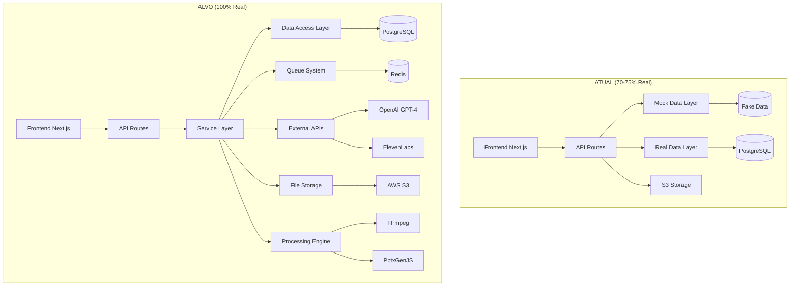
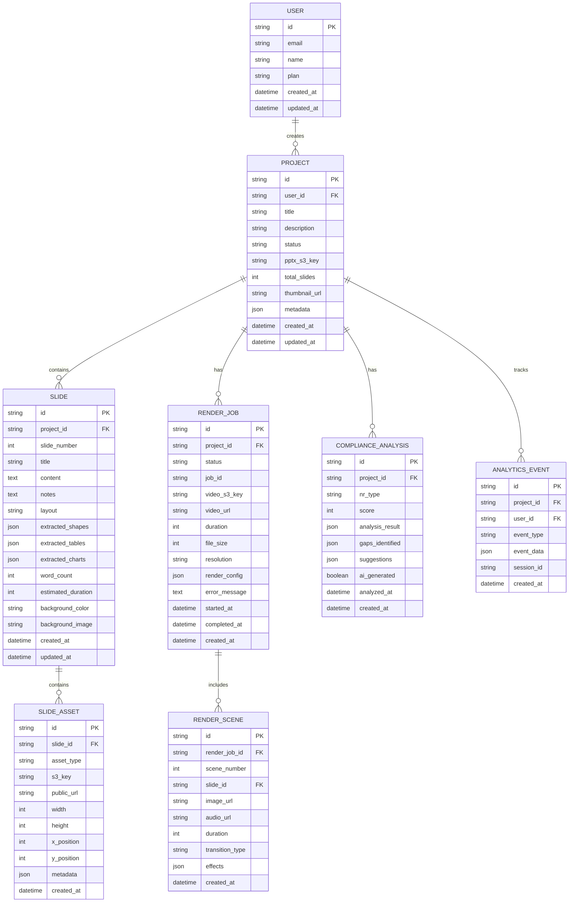

# 🏗️ ARQUITETURA TÉCNICA - IMPLEMENTAÇÃO 100% REAL

**Documento**: Especificação de Arquitetura Técnica  
**Data**: 06/10/2025  
**Versão**: 1.0.0  
**Objetivo**: Definir arquitetura técnica para eliminar mocks e implementar funcionalidades reais  

---

## 📋 ÍNDICE

1. [Visão Geral da Arquitetura](#visão-geral-da-arquitetura)
2. [Arquitetura de Dados](#arquitetura-de-dados)
3. [Arquitetura de Serviços](#arquitetura-de-serviços)
4. [Arquitetura de APIs](#arquitetura-de-apis)
5. [Arquitetura de Processamento](#arquitetura-de-processamento)
6. [Arquitetura de Segurança](#arquitetura-de-segurança)
7. [Arquitetura de Deploy](#arquitetura-de-deploy)

---

## 🔍 VISÃO GERAL DA ARQUITETURA {#visão-geral-da-arquitetura}

### Arquitetura Atual vs. Arquitetura Alvo



### Princípios Arquiteturais

#### 1. Separation of Concerns
```typescript
// Camadas bem definidas
Frontend Layer (UI/UX)
  ↓
API Layer (Routes + Validation)
  ↓
Service Layer (Business Logic)
  ↓
Data Access Layer (Repositories)
  ↓
Infrastructure Layer (DB, S3, Redis)
```

#### 2. Dependency Injection
```typescript
// Inversão de dependências
interface IPPTXProcessor {
  extract(s3Key: string): Promise<PPTXResult>;
}

class PPTXService {
  constructor(
    private processor: IPPTXProcessor,
    private storage: IStorageService,
    private repository: ISlideRepository
  ) {}
}
```

#### 3. Event-Driven Architecture
```typescript
// Eventos para processamento assíncrono
PPTXUploaded → PPTXProcessingStarted → SlidesExtracted → RenderQueued → VideoGenerated
```

---

## 🗄️ ARQUITETURA DE DADOS {#arquitetura-de-dados}

### Modelo de Dados Atualizado



### Schema Prisma Completo

```prisma
// prisma/schema.prisma

generator client {
  provider = "prisma-client-js"
}

datasource db {
  provider = "postgresql"
  url      = env("DATABASE_URL")
}

model User {
  id        String   @id @default(cuid())
  email     String   @unique
  name      String
  plan      String   @default("free")
  createdAt DateTime @default(now())
  updatedAt DateTime @updatedAt

  // Relations
  projects         Project[]
  analyticsEvents  AnalyticsEvent[]

  @@map("users")
}

model Project {
  id          String   @id @default(cuid())
  userId      String
  title       String
  description String?
  status      String   @default("draft") // draft, processing, ready, error
  pptxS3Key   String?
  totalSlides Int      @default(0)
  thumbnailUrl String?
  metadata    Json?
  createdAt   DateTime @default(now())
  updatedAt   DateTime @updatedAt

  // Relations
  user                User                  @relation(fields: [userId], references: [id], onDelete: Cascade)
  slides              Slide[]
  renderJobs          RenderJob[]
  complianceAnalyses  ComplianceAnalysis[]
  analyticsEvents     AnalyticsEvent[]

  @@index([userId])
  @@index([status])
  @@map("projects")
}

model Slide {
  id                String   @id @default(cuid())
  projectId         String
  slideNumber       Int
  title             String
  content           String   @db.Text
  notes             String?  @db.Text
  layout            String   @default("auto")
  extractedShapes   Json?
  extractedTables   Json?
  extractedCharts   Json?
  wordCount         Int      @default(0)
  estimatedDuration Int      @default(5) // seconds
  backgroundColor   String?
  backgroundImage   String?
  createdAt         DateTime @default(now())
  updatedAt         DateTime @updatedAt

  // Relations
  project     Project      @relation(fields: [projectId], references: [id], onDelete: Cascade)
  assets      SlideAsset[]
  renderScenes RenderScene[]

  @@unique([projectId, slideNumber])
  @@index([projectId])
  @@map("slides")
}

model SlideAsset {
  id          String   @id @default(cuid())
  slideId     String
  assetType   String   // image, video, audio, shape
  s3Key       String
  publicUrl   String
  width       Int?
  height      Int?
  xPosition   Int?
  yPosition   Int?
  metadata    Json?
  createdAt   DateTime @default(now())

  // Relations
  slide Slide @relation(fields: [slideId], references: [id], onDelete: Cascade)

  @@index([slideId])
  @@index([assetType])
  @@map("slide_assets")
}

model RenderJob {
  id           String    @id @default(cuid())
  projectId    String
  status       String    @default("pending") // pending, processing, completed, failed
  jobId        String?   // BullMQ job ID
  videoS3Key   String?
  videoUrl     String?
  duration     Int?      // seconds
  fileSize     Int?      // bytes
  resolution   String?   // 1920x1080
  renderConfig Json?
  errorMessage String?   @db.Text
  startedAt    DateTime?
  completedAt  DateTime?
  createdAt    DateTime  @default(now())

  // Relations
  project      Project       @relation(fields: [projectId], references: [id], onDelete: Cascade)
  renderScenes RenderScene[]

  @@index([projectId])
  @@index([status])
  @@map("render_jobs")
}

model RenderScene {
  id             String   @id @default(cuid())
  renderJobId    String
  sceneNumber    Int
  slideId        String
  imageUrl       String
  audioUrl       String?
  duration       Int      // seconds
  transitionType String?