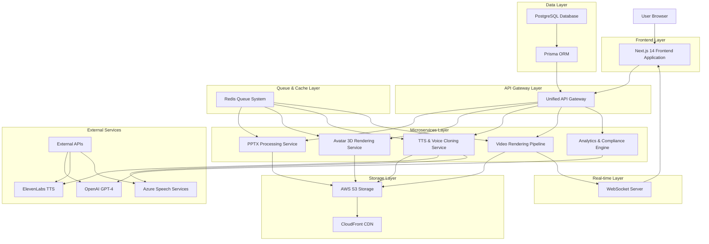
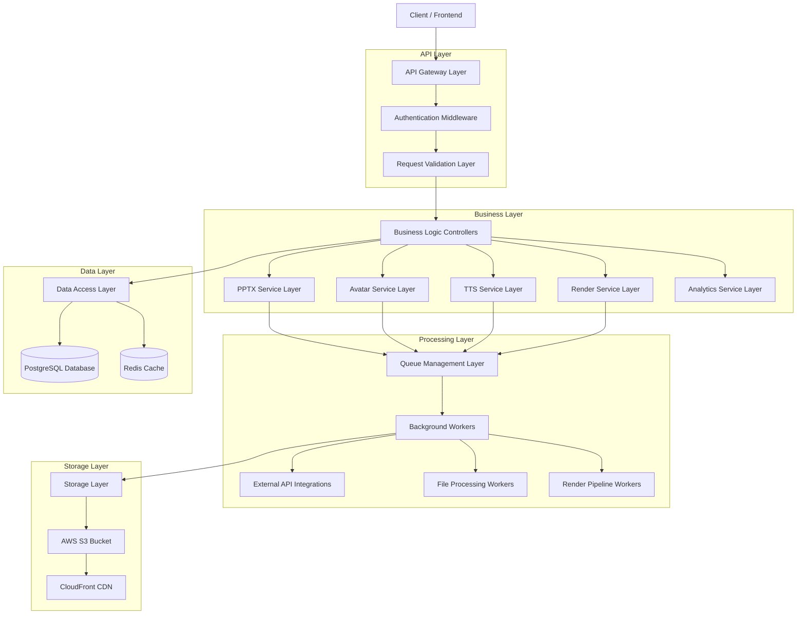
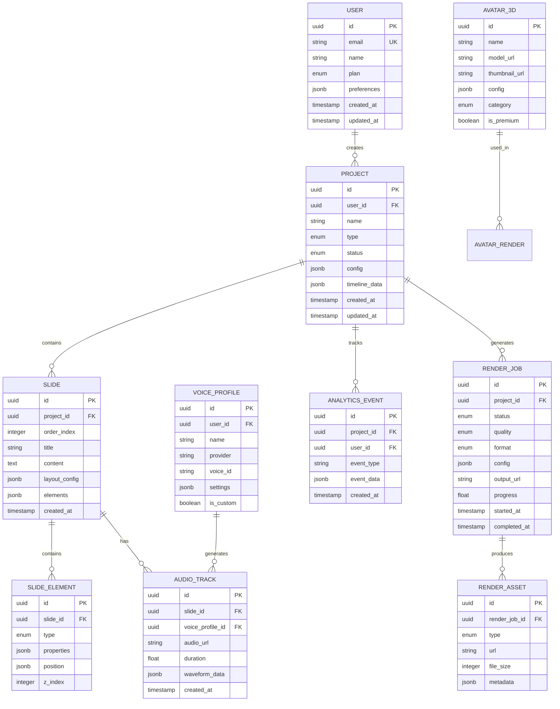

# 🏗️ Arquitetura Técnica - Sistema Integrado Unificado

## 1. Architecture Design



## 2. Technology Description

- **Frontend**: React@18 + Next.js@14 + TypeScript@5 + Tailwind CSS@3 + Framer Motion@12
- **Backend**: Next.js@14 API Routes + NextAuth.js@4 + Prisma@6 + BullMQ@5
- **Database**: PostgreSQL@15 + Redis@7 + Prisma ORM
- **Storage**: AWS S3 + CloudFront CDN + Sharp@0.32 para processamento de imagens
- **Processing**: FFmpeg@6 + PptxGenJS@3 + Canvas API + WebGL para renderização 3D
- **External APIs**: OpenAI GPT-4 + ElevenLabs + Azure Speech + Socket.io@4
- **Infrastructure**: Docker + Vercel/AWS ECS + DataDog monitoring

## 3. Route Definitions

| Route | Purpose |
|-------|---------|
| `/` | Landing page com overview do sistema e call-to-action para registro |
| `/auth/login` | Página de autenticação com OAuth (Google/Microsoft) e email/senha |
| `/auth/register` | Registro de novos usuários com planos básico/premium |
| `/dashboard` | Dashboard unificado principal com visão geral de projetos e analytics |
| `/studio` | Ambiente integrado de criação com todos os módulos unificados |
| `/studio/project/[id]` | Editor específico de projeto com estado persistente |
| `/library` | Biblioteca centralizada de assets (avatares, vozes, templates) |
| `/render-center` | Centro de monitoramento de renderização e downloads |
| `/analytics` | Analytics avançados e relatórios de compliance |
| `/profile` | Configurações de usuário e preferências do sistema |
| `/admin` | Painel administrativo para gestão de usuários e sistema |

## 4. API Definitions

### 4.1 Core API - Unified Project Management

**Criar projeto integrado**
```
POST /api/v1/projects/unified
```

Request:
| Param Name | Param Type | isRequired | Description |
|------------|------------|------------|-------------|
| name | string | true | Nome do projeto |
| type | enum | true | Tipo: 'pptx_import' ou 'from_scratch' |
| pptx_file | File | false | Arquivo PPTX (se type = pptx_import) |
| template_id | string | false | ID do template NR (opcional) |

Response:
| Param Name | Param Type | Description |
|------------|------------|-------------|
| project_id | string | ID único do projeto criado |
| status | string | Status do processamento inicial |
| slides | array | Array de slides processados (se PPTX) |
| timeline | object | Configuração inicial da timeline |

**Processamento PPTX integrado**
```
POST /api/v1/pptx/process-unified
```

Request:
| Param Name | Param Type | isRequired | Description |
|------------|------------|------------|-------------|
| project_id | string | true | ID do projeto |
| file | File | true | Arquivo PPTX para processamento |
| extract_images | boolean | false | Extrair imagens automaticamente |
| generate_timeline | boolean | false | Gerar timeline automaticamente |

Response:
| Param Name | Param Type | Description |
|------------|------------|-------------|
| slides | array | Slides extraídos com texto, imagens e layouts |
| timeline_config | object | Configuração automática da timeline |
| processing_status | string | Status do processamento |

### 4.2 Avatar 3D Integration API

**Renderizar avatar com sincronização**
```
POST /api/v1/avatar/render-sync
```

Request:
| Param Name | Param Type | isRequired | Description |
|------------|------------|------------|-------------|
| project_id | string | true | ID do projeto |
| avatar_id | string | true | ID do avatar 3D selecionado |
| audio_url | string | true | URL do áudio TTS gerado |
| scene_config | object | true | Configurações de cena (posição, iluminação) |
| lip_sync | boolean | false | Ativar sincronização labial |

Response:
| Param Name | Param Type | Description |
|------------|------------|-------------|
| render_job_id | string | ID do job de renderização |
| estimated_time | number | Tempo estimado em segundos |
| preview_url | string | URL do preview em baixa qualidade |

### 4.3 TTS & Voice Cloning API

**Gerar áudio com voice cloning**
```
POST /api/v1/tts/generate-voice
```

Request:
| Param Name | Param Type | isRequired | Description |
|------------|------------|------------|-------------|
| project_id | string | true | ID do projeto |
| text | string | true | Texto para síntese |
| voice_id | string | true | ID da voz (padrão ou clonada) |
| speed | number | false | Velocidade (0.5-2.0) |
| emotion | string | false | Emoção: 'neutral', 'happy', 'serious' |

Response:
| Param Name | Param Type | Description |
|------------|------------|-------------|
| audio_url | string | URL do áudio gerado |
| duration | number | Duração em segundos |
| waveform_data | array | Dados para visualização de waveform |

### 4.4 Unified Render Pipeline API

**Iniciar renderização completa**
```
POST /api/v1/render/start-unified
```

Request:
| Param Name | Param Type | isRequired | Description |
|------------|------------|------------|-------------|
| project_id | string | true | ID do projeto |
| quality | enum | true | Qualidade: 'draft', 'standard', 'high', '4k' |
| format | enum | true | Formato: 'mp4', 'webm', 'mov' |
| include_subtitles | boolean | false | Incluir legendas automáticas |
| watermark | boolean | false | Incluir watermark (usuários básicos) |

Response:
| Param Name | Param Type | Description |
|------------|------------|-------------|
| render_job_id | string | ID único do job de renderização |
| queue_position | number | Posição na fila |
| estimated_completion | string | Timestamp estimado de conclusão |

## 5. Server Architecture Diagram



## 6. Data Model

### 6.1 Data Model Definition



### 6.2 Data Definition Language

**Tabela de Usuários**
```sql
-- Criar tabela de usuários
CREATE TABLE users (
    id UUID PRIMARY KEY DEFAULT gen_random_uuid(),
    email VARCHAR(255) UNIQUE NOT NULL,
    name VARCHAR(100) NOT NULL,
    plan VARCHAR(20) DEFAULT 'basic' CHECK (plan IN ('basic', 'premium', 'enterprise')),
    preferences JSONB DEFAULT '{}',
    created_at TIMESTAMP WITH TIME ZONE DEFAULT NOW(),
    updated_at TIMESTAMP WITH TIME ZONE DEFAULT NOW()
);

-- Índices para performance
CREATE INDEX idx_users_email ON users(email);
CREATE INDEX idx_users_plan ON users(plan);
CREATE INDEX idx_users_created_at ON users(created_at DESC);
```

**Tabela de Projetos Integrados**
```sql
-- Criar tabela de projetos
CREATE TABLE projects (
    id UUID PRIMARY KEY DEFAULT gen_random_uuid(),
    user_id UUID NOT NULL REFERENCES users(id) ON DELETE CASCADE,
    name VARCHAR(200) NOT NULL,
    type VARCHAR(50) NOT NULL CHECK (type IN ('pptx_import', 'from_scratch', 'template')),
    status VARCHAR(50) DEFAULT 'draft' CHECK (status IN ('draft', 'processing', 'ready', 'rendering', 'completed')),
    config JSONB DEFAULT '{}',
    timeline_data JSONB DEFAULT '{}',
    created_at TIMESTAMP WITH TIME ZONE DEFAULT NOW(),
    updated_at TIMESTAMP WITH TIME ZONE DEFAULT NOW()
);

-- Índices para queries otimizadas
CREATE INDEX idx_projects_user_id ON projects(user_id);
CREATE INDEX idx_projects_status ON projects(status);
CREATE INDEX idx_projects_type ON projects(type);
CREATE INDEX idx_projects_created_at ON projects(created_at DESC);
```

**Tabela de Jobs de Renderização**
```sql
-- Criar tabela de jobs de renderização
CREATE TABLE render_jobs (
    id UUID PRIMARY KEY DEFAULT gen_random_uuid(),
    project_id UUID NOT NULL REFERENCES projects(id) ON DELETE CASCADE,
    status VARCHAR(50) DEFAULT 'queued' CHECK (status IN ('queued', 'processing', 'completed', 'failed', 'cancelled')),
    quality VARCHAR(20) NOT NULL CHECK (quality IN ('draft', 'standard', 'high', '4k')),
    format VARCHAR(10) NOT NULL CHECK (format IN ('mp4', 'webm', 'mov')),
    config JSONB DEFAULT '{}',
    output_url VARCHAR(500),
    progress FLOAT DEFAULT 0.0 CHECK (progress >= 0.0 AND progress <= 100.0),
    error_message TEXT,
    started_at TIMESTAMP WITH TIME ZONE,
    completed_at TIMESTAMP WITH TIME ZONE,
    created_at TIMESTAMP WITH TIME ZONE DEFAULT NOW()
);

-- Índices para monitoramento de fila
CREATE INDEX idx_render_jobs_status ON render_jobs(status);
CREATE INDEX idx_render_jobs_project_id ON render_jobs(project_id);
CREATE INDEX idx_render_jobs_created_at ON render_jobs(created_at DESC);
```

**Dados Iniciais**
```sql
-- Inserir avatares 3D padrão
INSERT INTO avatar_3d (name, model_url, thumbnail_url, config, category, is_premium) VALUES
('Avatar Executivo Masculino', '/assets/avatars/executive-male.glb', '/assets/thumbnails/executive-male.jpg', '{"style": "professional", "animations": ["idle", "talking", "gesturing"]}', 'executive', false),
('Avatar Educadora Feminina', '/assets/avatars/teacher-female.glb', '/assets/thumbnails/teacher-female.jpg', '{"style": "friendly", "animations": ["idle", "talking", "pointing"]}', 'education', false),
('Avatar Técnico Industrial', '/assets/avatars/technician-male.glb', '/assets/thumbnails/technician-male.jpg', '{"style": "industrial", "animations": ["idle", "talking", "demonstrating"]}', 'technical', true);

-- Inserir vozes padrão
INSERT INTO voice_profiles (name, provider, voice_id, settings, is_custom) VALUES
('Voz Masculina Profissional', 'elevenlabs', 'voice_001', '{"language": "pt-BR", "gender": "male", "age": "adult"}', false),
('Voz Feminina Educativa', 'elevenlabs', 'voice_002', '{"language": "pt-BR", "gender": "female", "age": "adult"}', false),
('Voz Técnica Industrial', 'azure', 'pt-BR-AntonioNeural', '{"language": "pt-BR", "gender": "male", "style": "technical"}', false);
```