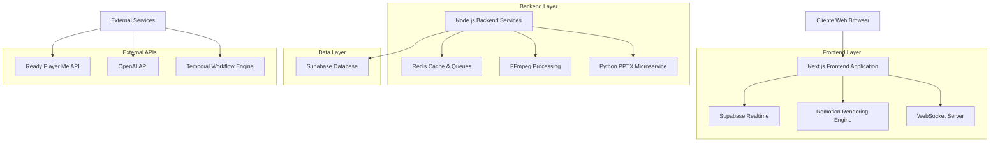
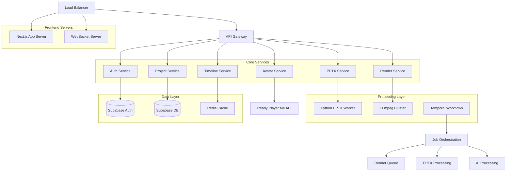
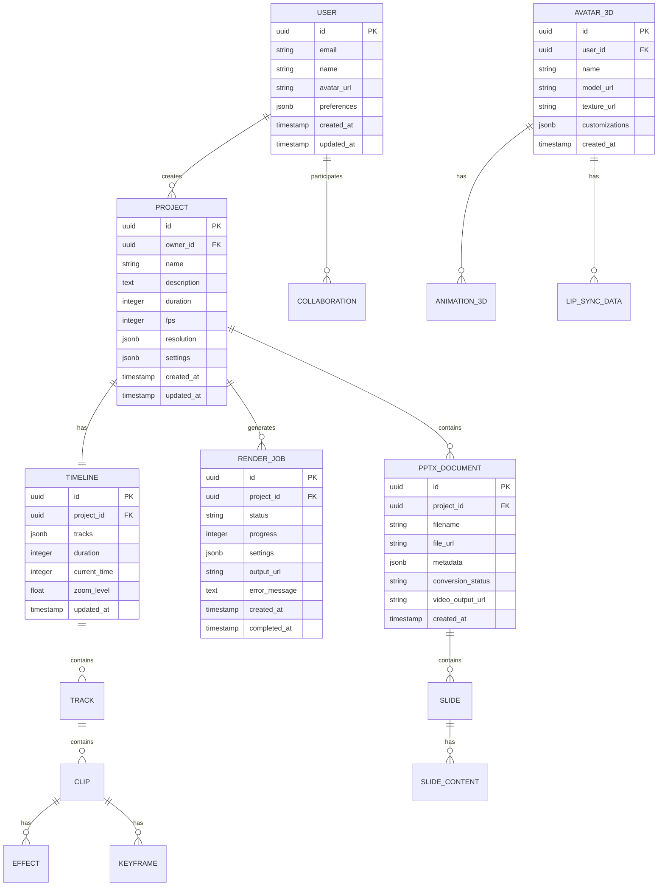

# Arquitetura Técnica - Editor de Vídeo e Módulo PPTX

## 1. Arquitetura Geral do Sistema



## 2. Stack Tecnológica Detalhada

### Frontend
- **Next.js**: 14.2.33 (App Router, Server Components, API Routes)
- **React**: 18.3.1 (Hooks, Context, Suspense)
- **TypeScript**: 5.6.2 (Strict mode, Path mapping)
- **Tailwind CSS**: 3.4.10 (JIT, Custom components)
- **Remotion**: 4.0.195 (Video composition, Player)
- **React Three Fiber**: Latest (3D rendering, WebGL)
- **@dnd-kit**: 6.1.0 (Drag and drop, Accessibility)
- **Framer Motion**: 11.3.30 (Animations, Gestures)

### Backend
- **Node.js**: 18+ (ES Modules, Worker Threads)
- **Supabase**: Latest (Auth, Database, Realtime, Storage)
- **BullMQ**: Latest (Job queues, Redis-based)
- **FFmpeg**: 6.0+ (Video processing, Transcoding)
- **Python**: 3.11+ (PPTX processing, AI integrations)

### Bibliotecas Especializadas
- **PptxGenJS**: 4.0.1 (PPTX generation, Browser/Node)
- **python-pptx**: Latest (Advanced PPTX parsing)
- **pptx-automizer**: Latest (Template automation)
- **Liveblocks**: Latest (Real-time collaboration)
- **Temporal**: Latest (Workflow orchestration)

## 3. Definições de Rotas Frontend

| Rota | Propósito | Componentes Principais |
|------|-----------|------------------------|
| `/` | Dashboard principal com visão geral de projetos | ProjectGrid, StatsWidget, NotificationCenter |
| `/editor/[projectId]` | Interface principal de edição de vídeo | TimelineEditor, AssetLibrary, PreviewPlayer |
| `/pptx/library` | Biblioteca de apresentações PPTX | PPTXGrid, UploadZone, ConversionPanel |
| `/pptx/editor/[id]` | Editor de slides integrado | SlideEditor, TemplateSelector, ExportOptions |
| `/studio-3d` | Estúdio de criação de avatares 3D | Avatar3DCanvas, CustomizationPanel, AssetBrowser |
| `/collaboration/[projectId]` | Centro de colaboração em tempo real | CollaboratorsList, CommentThread, VersionHistory |
| `/render/queue` | Painel de monitoramento de renderização | RenderQueue, ProgressMonitor, OutputManager |
| `/analytics` | Dashboard de métricas e analytics | MetricsDashboard, UsageCharts, PerformanceReports |
| `/settings` | Configurações de usuário e sistema | UserProfile, SystemSettings, IntegrationConfig |

## 4. APIs e Endpoints Backend

### 4.1 Core APIs

**Autenticação e Usuários**
```
POST /api/auth/login
POST /api/auth/register
GET /api/auth/profile
PUT /api/auth/profile
```

**Projetos de Vídeo**
```
GET /api/projects
POST /api/projects
GET /api/projects/[id]
PUT /api/projects/[id]
DELETE /api/projects/[id]
POST /api/projects/[id]/duplicate
```

**Timeline e Edição**
```
GET /api/timeline/[projectId]
PUT /api/timeline/[projectId]
POST /api/timeline/[projectId]/tracks
DELETE /api/timeline/[projectId]/tracks/[trackId]
POST /api/timeline/[projectId]/keyframes
```

**Sistema PPTX**
```
POST /api/pptx/upload
GET /api/pptx/[id]
POST /api/pptx/[id]/convert-to-video
GET /api/pptx/[id]/slides
POST /api/pptx/generate-from-template
```

**Renderização**
```
POST /api/render/start
GET /api/render/status/[jobId]
POST /api/render/cancel/[jobId]
GET /api/render/output/[jobId]
GET /api/render/queue
```

**Avatares 3D**
```
GET /api/avatars/library
POST /api/avatars/create
GET /api/avatars/[id]
PUT /api/avatars/[id]
POST /api/avatars/[id]/animate
POST /api/avatars/[id]/lip-sync
```

### 4.2 Tipos TypeScript Compartilhados

```typescript
// Projeto de Vídeo
interface VideoProject {
  id: string;
  name: string;
  description?: string;
  duration: number;
  fps: number;
  resolution: {
    width: number;
    height: number;
  };
  timeline: TimelineData;
  collaborators: Collaborator[];
  createdAt: Date;
  updatedAt: Date;
}

// Timeline
interface TimelineData {
  tracks: Track[];
  duration: number;
  currentTime: number;
  zoom: number;
}

interface Track {
  id: string;
  type: 'video' | 'audio' | 'text' | 'image' | 'pptx' | '3d';
  name: string;
  clips: Clip[];
  locked: boolean;
  visible: boolean;
}

interface Clip {
  id: string;
  startTime: number;
  endTime: number;
  duration: number;
  sourceId: string;
  effects: Effect[];
  keyframes: Keyframe[];
}

// PPTX
interface PPTXDocument {
  id: string;
  filename: string;
  slides: Slide[];
  metadata: PPTXMetadata;
  conversionStatus: 'pending' | 'processing' | 'completed' | 'failed';
  videoOutput?: string;
}

interface Slide {
  id: string;
  slideNumber: number;
  title?: string;
  content: SlideContent[];
  thumbnail: string;
  duration: number;
}

// Avatar 3D
interface Avatar3D {
  id: string;
  name: string;
  modelUrl: string;
  textureUrl: string;
  animations: Animation3D[];
  lipSyncData?: LipSyncData;
  customizations: AvatarCustomization;
}

// Renderização
interface RenderJob {
  id: string;
  projectId: string;
  status: 'queued' | 'processing' | 'completed' | 'failed';
  progress: number;
  settings: RenderSettings;
  outputUrl?: string;
  error?: string;
  createdAt: Date;
  completedAt?: Date;
}

interface RenderSettings {
  format: 'mp4' | 'webm' | 'mov';
  quality: 'low' | 'medium' | 'high' | 'ultra';
  resolution: {
    width: number;
    height: number;
  };
  fps: number;
  bitrate?: number;
  includeSubtitles: boolean;
}
```

## 5. Arquitetura de Servidor e Microserviços



## 6. Modelo de Dados e Schema

### 6.1 Diagrama Entidade-Relacionamento



### 6.2 Scripts de Criação de Tabelas

```sql
-- Tabela de Usuários (estende Supabase Auth)
CREATE TABLE user_profiles (
    id UUID PRIMARY KEY REFERENCES auth.users(id),
    email VARCHAR(255) UNIQUE NOT NULL,
    name VARCHAR(100) NOT NULL,
    avatar_url TEXT,
    preferences JSONB DEFAULT '{}',
    storage_quota BIGINT DEFAULT 5368709120, -- 5GB
    created_at TIMESTAMP WITH TIME ZONE DEFAULT NOW(),
    updated_at TIMESTAMP WITH TIME ZONE DEFAULT NOW()
);

-- Tabela de Projetos
CREATE TABLE projects (
    id UUID PRIMARY KEY DEFAULT gen_random_uuid(),
    owner_id UUID NOT NULL REFERENCES user_profiles(id),
    name VARCHAR(255) NOT NULL,
    description TEXT,
    duration INTEGER DEFAULT 0,
    fps INTEGER DEFAULT 30,
    resolution JSONB DEFAULT '{"width": 1920, "height": 1080}',
    settings JSONB DEFAULT '{}',
    created_at TIMESTAMP WITH TIME ZONE DEFAULT NOW(),
    updated_at TIMESTAMP WITH TIME ZONE DEFAULT NOW()
);

-- Tabela de Timeline
CREATE TABLE timelines (
    id UUID PRIMARY KEY DEFAULT gen_random_uuid(),
    project_id UUID NOT NULL REFERENCES projects(id) ON DELETE CASCADE,
    tracks JSONB DEFAULT '[]',
    duration INTEGER DEFAULT 0,
    current_time INTEGER DEFAULT 0,
    zoom_level FLOAT DEFAULT 1.0,
    updated_at TIMESTAMP WITH TIME ZONE DEFAULT NOW()
);

-- Tabela de Documentos PPTX
CREATE TABLE pptx_documents (
    id UUID PRIMARY KEY DEFAULT gen_random_uuid(),
    project_id UUID NOT NULL REFERENCES projects(id) ON DELETE CASCADE,
    filename VARCHAR(255) NOT NULL,
    file_url TEXT NOT NULL,
    metadata JSONB DEFAULT '{}',
    conversion_status VARCHAR(20) DEFAULT 'pending',
    video_output_url TEXT,
    created_at TIMESTAMP WITH TIME ZONE DEFAULT NOW()
);

-- Tabela de Avatares 3D
CREATE TABLE avatars_3d (
    id UUID PRIMARY KEY DEFAULT gen_random_uuid(),
    user_id UUID NOT NULL REFERENCES user_profiles(id),
    name VARCHAR(255) NOT NULL,
    model_url TEXT NOT NULL,
    texture_url TEXT,
    customizations JSONB DEFAULT '{}',
    created_at TIMESTAMP WITH TIME ZONE DEFAULT NOW()
);

-- Tabela de Jobs de Renderização
CREATE TABLE render_jobs (
    id UUID PRIMARY KEY DEFAULT gen_random_uuid(),
    project_id UUID NOT NULL REFERENCES projects(id),
    status VARCHAR(20) DEFAULT 'queued',
    progress INTEGER DEFAULT 0,
    settings JSONB NOT NULL,
    output_url TEXT,
    error_message TEXT,
    created_at TIMESTAMP WITH TIME ZONE DEFAULT NOW(),
    completed_at TIMESTAMP WITH TIME ZONE
);

-- Tabela de Colaboração
CREATE TABLE collaborations (
    id UUID PRIMARY KEY DEFAULT gen_random_uuid(),
    project_id UUID NOT NULL REFERENCES projects(id) ON DELETE CASCADE,
    user_id UUID NOT NULL REFERENCES user_profiles(id),
    role VARCHAR(20) DEFAULT 'editor',
    permissions JSONB DEFAULT '{}',
    created_at TIMESTAMP WITH TIME ZONE DEFAULT NOW()
);

-- Índices para Performance
CREATE INDEX idx_projects_owner_id ON projects(owner_id);
CREATE INDEX idx_timelines_project_id ON timelines(project_id);
CREATE INDEX idx_pptx_documents_project_id ON pptx_documents(project_id);
CREATE INDEX idx_render_jobs_project_id ON render_jobs(project_id);
CREATE INDEX idx_render_jobs_status ON render_jobs(status);
CREATE INDEX idx_collaborations_project_id ON collaborations(project_id);
CREATE INDEX idx_collaborations_user_id ON collaborations(user_id);

-- Políticas RLS (Row Level Security)
ALTER TABLE projects ENABLE ROW LEVEL SECURITY;
ALTER TABLE timelines ENABLE ROW LEVEL SECURITY;
ALTER TABLE pptx_documents ENABLE ROW LEVEL SECURITY;
ALTER TABLE render_jobs ENABLE ROW LEVEL SECURITY;

-- Política para projetos (usuário pode ver seus próprios projetos e colaborações)
CREATE POLICY "Users can view own projects" ON projects
    FOR SELECT USING (
        owner_id = auth.uid() OR 
        id IN (
            SELECT project_id FROM collaborations 
            WHERE user_id = auth.uid()
        )
    );

-- Política para timelines
CREATE POLICY "Users can access project timelines" ON timelines
    FOR ALL USING (
        project_id IN (
            SELECT id FROM projects WHERE 
            owner_id = auth.uid() OR 
            id IN (SELECT project_id FROM collaborations WHERE user_id = auth.uid())
        )
    );

-- Triggers para updated_at
CREATE OR REPLACE FUNCTION update_updated_at_column()
RETURNS TRIGGER AS $$
BEGIN
    NEW.updated_at = NOW();
    RETURN NEW;
END;
$$ language 'plpgsql';

CREATE TRIGGER update_projects_updated_at BEFORE UPDATE ON projects
    FOR EACH ROW EXECUTE FUNCTION update_updated_at_column();

CREATE TRIGGER update_timelines_updated_at BEFORE UPDATE ON timelines
    FOR EACH ROW EXECUTE FUNCTION update_updated_at_column();
```

## 7. Configuração de Desenvolvimento

### 7.1 Variáveis de Ambiente

```bash
# Next.js
NEXT_PUBLIC_SUPABASE_URL=your_supabase_url
NEXT_PUBLIC_SUPABASE_ANON_KEY=your_supabase_anon_key
SUPABASE_SERVICE_ROLE_KEY=your_service_role_key

# Redis
REDIS_URL=redis://localhost:6379

# FFmpeg
FFMPEG_PATH=/usr/bin/ffmpeg
FFPROBE_PATH=/usr/bin/ffprobe

# External APIs
OPENAI_API_KEY=your_openai_key
READY_PLAYER_ME_API_KEY=your_rpm_key
LIVEBLOCKS_SECRET_KEY=your_liveblocks_key

# Storage
AWS_ACCESS_KEY_ID=your_aws_key
AWS_SECRET_ACCESS_KEY=your_aws_secret
AWS_REGION=us-east-1
AWS_S3_BUCKET=your_bucket_name

# Temporal
TEMPORAL_ADDRESS=localhost:7233
TEMPORAL_NAMESPACE=default
```

### 7.2 Scripts de Desenvolvimento

```json
{
  "scripts": {
    "dev": "next dev",
    "build": "next build",
    "start": "next start",
    "lint": "next lint",
    "type-check": "tsc --noEmit",
    "test": "jest",
    "test:watch": "jest --watch",
    "test:e2e": "playwright test",
    "db:generate": "supabase gen types typescript --local > types/database.types.ts",
    "db:reset": "supabase db reset",
    "worker:start": "node workers/render-worker.js",
    "temporal:start": "temporal server start-dev"
  }
}
```