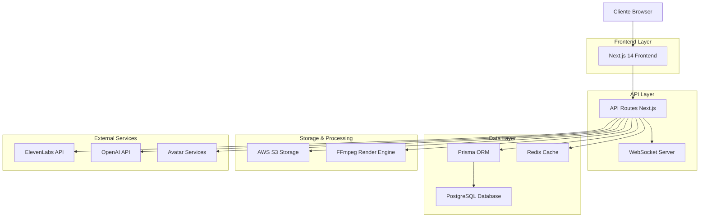
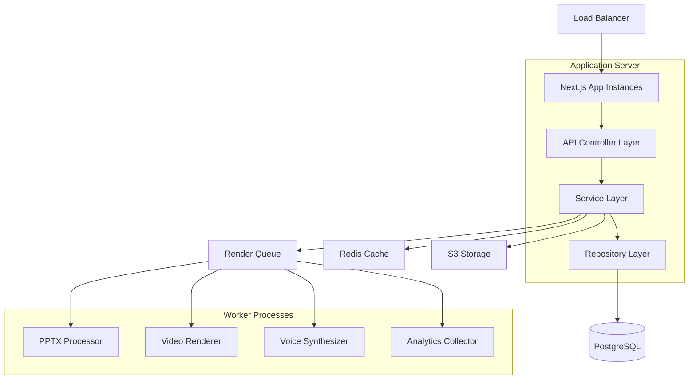
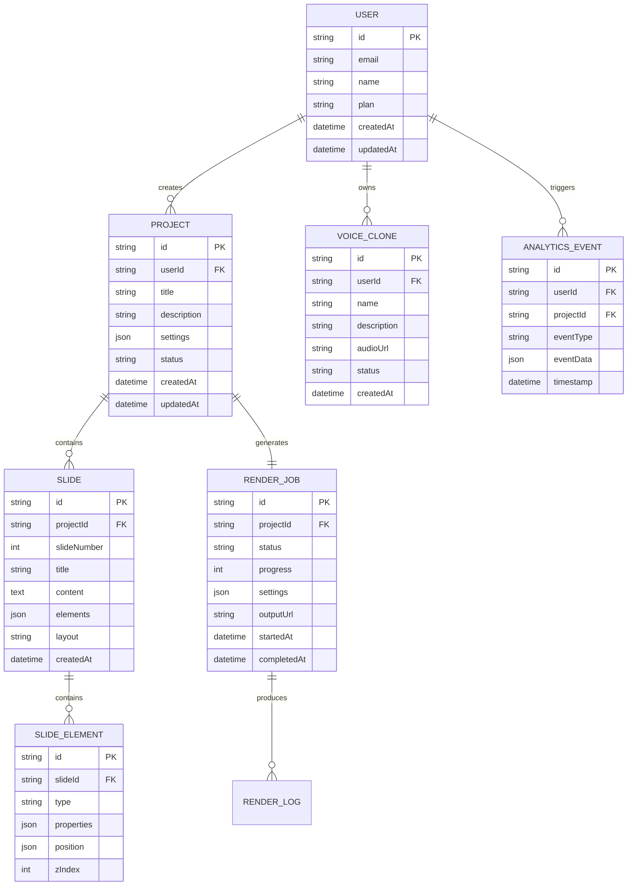

# Arquitetura Técnica - Estúdio IA de Vídeos

## 1. Arquitetura do Sistema



## 2. Stack Tecnológico

- **Frontend**: Next.js 14 + React 18 + TypeScript + Tailwind CSS + Shadcn UI
- **Backend**: Next.js API Routes + Prisma ORM + Redis + WebSocket
- **Database**: PostgreSQL (via Supabase)
- **Storage**: AWS S3 + CloudFront CDN
- **Processing**: FFmpeg + Canvas API + Node.js Workers
- **Authentication**: NextAuth.js + JWT
- **Monitoring**: Custom analytics + Error tracking

## 3. Definições de Rotas

| Rota | Propósito |
|------|-----------|
| `/` | Dashboard principal com métricas e projetos |
| `/auth/signin` | Página de login e autenticação |
| `/auth/signup` | Registro de novos usuários |
| `/projects` | Lista de projetos do usuário |
| `/projects/[id]` | Editor de projeto específico |
| `/pptx-upload` | Upload e processamento de PPTX |
| `/avatar-studio` | Seleção e personalização de avatares |
| `/voice-cloning` | Studio de clonagem de voz |
| `/timeline-editor` | Editor profissional de timeline |
| `/canvas-editor` | Editor visual avançado |
| `/compliance-nr` | Validação de normas regulamentadoras |
| `/render-pipeline` | Monitoramento de renderização |
| `/analytics` | Dashboard de métricas avançadas |
| `/collaboration` | Hub de colaboração em tempo real |
| `/settings` | Configurações do usuário e conta |

## 4. Definições de APIs

### 4.1 APIs de Processamento PPTX

**Upload e Processamento de PPTX**
```
POST /api/v1/pptx/upload
```

Request:
| Parâmetro | Tipo | Obrigatório | Descrição |
|-----------|------|-------------|-----------|
| file | File | true | Arquivo PPTX para upload |
| projectId | string | false | ID do projeto existente |

Response:
| Parâmetro | Tipo | Descrição |
|-----------|------|-----------|
| success | boolean | Status da operação |
| uploadId | string | ID único do upload |
| s3Key | string | Chave do arquivo no S3 |

**Processamento Real de PPTX**
```
POST /api/v1/pptx/process
```

Request:
| Parâmetro | Tipo | Obrigatório | Descrição |
|-----------|------|-------------|-----------|
| s3Key | string | true | Chave do arquivo no S3 |
| extractImages | boolean | false | Extrair imagens dos slides |
| extractNotes | boolean | false | Extrair anotações do apresentador |

Response:
```json
{
  "success": true,
  "slides": [
    {
      "slideNumber": 1,
      "title": "Título extraído real",
      "content": ["Texto real do slide"],
      "images": [
        {
          "id": "img_001",
          "url": "https://s3.amazonaws.com/...",
          "width": 1920,
          "height": 1080
        }
      ],
      "notes": "Anotações reais do apresentador",
      "layout": "titleAndContent"
    }
  ],
  "metadata": {
    "totalSlides": 15,
    "extractedImages": 8,
    "processingTime": 2.3
  }
}
```

### 4.2 APIs de Renderização

**Iniciar Renderização**
```
POST /api/v1/render/start
```

Request:
| Parâmetro | Tipo | Obrigatório | Descrição |
|-----------|------|-------------|-----------|
| projectId | string | true | ID do projeto |
| preset | string | true | Preset de qualidade (4K, HD, Mobile) |
| avatarId | string | true | ID do avatar selecionado |
| voiceId | string | true | ID da voz para narração |

Response:
```json
{
  "success": true,
  "jobId": "render_job_12345",
  "estimatedTime": 180,
  "queuePosition": 2
}
```

**Status da Renderização**
```
GET /api/v1/render/status/[jobId]
```

Response:
```json
{
  "jobId": "render_job_12345",
  "status": "processing",
  "progress": 65,
  "currentStep": "Generating avatar animation",
  "estimatedTimeRemaining": 45,
  "outputUrl": null
}
```

### 4.3 APIs de Voice Cloning

**Clonar Voz**
```
POST /api/v1/voice/clone
```

Request:
| Parâmetro | Tipo | Obrigatório | Descrição |
|-----------|------|-------------|-----------|
| audioFile | File | true | Arquivo de áudio para clonagem |
| voiceName | string | true | Nome da voz personalizada |
| description | string | false | Descrição da voz |

Response:
```json
{
  "success": true,
  "voiceId": "voice_custom_001",
  "trainingStatus": "processing",
  "estimatedTime": 300
}
```

### 4.4 APIs de Analytics

**Métricas do Projeto**
```
GET /api/v1/analytics/project/[id]
```

Response:
```json
{
  "projectId": "proj_001",
  "views": 1250,
  "completionRate": 0.87,
  "averageWatchTime": 245,
  "engagementScore": 8.4,
  "demographics": {
    "ageGroups": {"18-25": 15, "26-35": 45, "36-50": 30, "50+": 10},
    "regions": {"Southeast": 60, "South": 20, "Northeast": 15, "Other": 5}
  }
}
```

## 5. Arquitetura do Servidor



## 6. Modelo de Dados

### 6.1 Diagrama de Entidades



### 6.2 Definições DDL

**Tabela de Usuários**
```sql
CREATE TABLE users (
    id UUID PRIMARY KEY DEFAULT gen_random_uuid(),
    email VARCHAR(255) UNIQUE NOT NULL,
    name VARCHAR(100) NOT NULL,
    password_hash VARCHAR(255),
    plan VARCHAR(20) DEFAULT 'free' CHECK (plan IN ('free', 'premium', 'enterprise')),
    avatar_url TEXT,
    settings JSONB DEFAULT '{}',
    created_at TIMESTAMP WITH TIME ZONE DEFAULT NOW(),
    updated_at TIMESTAMP WITH TIME ZONE DEFAULT NOW()
);

CREATE INDEX idx_users_email ON users(email);
CREATE INDEX idx_users_plan ON users(plan);
```

**Tabela de Projetos**
```sql
CREATE TABLE projects (
    id UUID PRIMARY KEY DEFAULT gen_random_uuid(),
    user_id UUID NOT NULL REFERENCES users(id) ON DELETE CASCADE,
    title VARCHAR(255) NOT NULL,
    description TEXT,
    pptx_s3_key VARCHAR(500),
    avatar_id VARCHAR(100),
    voice_id VARCHAR(100),
    settings JSONB DEFAULT '{}',
    status VARCHAR(50) DEFAULT 'draft' CHECK (status IN ('draft', 'processing', 'completed', 'error')),
    created_at TIMESTAMP WITH TIME ZONE DEFAULT NOW(),
    updated_at TIMESTAMP WITH TIME ZONE DEFAULT NOW()
);

CREATE INDEX idx_projects_user_id ON projects(user_id);
CREATE INDEX idx_projects_status ON projects(status);
CREATE INDEX idx_projects_created_at ON projects(created_at DESC);
```

**Tabela de Slides**
```sql
CREATE TABLE slides (
    id UUID PRIMARY KEY DEFAULT gen_random_uuid(),
    project_id UUID NOT NULL REFERENCES projects(id) ON DELETE CASCADE,
    slide_number INTEGER NOT NULL,
    title VARCHAR(500),
    content TEXT,
    speaker_notes TEXT,
    layout VARCHAR(100),
    background_image TEXT,
    elements JSONB DEFAULT '[]',
    duration_seconds INTEGER DEFAULT 5,
    created_at TIMESTAMP WITH TIME ZONE DEFAULT NOW()
);

CREATE INDEX idx_slides_project_id ON slides(project_id);
CREATE INDEX idx_slides_slide_number ON slides(project_id, slide_number);
```

**Tabela de Jobs de Renderização**
```sql
CREATE TABLE render_jobs (
    id UUID PRIMARY KEY DEFAULT gen_random_uuid(),
    project_id UUID NOT NULL REFERENCES projects(id) ON DELETE CASCADE,
    status VARCHAR(50) DEFAULT 'queued' CHECK (status IN ('queued', 'processing', 'completed', 'failed')),
    progress INTEGER DEFAULT 0 CHECK (progress >= 0 AND progress <= 100),
    current_step VARCHAR(255),
    preset VARCHAR(50) NOT NULL,
    output_url TEXT,
    error_message TEXT,
    processing_time_seconds INTEGER,
    started_at TIMESTAMP WITH TIME ZONE,
    completed_at TIMESTAMP WITH TIME ZONE,
    created_at TIMESTAMP WITH TIME ZONE DEFAULT NOW()
);

CREATE INDEX idx_render_jobs_project_id ON render_jobs(project_id);
CREATE INDEX idx_render_jobs_status ON render_jobs(status);
CREATE INDEX idx_render_jobs_created_at ON render_jobs(created_at DESC);
```

**Tabela de Voice Clones**
```sql
CREATE TABLE voice_clones (
    id UUID PRIMARY KEY DEFAULT gen_random_uuid(),
    user_id UUID NOT NULL REFERENCES users(id) ON DELETE CASCADE,
    name VARCHAR(255) NOT NULL,
    description TEXT,
    audio_s3_key VARCHAR(500) NOT NULL,
    elevenlabs_voice_id VARCHAR(100),
    status VARCHAR(50) DEFAULT 'training' CHECK (status IN ('training', 'ready', 'failed')),
    quality_score DECIMAL(3,2),
    created_at TIMESTAMP WITH TIME ZONE DEFAULT NOW(),
    updated_at TIMESTAMP WITH TIME ZONE DEFAULT NOW()
);

CREATE INDEX idx_voice_clones_user_id ON voice_clones(user_id);
CREATE INDEX idx_voice_clones_status ON voice_clones(status);
```

**Tabela de Analytics**
```sql
CREATE TABLE analytics_events (
    id UUID PRIMARY KEY DEFAULT gen_random_uuid(),
    user_id UUID REFERENCES users(id) ON DELETE SET NULL,
    project_id UUID REFERENCES projects(id) ON DELETE SET NULL,
    session_id VARCHAR(100),
    event_type VARCHAR(100) NOT NULL,
    event_data JSONB DEFAULT '{}',
    ip_address INET,
    user_agent TEXT,
    timestamp TIMESTAMP WITH TIME ZONE DEFAULT NOW()
);

CREATE INDEX idx_analytics_events_user_id ON analytics_events(user_id);
CREATE INDEX idx_analytics_events_project_id ON analytics_events(project_id);
CREATE INDEX idx_analytics_events_type ON analytics_events(event_type);
CREATE INDEX idx_analytics_events_timestamp ON analytics_events(timestamp DESC);
```

**Dados Iniciais**
```sql
-- Inserir usuário administrador padrão
INSERT INTO users (email, name, plan) VALUES 
('admin@estudio-ia.com', 'Administrador', 'enterprise');

-- Inserir templates de projeto padrão
INSERT INTO projects (user_id, title, description, status) 
SELECT id, 'Template NR-12', 'Template padrão para treinamentos de Segurança em Máquinas', 'completed'
FROM users WHERE email = 'admin@estudio-ia.com';
```