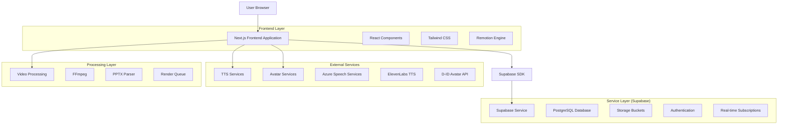
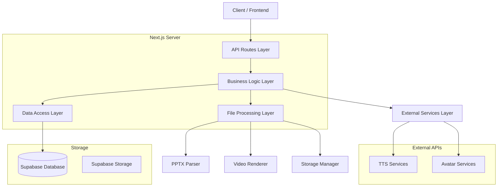
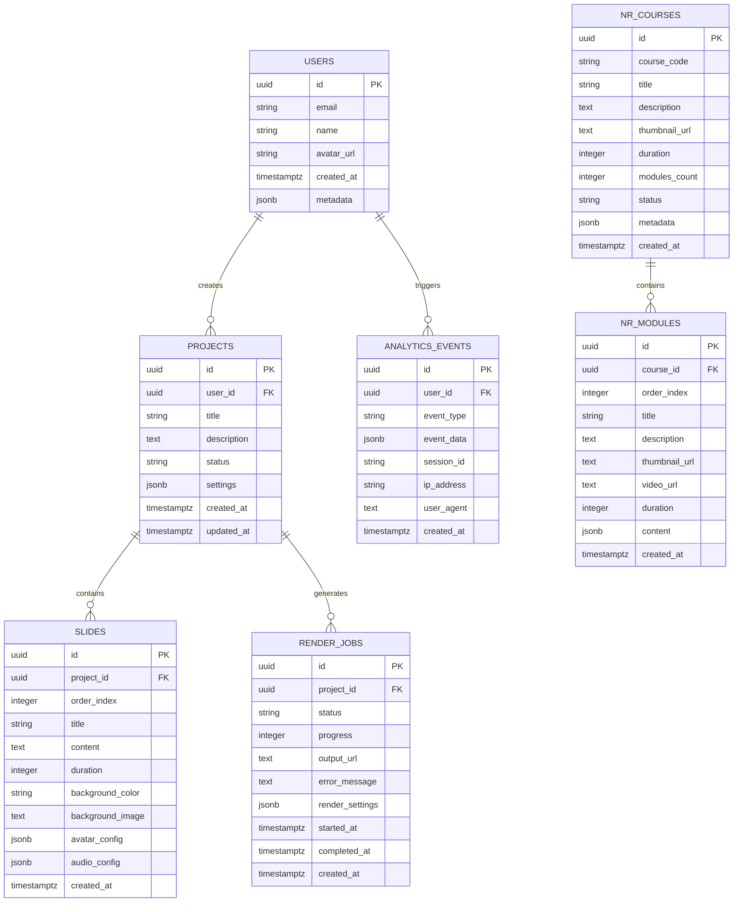

# 🏗️ Documento de Arquitetura Técnica - Sistema de Produção de Vídeos

## 1. Architecture Design



## 2. Technology Description

- **Frontend**: React@18 + Next.js@14 + TypeScript + Tailwind CSS@3 + Remotion@4
- **Backend**: Supabase (PostgreSQL + Storage + Auth + Real-time)
- **Video Processing**: FFmpeg + Remotion + Canvas API
- **TTS Integration**: Azure Speech Services + ElevenLabs API
- **Avatar Integration**: D-ID API (opcional)
- **File Processing**: PPTX.js + Sharp + Multer

## 3. Route Definitions

| Route | Purpose |
|-------|---------|
| `/` | Landing page com overview do sistema e call-to-action |
| `/dashboard` | Dashboard principal com projetos e estatísticas |
| `/upload` | Página de upload e processamento de PPTX |
| `/project/[id]` | Editor de projeto específico com todas as ferramentas |
| `/project/[id]/preview` | Preview completo do vídeo antes da renderização |
| `/library` | Biblioteca de cursos NR e templates prontos |
| `/library/nr-[number]` | Página específica de cada curso NR |
| `/render/[jobId]` | Status de renderização e download |
| `/analytics` | Dashboard de analytics e relatórios |
| `/settings` | Configurações do usuário e preferências |
| `/auth/login` | Página de login com múltiplas opções |
| `/auth/register` | Página de registro de novos usuários |

## 4. API Definitions

### 4.1 Core API

**Autenticação e Usuários**
```
POST /api/auth/login
```

Request:
| Param Name | Param Type | isRequired | Description |
|------------|------------|------------|-------------|
| email | string | true | Email do usuário |
| password | string | true | Senha do usuário |

Response:
| Param Name | Param Type | Description |
|------------|------------|-------------|
| user | object | Dados do usuário autenticado |
| session | object | Token de sessão |

**Upload e Processamento PPTX**
```
POST /api/upload/pptx
```

Request:
| Param Name | Param Type | isRequired | Description |
|------------|------------|------------|-------------|
| file | File | true | Arquivo PPTX para upload |
| projectName | string | false | Nome do projeto |

Response:
| Param Name | Param Type | Description |
|------------|------------|-------------|
| projectId | string | ID único do projeto criado |
| slides | array | Array de slides extraídos |
| metadata | object | Metadados do arquivo |

**Renderização de Vídeo**
```
POST /api/render/start
```

Request:
| Param Name | Param Type | isRequired | Description |
|------------|------------|------------|-------------|
| projectId | string | true | ID do projeto a ser renderizado |
| settings | object | true | Configurações de renderização |

Response:
| Param Name | Param Type | Description |
|------------|------------|-------------|
| jobId | string | ID único do job de renderização |
| estimatedTime | number | Tempo estimado em segundos |

**Text-to-Speech**
```
POST /api/tts/generate
```

Request:
| Param Name | Param Type | isRequired | Description |
|------------|------------|------------|-------------|
| text | string | true | Texto para conversão |
| voice | string | true | ID da voz selecionada |
| provider | string | true | azure ou elevenlabs |

Response:
| Param Name | Param Type | Description |
|------------|------------|-------------|
| audioUrl | string | URL do arquivo de áudio gerado |
| duration | number | Duração do áudio em segundos |

## 5. Server Architecture Diagram



## 6. Data Model

### 6.1 Data Model Definition



### 6.2 Data Definition Language

**Tabela Users**
```sql
CREATE TABLE IF NOT EXISTS public.users (
    id UUID PRIMARY KEY DEFAULT gen_random_uuid(),
    email VARCHAR(255) UNIQUE NOT NULL,
    name VARCHAR(255),
    avatar_url TEXT,
    created_at TIMESTAMPTZ DEFAULT NOW(),
    updated_at TIMESTAMPTZ DEFAULT NOW(),
    metadata JSONB DEFAULT '{}'::jsonb
);

-- RLS Policy
ALTER TABLE public.users ENABLE ROW LEVEL SECURITY;
CREATE POLICY "Users can view own profile" ON public.users
FOR SELECT USING (auth.uid() = id);
CREATE POLICY "Users can update own profile" ON public.users
FOR UPDATE USING (auth.uid() = id);
```

**Tabela Projects**
```sql
CREATE TABLE IF NOT EXISTS public.projects (
    id UUID PRIMARY KEY DEFAULT gen_random_uuid(),
    user_id UUID REFERENCES public.users(id) ON DELETE CASCADE,
    title VARCHAR(500) NOT NULL,
    description TEXT,
    status VARCHAR(50) DEFAULT 'draft',
    settings JSONB DEFAULT '{}'::jsonb,
    created_at TIMESTAMPTZ DEFAULT NOW(),
    updated_at TIMESTAMPTZ DEFAULT NOW()
);

-- RLS Policies
ALTER TABLE public.projects ENABLE ROW LEVEL SECURITY;
CREATE POLICY "Users can view own projects" ON public.projects
FOR SELECT USING (auth.uid() = user_id);
CREATE POLICY "Users can create projects" ON public.projects
FOR INSERT WITH CHECK (auth.uid() = user_id);
CREATE POLICY "Users can update own projects" ON public.projects
FOR UPDATE USING (auth.uid() = user_id);
CREATE POLICY "Users can delete own projects" ON public.projects
FOR DELETE USING (auth.uid() = user_id);
```

**Tabela Slides**
```sql
CREATE TABLE IF NOT EXISTS public.slides (
    id UUID PRIMARY KEY DEFAULT gen_random_uuid(),
    project_id UUID REFERENCES public.projects(id) ON DELETE CASCADE,
    order_index INTEGER NOT NULL,
    title VARCHAR(500),
    content TEXT,
    duration INTEGER DEFAULT 5,
    background_color VARCHAR(50),
    background_image TEXT,
    avatar_config JSONB DEFAULT '{}'::jsonb,
    audio_config JSONB DEFAULT '{}'::jsonb,
    created_at TIMESTAMPTZ DEFAULT NOW(),
    updated_at TIMESTAMPTZ DEFAULT NOW()
);

-- RLS Policy
ALTER TABLE public.slides ENABLE ROW LEVEL SECURITY;
CREATE POLICY "Users can manage slides of own projects" ON public.slides
FOR ALL USING (
    EXISTS (
        SELECT 1 FROM public.projects 
        WHERE projects.id = slides.project_id 
        AND projects.user_id = auth.uid()
    )
);
```

**Tabela Render Jobs**
```sql
CREATE TABLE IF NOT EXISTS public.render_jobs (
    id UUID PRIMARY KEY DEFAULT gen_random_uuid(),
    project_id UUID REFERENCES public.projects(id) ON DELETE CASCADE,
    status VARCHAR(50) DEFAULT 'pending',
    progress INTEGER DEFAULT 0,
    output_url TEXT,
    error_message TEXT,
    render_settings JSONB DEFAULT '{}'::jsonb,
    started_at TIMESTAMPTZ,
    completed_at TIMESTAMPTZ,
    created_at TIMESTAMPTZ DEFAULT NOW()
);

-- RLS Policy
ALTER TABLE public.render_jobs ENABLE ROW LEVEL SECURITY;
CREATE POLICY "Users can view render jobs of own projects" ON public.render_jobs
FOR SELECT USING (
    EXISTS (
        SELECT 1 FROM public.projects 
        WHERE projects.id = render_jobs.project_id 
        AND projects.user_id = auth.uid()
    )
);
```

**Tabela NR Courses**
```sql
CREATE TABLE IF NOT EXISTS public.nr_courses (
    id UUID PRIMARY KEY DEFAULT gen_random_uuid(),
    course_code VARCHAR(10) NOT NULL UNIQUE,
    title VARCHAR(500) NOT NULL,
    description TEXT,
    thumbnail_url TEXT,
    duration INTEGER,
    modules_count INTEGER DEFAULT 0,
    status VARCHAR(50) DEFAULT 'active',
    metadata JSONB DEFAULT '{}'::jsonb,
    created_at TIMESTAMPTZ DEFAULT NOW(),
    updated_at TIMESTAMPTZ DEFAULT NOW()
);

-- RLS Policy (Public Read)
ALTER TABLE public.nr_courses ENABLE ROW LEVEL SECURITY;
CREATE POLICY "Allow public read access" ON public.nr_courses
FOR SELECT USING (true);

-- Dados Iniciais
INSERT INTO public.nr_courses (course_code, title, description, thumbnail_url, duration, modules_count) 
VALUES 
    ('NR-12', 'Segurança no Trabalho em Máquinas e Equipamentos', 'Curso sobre segurança em máquinas e equipamentos conforme NR-12', '/thumbnails/nr12-thumb.jpg', 120, 8),
    ('NR-33', 'Segurança e Saúde nos Trabalhos em Espaços Confinados', 'Curso sobre trabalho em espaços confinados conforme NR-33', '/thumbnails/nr33-thumb.jpg', 90, 6),
    ('NR-35', 'Trabalho em Altura', 'Curso sobre trabalho em altura conforme NR-35', '/thumbnails/nr35-thumb.jpg', 80, 5)
ON CONFLICT (course_code) DO NOTHING;
```

**Índices para Performance**
```sql
CREATE INDEX IF NOT EXISTS idx_projects_user_id ON public.projects(user_id);
CREATE INDEX IF NOT EXISTS idx_slides_project_id ON public.slides(project_id);
CREATE INDEX IF NOT EXISTS idx_render_jobs_project_id ON public.render_jobs(project_id);
CREATE INDEX IF NOT EXISTS idx_analytics_user_id ON public.analytics_events(user_id);
CREATE INDEX IF NOT EXISTS idx_nr_modules_course_id ON public.nr_modules(course_id);
```