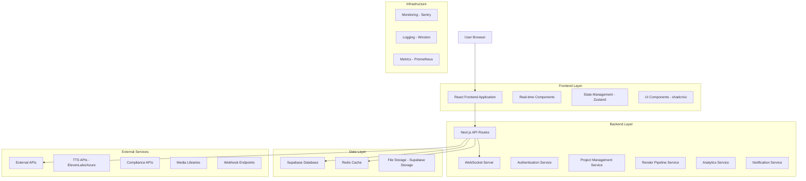
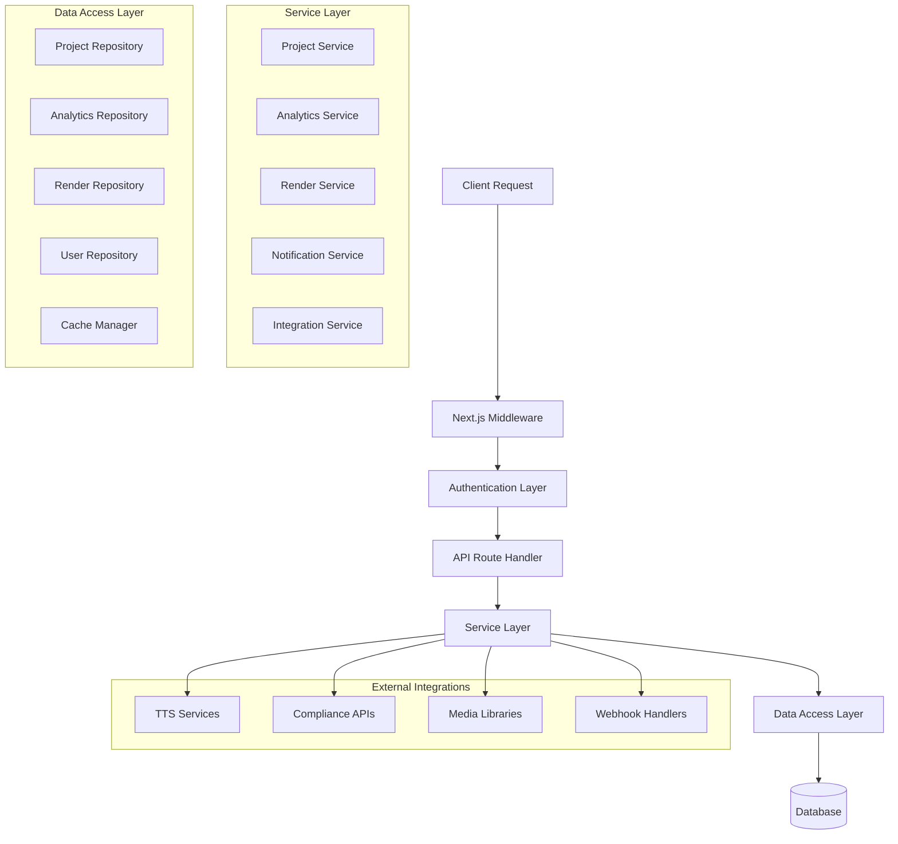
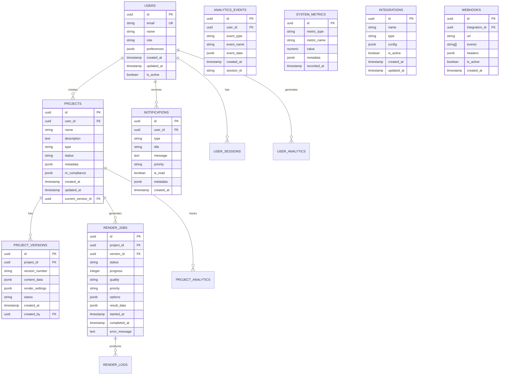

# Dashboard Unificado - Arquitetura Técnica Avançada
## Documento de Arquitetura Técnica

## 1. Architecture Design



## 2. Technology Description

- **Frontend**: React@18 + Next.js@14 + TypeScript + Tailwind CSS + shadcn/ui
- **Backend**: Next.js API Routes + WebSocket Server (ws)
- **Database**: Supabase (PostgreSQL) + Redis Cache
- **Real-time**: WebSocket + Server-Sent Events
- **State Management**: Zustand + React Query
- **Authentication**: NextAuth.js + Supabase Auth
- **File Storage**: Supabase Storage
- **Monitoring**: Sentry + Winston + Custom Metrics
- **Testing**: Jest + React Testing Library + Playwright

## 3. Route Definitions

| Route | Purpose |
|-------|---------|
| `/unified-dashboard` | Dashboard principal com visão geral do sistema |
| `/projects` | Gerenciamento completo de projetos |
| `/projects/[id]` | Detalhes e edição de projeto específico |
| `/projects/[id]/versions` | Histórico de versões do projeto |
| `/analytics` | Dashboard de analytics e métricas |
| `/analytics/performance` | Métricas de performance do sistema |
| `/analytics/users` | Estatísticas de usuários |
| `/notifications` | Centro de notificações |
| `/notifications/settings` | Configurações de notificações |
| `/render-pipeline` | Monitoramento da fila de renderização |
| `/render-pipeline/[jobId]` | Detalhes de job de renderização |
| `/integrations` | Configuração de integrações externas |
| `/integrations/webhooks` | Gerenciamento de webhooks |
| `/settings` | Configurações gerais do sistema |
| `/admin` | Painel administrativo |

## 4. API Definitions

### 4.1 Project Management APIs

**Criar Projeto**
```
POST /api/projects
```

Request:
| Param Name | Param Type | isRequired | Description |
|------------|------------|------------|-------------|
| name | string | true | Nome do projeto |
| description | string | false | Descrição do projeto |
| type | string | true | Tipo: 'pptx', 'video', 'template' |
| nrCompliance | string[] | false | Normas NR aplicáveis |
| metadata | object | false | Metadados adicionais |

Response:
| Param Name | Param Type | Description |
|------------|------------|-------------|
| id | string | ID único do projeto |
| status | string | Status da criação |
| project | object | Dados completos do projeto |

**Listar Projetos**
```
GET /api/projects
```

Query Parameters:
| Param Name | Param Type | Description |
|------------|------------|-------------|
| page | number | Página (default: 1) |
| limit | number | Itens por página (default: 20) |
| status | string | Filtro por status |
| search | string | Busca por nome/descrição |
| sortBy | string | Campo de ordenação |
| sortOrder | string | Ordem: 'asc' ou 'desc' |

**Atualizar Projeto**
```
PUT /api/projects/[id]
```

**Excluir Projeto**
```
DELETE /api/projects/[id]
```

### 4.2 Analytics APIs

**Métricas do Sistema**
```
GET /api/analytics/system-metrics
```

Response:
| Param Name | Param Type | Description |
|------------|------------|-------------|
| cpu | object | Uso de CPU (current, average, peak) |
| memory | object | Uso de memória |
| storage | object | Uso de armazenamento |
| activeUsers | number | Usuários ativos |
| renderQueue | number | Jobs na fila |

**Métricas de Usuário**
```
GET /api/analytics/user-metrics
```

**Estatísticas de Renderização**
```
GET /api/analytics/render-stats
```

### 4.3 Real-time APIs

**WebSocket Connection**
```
WS /api/websocket
```

Message Types:
- `project_update`: Atualizações de projeto
- `render_progress`: Progresso de renderização
- `system_notification`: Notificações do sistema
- `user_activity`: Atividade de usuários

### 4.4 Render Pipeline APIs

**Iniciar Renderização**
```
POST /api/render/start
```

Request:
| Param Name | Param Type | isRequired | Description |
|------------|------------|------------|-------------|
| projectId | string | true | ID do projeto |
| quality | string | true | Qualidade: 'draft', 'standard', 'high' |
| priority | string | false | Prioridade: 'low', 'normal', 'high' |
| options | object | false | Opções de renderização |

**Status da Fila**
```
GET /api/render/queue
```

**Cancelar Job**
```
DELETE /api/render/jobs/[jobId]
```

### 4.5 Notification APIs

**Listar Notificações**
```
GET /api/notifications
```

**Marcar como Lida**
```
PUT /api/notifications/[id]/read
```

**Configurações de Notificação**
```
GET/PUT /api/notifications/settings
```

## 5. Server Architecture Diagram



## 6. Data Model

### 6.1 Data Model Definition



### 6.2 Data Definition Language

**Users Table**
```sql
-- Tabela de usuários
CREATE TABLE users (
    id UUID PRIMARY KEY DEFAULT gen_random_uuid(),
    email VARCHAR(255) UNIQUE NOT NULL,
    name VARCHAR(255) NOT NULL,
    role VARCHAR(50) DEFAULT 'creator' CHECK (role IN ('admin', 'creator', 'reviewer', 'viewer')),
    preferences JSONB DEFAULT '{}',
    created_at TIMESTAMP WITH TIME ZONE DEFAULT NOW(),
    updated_at TIMESTAMP WITH TIME ZONE DEFAULT NOW(),
    is_active BOOLEAN DEFAULT true
);

-- Índices para performance
CREATE INDEX idx_users_email ON users(email);
CREATE INDEX idx_users_role ON users(role);
CREATE INDEX idx_users_active ON users(is_active);
```

**Projects Table**
```sql
-- Tabela de projetos
CREATE TABLE projects (
    id UUID PRIMARY KEY DEFAULT gen_random_uuid(),
    user_id UUID NOT NULL REFERENCES users(id) ON DELETE CASCADE,
    name VARCHAR(255) NOT NULL,
    description TEXT,
    type VARCHAR(50) NOT NULL CHECK (type IN ('pptx', 'video', 'template')),
    status VARCHAR(50) DEFAULT 'draft' CHECK (status IN ('draft', 'in_progress', 'rendering', 'completed', 'archived')),
    metadata JSONB DEFAULT '{}',
    nr_compliance TEXT[] DEFAULT '{}',
    created_at TIMESTAMP WITH TIME ZONE DEFAULT NOW(),
    updated_at TIMESTAMP WITH TIME ZONE DEFAULT NOW(),
    current_version_id UUID
);

-- Índices
CREATE INDEX idx_projects_user_id ON projects(user_id);
CREATE INDEX idx_projects_status ON projects(status);
CREATE INDEX idx_projects_type ON projects(type);
CREATE INDEX idx_projects_created_at ON projects(created_at DESC);
```

**Project Versions Table**
```sql
-- Tabela de versões de projeto
CREATE TABLE project_versions (
    id UUID PRIMARY KEY DEFAULT gen_random_uuid(),
    project_id UUID NOT NULL REFERENCES projects(id) ON DELETE CASCADE,
    version_number VARCHAR(20) NOT NULL,
    content_data JSONB NOT NULL DEFAULT '{}',
    render_settings JSONB DEFAULT '{}',
    status VARCHAR(50) DEFAULT 'draft',
    created_at TIMESTAMP WITH TIME ZONE DEFAULT NOW(),
    created_by UUID NOT NULL REFERENCES users(id)
);

-- Índices
CREATE INDEX idx_project_versions_project_id ON project_versions(project_id);
CREATE INDEX idx_project_versions_created_at ON project_versions(created_at DESC);
CREATE UNIQUE INDEX idx_project_versions_unique ON project_versions(project_id, version_number);
```

**Render Jobs Table**
```sql
-- Tabela de jobs de renderização
CREATE TABLE render_jobs (
    id UUID PRIMARY KEY DEFAULT gen_random_uuid(),
    project_id UUID NOT NULL REFERENCES projects(id) ON DELETE CASCADE,
    version_id UUID NOT NULL REFERENCES project_versions(id),
    status VARCHAR(50) DEFAULT 'queued' CHECK (status IN ('queued', 'processing', 'completed', 'failed', 'cancelled')),
    progress INTEGER DEFAULT 0 CHECK (progress >= 0 AND progress <= 100),
    quality VARCHAR(20) DEFAULT 'standard' CHECK (quality IN ('draft', 'standard', 'high')),
    priority VARCHAR(20) DEFAULT 'normal' CHECK (priority IN ('low', 'normal', 'high')),
    options JSONB DEFAULT '{}',
    result_data JSONB DEFAULT '{}',
    started_at TIMESTAMP WITH TIME ZONE,
    completed_at TIMESTAMP WITH TIME ZONE,
    error_message TEXT,
    created_at TIMESTAMP WITH TIME ZONE DEFAULT NOW()
);

-- Índices
CREATE INDEX idx_render_jobs_project_id ON render_jobs(project_id);
CREATE INDEX idx_render_jobs_status ON render_jobs(status);
CREATE INDEX idx_render_jobs_priority ON render_jobs(priority);
CREATE INDEX idx_render_jobs_created_at ON render_jobs(created_at DESC);
```

**Notifications Table**
```sql
-- Tabela de notificações
CREATE TABLE notifications (
    id UUID PRIMARY KEY DEFAULT gen_random_uuid(),
    user_id UUID NOT NULL REFERENCES users(id) ON DELETE CASCADE,
    type VARCHAR(50) NOT NULL,
    title VARCHAR(255) NOT NULL,
    message TEXT NOT NULL,
    priority VARCHAR(20) DEFAULT 'normal' CHECK (priority IN ('low', 'normal', 'high', 'urgent')),
    is_read BOOLEAN DEFAULT false,
    metadata JSONB DEFAULT '{}',
    created_at TIMESTAMP WITH TIME ZONE DEFAULT NOW()
);

-- Índices
CREATE INDEX idx_notifications_user_id ON notifications(user_id);
CREATE INDEX idx_notifications_is_read ON notifications(is_read);
CREATE INDEX idx_notifications_created_at ON notifications(created_at DESC);
CREATE INDEX idx_notifications_priority ON notifications(priority);
```

**Analytics Events Table**
```sql
-- Tabela de eventos de analytics
CREATE TABLE analytics_events (
    id UUID PRIMARY KEY DEFAULT gen_random_uuid(),
    user_id UUID REFERENCES users(id) ON DELETE SET NULL,
    event_type VARCHAR(50) NOT NULL,
    event_name VARCHAR(100) NOT NULL,
    event_data JSONB DEFAULT '{}',
    session_id VARCHAR(255),
    created_at TIMESTAMP WITH TIME ZONE DEFAULT NOW()
);

-- Índices
CREATE INDEX idx_analytics_events_user_id ON analytics_events(user_id);
CREATE INDEX idx_analytics_events_type ON analytics_events(event_type);
CREATE INDEX idx_analytics_events_created_at ON analytics_events(created_at DESC);
CREATE INDEX idx_analytics_events_session ON analytics_events(session_id);
```

**System Metrics Table**
```sql
-- Tabela de métricas do sistema
CREATE TABLE system_metrics (
    id UUID PRIMARY KEY DEFAULT gen_random_uuid(),
    metric_type VARCHAR(50) NOT NULL,
    metric_name VARCHAR(100) NOT NULL,
    value NUMERIC NOT NULL,
    metadata JSONB DEFAULT '{}',
    recorded_at TIMESTAMP WITH TIME ZONE DEFAULT NOW()
);

-- Índices
CREATE INDEX idx_system_metrics_type ON system_metrics(metric_type);
CREATE INDEX idx_system_metrics_name ON system_metrics(metric_name);
CREATE INDEX idx_system_metrics_recorded_at ON system_metrics(recorded_at DESC);
```

**Integrations and Webhooks Tables**
```sql
-- Tabela de integrações
CREATE TABLE integrations (
    id UUID PRIMARY KEY DEFAULT gen_random_uuid(),
    name VARCHAR(255) NOT NULL,
    type VARCHAR(50) NOT NULL,
    config JSONB NOT NULL DEFAULT '{}',
    is_active BOOLEAN DEFAULT true,
    created_at TIMESTAMP WITH TIME ZONE DEFAULT NOW(),
    updated_at TIMESTAMP WITH TIME ZONE DEFAULT NOW()
);

-- Tabela de webhooks
CREATE TABLE webhooks (
    id UUID PRIMARY KEY DEFAULT gen_random_uuid(),
    integration_id UUID NOT NULL REFERENCES integrations(id) ON DELETE CASCADE,
    url VARCHAR(500) NOT NULL,
    events TEXT[] NOT NULL DEFAULT '{}',
    headers JSONB DEFAULT '{}',
    is_active BOOLEAN DEFAULT true,
    created_at TIMESTAMP WITH TIME ZONE DEFAULT NOW()
);

-- Índices
CREATE INDEX idx_integrations_type ON integrations(type);
CREATE INDEX idx_integrations_active ON integrations(is_active);
CREATE INDEX idx_webhooks_integration_id ON webhooks(integration_id);
CREATE INDEX idx_webhooks_active ON webhooks(is_active);
```

**Row Level Security (RLS) Policies**
```sql
-- Habilitar RLS
ALTER TABLE projects ENABLE ROW LEVEL SECURITY;
ALTER TABLE project_versions ENABLE ROW LEVEL SECURITY;
ALTER TABLE render_jobs ENABLE ROW LEVEL SECURITY;
ALTER TABLE notifications ENABLE ROW LEVEL SECURITY;

-- Políticas para projetos
CREATE POLICY "Users can view own projects" ON projects
    FOR SELECT USING (auth.uid() = user_id);

CREATE POLICY "Users can create own projects" ON projects
    FOR INSERT WITH CHECK (auth.uid() = user_id);

CREATE POLICY "Users can update own projects" ON projects
    FOR UPDATE USING (auth.uid() = user_id);

-- Políticas para notificações
CREATE POLICY "Users can view own notifications" ON notifications
    FOR SELECT USING (auth.uid() = user_id);

-- Grants para roles
GRANT SELECT, INSERT, UPDATE, DELETE ON ALL TABLES IN SCHEMA public TO authenticated;
GRANT SELECT ON ALL TABLES IN SCHEMA public TO anon;
```

## 7. Performance Optimization

### 7.1 Database Optimization
- Índices otimizados para queries frequentes
- Particionamento de tabelas por data
- Connection pooling com PgBouncer
- Query optimization com EXPLAIN ANALYZE

### 7.2 Caching Strategy
- Redis para cache de sessões e dados frequentes
- Cache de queries com React Query
- CDN para assets estáticos
- Service Worker para cache offline

### 7.3 Real-time Optimization
- WebSocket connection pooling
- Message batching para reduzir overhead
- Selective subscriptions por usuário
- Heartbeat para connection health

## 8. Security Implementation

### 8.1 Authentication & Authorization
- JWT tokens com refresh automático
- Role-based access control (RBAC)
- Multi-factor authentication (MFA)
- Session management seguro

### 8.2 Data Protection
- Encryption at rest e in transit
- Input validation e sanitization
- SQL injection prevention
- XSS protection

### 8.3 API Security
- Rate limiting por usuário/IP
- CORS configuration
- API key management
- Webhook signature validation

## 9. Monitoring & Observability

### 9.1 Application Monitoring
- Error tracking com Sentry
- Performance monitoring
- User behavior analytics
- Custom business metrics

### 9.2 Infrastructure Monitoring
- System resource monitoring
- Database performance
- API response times
- WebSocket connection health

### 9.3 Alerting
- Automated alerts para issues críticos
- Escalation policies
- Integration com Slack/Teams
- Custom notification channels