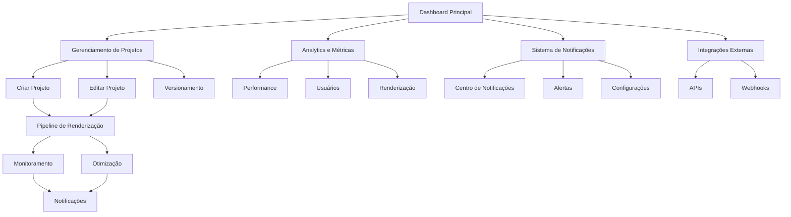

# Dashboard Unificado - Funcionalidades Avançadas
## Documento de Requisitos do Produto (PRD)

## 1. Product Overview

O Dashboard Unificado do Estúdio IA de Vídeos é uma plataforma integrada que centraliza todas as funcionalidades de criação, edição, renderização e gerenciamento de vídeos educacionais com foco em compliance NR (Normas Regulamentadoras). O sistema oferece uma experiência unificada para criadores de conteúdo, permitindo fluxos de trabalho otimizados desde a importação de apresentações PPTX até a exportação final de vídeos com avatares 3D e narração por IA.

- **Objetivo Principal**: Criar uma plataforma completa e integrada para produção de vídeos educacionais de alta qualidade com compliance automático às normas regulamentadoras brasileiras.
- **Público-Alvo**: Empresas de treinamento corporativo, consultores em segurança do trabalho, departamentos de RH e profissionais de educação corporativa.
- **Valor de Mercado**: Redução de 80% no tempo de produção de vídeos educacionais e garantia de 100% de compliance com normas NR.

## 2. Core Features

### 2.1 User Roles

| Role | Registration Method | Core Permissions |
|------|---------------------|------------------|
| Administrador | Convite direto do sistema | Acesso completo ao sistema, gerenciamento de usuários, configurações avançadas |
| Criador de Conteúdo | Registro por email + aprovação | Criação e edição de projetos, acesso a templates, renderização |
| Revisor | Convite de administrador | Revisão de conteúdo, aprovação de projetos, comentários |
| Visualizador | Registro público | Visualização de projetos aprovados, download de vídeos finais |

### 2.2 Feature Module

Nosso sistema de funcionalidades avançadas consiste nas seguintes páginas principais:

1. **Dashboard Principal**: visão geral do sistema, métricas em tempo real, ações rápidas, status de projetos.
2. **Gerenciamento de Projetos**: CRUD completo, versionamento, estados de projeto, metadados avançados.
3. **Analytics e Métricas**: dashboard de performance, estatísticas de uso, monitoramento de recursos.
4. **Sistema de Notificações**: centro de notificações, alertas inteligentes, configurações de preferências.
5. **Pipeline de Renderização**: fila de renderização, monitoramento de progresso, otimização de recursos.
6. **Integrações Externas**: conectores de APIs, webhooks, configurações de serviços externos.

### 2.3 Page Details

| Page Name | Module Name | Feature description |
|-----------|-------------|---------------------|
| Dashboard Principal | Visão Geral | Exibir métricas em tempo real, projetos ativos, status do sistema, ações rápidas de criação |
| Dashboard Principal | Widgets Interativos | Gráficos de performance, estatísticas de uso, alertas de sistema, indicadores de saúde |
| Gerenciamento de Projetos | CRUD de Projetos | Criar, editar, duplicar, excluir projetos com validação completa e controle de permissões |
| Gerenciamento de Projetos | Estados de Projeto | Gerenciar estados (rascunho, em progresso, renderizando, concluído, arquivado) |
| Gerenciamento de Projetos | Versionamento | Sistema de controle de versões com histórico, comparação e rollback |
| Gerenciamento de Projetos | Metadados Avançados | Duração, resolução, templates, tags, compliance score, data de criação/modificação |
| Analytics e Métricas | Dashboard de Performance | CPU, memória, storage, rede, tempo de renderização, throughput |
| Analytics e Métricas | Métricas de Usuário | Tempo de sessão, projetos criados, vídeos renderizados, features mais usadas |
| Analytics e Métricas | Estatísticas de Renderização | Tempo médio, taxa de sucesso, recursos utilizados, fila de espera |
| Sistema de Notificações | Centro de Notificações | Lista unificada de notificações com filtros, busca e ações em lote |
| Sistema de Notificações | Alertas Inteligentes | Notificações baseadas em eventos, prioridades, escalação automática |
| Sistema de Notificações | Configurações | Preferências de notificação, canais de entrega, frequência |
| Pipeline de Renderização | Fila de Renderização | Visualizar fila, prioridades, estimativas de tempo, cancelamento de jobs |
| Pipeline de Renderização | Monitoramento em Tempo Real | Progresso detalhado, logs de renderização, métricas de performance |
| Pipeline de Renderização | Otimização de Recursos | Balanceamento de carga, retry automático, alocação dinâmica |
| Integrações Externas | Conectores de API | Configuração de TTS, bibliotecas de mídia, serviços de compliance |
| Integrações Externas | Webhooks | Configuração de endpoints, eventos, autenticação, logs de entrega |

## 3. Core Process

### Fluxo Principal do Usuário:

**Criador de Conteúdo:**
1. Acessa o Dashboard Principal e visualiza métricas e projetos ativos
2. Cria novo projeto ou seleciona projeto existente
3. Configura metadados do projeto (título, descrição, compliance NR)
4. Importa conteúdo (PPTX, imagens, áudio) ou usa templates
5. Edita conteúdo no editor integrado com preview em tempo real
6. Configura avatar 3D e narração por TTS
7. Inicia renderização e monitora progresso em tempo real
8. Recebe notificações de conclusão e baixa vídeo final
9. Compartilha ou publica vídeo conforme permissões

**Administrador:**
1. Monitora sistema através do dashboard de analytics
2. Gerencia usuários, permissões e configurações
3. Configura integrações externas e webhooks
4. Monitora performance e otimiza recursos
5. Revisa logs de sistema e resolve problemas

## 4. User Interface Design

### 4.1 Design Style

- **Cores Primárias**: Azul (#2563eb), Verde (#16a34a), Cinza (#64748b)
- **Cores Secundárias**: Laranja (#ea580c), Vermelho (#dc2626), Roxo (#7c3aed)
- **Estilo de Botões**: Rounded corners (8px), gradientes sutis, estados hover/active
- **Fontes**: Inter (títulos), Source Sans Pro (corpo), tamanhos 12px-32px
- **Layout**: Grid responsivo, sidebar fixa, cards com sombras sutis, navegação top
- **Ícones**: Lucide React, estilo outline, tamanho 16px-24px, cores consistentes

### 4.2 Page Design Overview

| Page Name | Module Name | UI Elements |
|-----------|-------------|-------------|
| Dashboard Principal | Visão Geral | Grid 4 colunas com cards de métricas, gráficos interativos, cores de status (verde/amarelo/vermelho) |
| Dashboard Principal | Widgets | Charts.js para gráficos, progress bars animadas, badges de status, tooltips informativos |
| Gerenciamento de Projetos | Lista de Projetos | Tabela responsiva, filtros avançados, ações em lote, modal de criação/edição |
| Gerenciamento de Projetos | Detalhes do Projeto | Layout em abas, formulários validados, preview de conteúdo, histórico de versões |
| Analytics e Métricas | Dashboard | Grid flexível, gráficos em tempo real, filtros de data, export de dados |
| Sistema de Notificações | Centro | Lista infinita, badges de prioridade, ações rápidas, busca em tempo real |
| Pipeline de Renderização | Fila | Lista com progress bars, estimativas de tempo, ações de controle |
| Integrações Externas | Configurações | Formulários de configuração, teste de conexão, logs de atividade |

### 4.3 Responsiveness

O sistema é **desktop-first** com adaptação completa para mobile e tablet. Inclui otimização para touch interaction, navegação por gestos e layouts adaptativos. Breakpoints: 768px (tablet), 1024px (desktop), 1440px (large desktop).

## 5. Technical Requirements

### 5.1 Performance Requirements

- **Tempo de carregamento**: < 2 segundos para dashboard principal
- **Tempo de resposta**: < 500ms para operações CRUD
- **Renderização em tempo real**: Updates a cada 100ms
- **Capacidade**: Suporte a 100 usuários simultâneos
- **Disponibilidade**: 99.9% uptime

### 5.2 Security Requirements

- **Autenticação**: JWT tokens com refresh automático
- **Autorização**: RBAC (Role-Based Access Control)
- **Criptografia**: TLS 1.3 para todas as comunicações
- **Auditoria**: Log completo de todas as ações
- **Compliance**: LGPD e ISO 27001

### 5.3 Integration Requirements

- **APIs Externas**: TTS (ElevenLabs, Azure), Compliance (NR APIs)
- **Webhooks**: Suporte a eventos customizados
- **Real-time**: WebSocket para updates instantâneos
- **Storage**: Supabase para dados, S3 para arquivos
- **Monitoring**: Métricas customizadas e alertas

## 6. Success Metrics

### 6.1 User Experience Metrics

- **Time to First Value**: < 5 minutos para criar primeiro projeto
- **Task Completion Rate**: > 95% para fluxos principais
- **User Satisfaction**: NPS > 8.0
- **Feature Adoption**: > 80% para funcionalidades core

### 6.2 Technical Metrics

- **System Performance**: < 2s load time, < 500ms response
- **Render Success Rate**: > 98%
- **Error Rate**: < 1%
- **Resource Utilization**: < 80% CPU/Memory average

### 6.3 Business Metrics

- **User Retention**: > 85% monthly active users
- **Project Completion**: > 90% de projetos finalizados
- **Compliance Score**: 100% para normas NR
- **Cost Efficiency**: 50% redução em tempo de produção