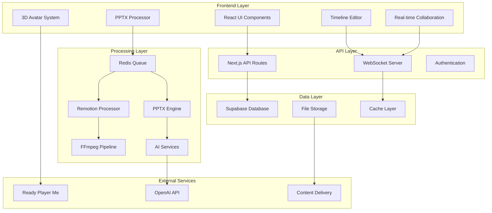

# Especificações Técnicas Detalhadas - Editor de Vídeo e Módulo PPTX

## 1. Visão Geral da Arquitetura

### 1.1 Arquitetura de Alto Nível



### 1.2 Stack Tecnológico Detalhado

| Categoria | Tecnologia | Versão | Propósito |
|-----------|------------|--------|-----------|
| **Frontend Framework** | Next.js | 14.0+ | SSR, API Routes, Otimização |
| **UI Library** | React | 18.0+ | Interface de usuário |
| **Language** | TypeScript | 5.0+ | Type safety |
| **Styling** | Tailwind CSS | 3.3+ | Utility-first CSS |
| **Animation** | Framer Motion | 10.0+ | Animações fluidas |
| **3D Graphics** | React Three Fiber | 8.0+ | Renderização 3D |
| **Video Engine** | Remotion | 4.0+ | Composição de vídeo |
| **Timeline** | Motionity | Custom | Editor timeline |
| **PPTX Processing** | PptxGenJS | 3.12+ | Geração PPTX |
| **Python PPTX** | python-pptx | 0.6+ | Processamento avançado |
| **Database** | Supabase | Latest | PostgreSQL + Auth |
| **Real-time** | Liveblocks | 1.0+ | Colaboração tempo real |
| **Queue System** | BullMQ | 4.0+ | Job processing |
| **Cache** | Redis | 7.0+ | Cache e sessões |
| **File Processing** | FFmpeg | 6.0+ | Processamento de mídia |
| **AI Integration** | OpenAI API | v1 | Geração de conteúdo |
| **Avatar System** | Ready Player Me | v1 | Avatares 3D |
| **Testing** | Jest + Playwright | Latest | Testes automatizados |
| **Monitoring** | Sentry + PostHog | Latest | Observabilidade |

## 2. Estrutura de Componentes Frontend

### 2.1 Hierarquia de Componentes

```
src/
├── components/
│   ├── ui/                     # Componentes base
│   │   ├── Button.tsx
│   │   ├── Input.tsx
│   │   ├── Modal.tsx
│   │   └── Tooltip.tsx
│   ├── timeline/               # Editor de timeline
│   │   ├── TimelineEditor.tsx
│   │   ├── Track.tsx
│   │   ├── Clip.tsx
│   │   ├── Playhead.tsx
│   │   └── Controls.tsx
│   ├── pptx/                   # Sistema PPTX
│   │   ├── PPTXUploader.tsx
│   │   ├── SlidePreview.tsx
│   │   ├── TemplateSelector.tsx
│   │   └── ConversionStatus.tsx
│   ├── render/                 # Sistema de renderização
│   │   ├── RenderQueue.tsx
│   │   ├── ProgressBar.tsx
│   │   ├── QualitySelector.tsx
│   │   └── OutputPreview.tsx
│   ├── avatar/                 # Sistema 3D
│   │   ├── AvatarSelector.tsx
│   │   ├── Scene3D.tsx
│   │   ├── AnimationControls.tsx
│   │   └── CustomizationPanel.tsx
│   └── collaboration/          # Colaboração
│       ├── UserCursors.tsx
│       ├── ChatPanel.tsx
│       ├── VersionHistory.tsx
│       └── ShareDialog.tsx
├── hooks/                      # Custom hooks
│   ├── useTimeline.ts
│   ├── usePPTX.ts
│   ├── useRender.ts
│   ├── useCollaboration.ts
│   └── useWebSocket.ts
├── lib/                        # Utilitários
│   ├── timeline.ts
│   ├── pptx-processor.ts
│   ├── render-engine.ts
│   ├── avatar-system.ts
│   └── collaboration.ts
└── types/                      # Definições TypeScript
    ├── timeline.ts
    ├── pptx.ts
    ├── render.ts
    └── collaboration.ts
```

### 2.2 Componente Timeline Editor

```typescript
// components/timeline/TimelineEditor.tsx
import React, { useCallback, useEffect, useRef } from 'react';
import { DndContext, DragEndEvent } from '@dnd-kit/core';
import { useTimeline } from '@/hooks/useTimeline';
import { Track } from './Track';
import { Playhead } from './Playhead';
import { Controls } from './Controls';

interface TimelineEditorProps {
  projectId: string;
  onTimelineUpdate?: (timeline: Timeline) => void;
}

export const TimelineEditor: React.FC<TimelineEditorProps> = ({
  projectId,
  onTimelineUpdate
}) => {
  const timelineRef = useRef<HTMLDivElement>(null);
  const {
    timeline,
    currentTime,
    isPlaying,
    updateTimeline,
    play,
    pause,
    seek
  } = useTimeline(projectId);

  const handleDragEnd = useCallback((event: DragEndEvent) => {
    const { active, over } = event;
    
    if (!over) return;
    
    const clipId = active.id as string;
    const targetTrackId = over.id as string;
    const dropPosition = calculateDropPosition(event);
    
    updateTimeline({
      type: 'MOVE_CLIP',
      payload: {
        clipId,
        targetTrackId,
        startTime: dropPosition
      }
    });
  }, [updateTimeline]);

  const handleKeyboardShortcuts = useCallback((event: KeyboardEvent) => {
    switch (event.code) {
      case 'Space':
        event.preventDefault();
        isPlaying ? pause() : play();
        break;
      case 'ArrowLeft':
        seek(Math.max(0, currentTime - 0.1));
        break;
      case 'ArrowRight':
        seek(currentTime + 0.1);
        break;
    }
  }, [isPlaying, currentTime, play, pause, seek]);

  useEffect(() => {
    document.addEventListener('keydown', handleKeyboardShortcuts);
    return () => document.removeEventListener('keydown', handleKeyboardShortcuts);
  }, [handleKeyboardShortcuts]);

  useEffect(() => {
    onTimelineUpdate?.(timeline);
  }, [timeline, onTimelineUpdate]);

  return (
    <div className="timeline-editor" ref={timelineRef}>
      <Controls
        isPlaying={isPlaying}
        currentTime={currentTime}
        duration={timeline.duration}
        onPlay={play}
        onPause={pause}
        onSeek={seek}
      />
      
      <DndContext onDragEnd={handleDragEnd}>
        <div className="timeline-container">
          <Playhead 
            currentTime={currentTime}
            duration={timeline.duration}
            onSeek={seek}
          />
          
          {timeline.tracks.map((track) => (
            <Track
              key={track.id}
              track={track}
              currentTime={currentTime}
              onClipUpdate={(clipId, updates) => 
                updateTimeline({
                  type: 'UPDATE_CLIP',
                  payload: { trackId: track.id, clipId, updates }
                })
              }
            />
          ))}
        </div>
      </DndContext>
    </div>
  );
};

function calculateDropPosition(event: DragEndEvent): number {
  // Implementação do cálculo de posição baseado na posição do mouse
  const rect = event.over?.rect;
  if (!rect) return 0;
  
  const pixelsPerSecond = 100; // Configurável
  return (event.activatorEvent.clientX - rect.left) / pixelsPerSecond;
}
```

### 2.3 Sistema PPTX Processor

```typescript
// lib/pptx-processor.ts
import PptxGenJS from 'pptxgenjs';
import { createWorker } from 'tesseract.js';

export interface PPTXSlide {
  id: string;
  title: string;
  content: string;
  imageUrl?: string;
  duration: number;
  transition: TransitionType;
  animations: Animation[];
}

export interface PPTXProcessingResult {
  id: string;
  slides: PPTXSlide[];
  metadata: {
    totalSlides: number;
    estimatedDuration: number;
    hasAnimations: boolean;
    hasAudio: boolean;
  };
  status: 'processing' | 'completed' | 'error';
}

export class PPTXProcessor {
  private worker: Tesseract.Worker | null = null;

  async initialize(): Promise<void> {
    this.worker = await createWorker('por'); // Português
  }

  async processFile(file: File): Promise<PPTXProcessingResult> {
    try {
      // Validação inicial
      await this.validateFile(file);
      
      // Extração de conteúdo
      const slides = await this.extractSlides(file);
      
      // Processamento de texto (OCR se necessário)
      const processedSlides = await this.processSlideContent(slides);
      
      // Geração de metadados
      const metadata = this.generateMetadata(processedSlides);
      
      return {
        id: generateId(),
        slides: processedSlides,
        metadata,
        status: 'completed'
      };
    } catch (error) {
      throw new PPTXProcessingError(`Failed to process PPTX: ${error.message}`);
    }
  }

  private async validateFile(file: File): Promise<void> {
    // Verificação de tipo MIME
    const validTypes = [
      'application/vnd.openxmlformats-officedocument.presentationml.presentation',
      'application/vnd.ms-powerpoint'
    ];
    
    if (!validTypes.includes(file.type)) {
      throw new Error('Invalid file type. Only PPTX files are supported.');
    }
    
    // Verificação de tamanho (max 100MB)
    if (file.size > 100 * 1024 * 1024) {
      throw new Error('File too large. Maximum size is 100MB.');
    }
    
    // Scan de segurança básico
    await this.scanForMaliciousContent(file);
  }

  private async extractSlides(file: File): Promise<PPTXSlide[]> {
    const arrayBuffer = await file.arrayBuffer();
    const pptx = new PptxGenJS();
    
    // Carregamento do arquivo PPTX
    await pptx.load(arrayBuffer);
    
    const slides: PPTXSlide[] = [];
    const slideCount = pptx.slides.length;
    
    for (let i = 0; i < slideCount; i++) {
      const slide = pptx.slides[i];
      
      // Extração de texto
      const textContent = this.extractTextFromSlide(slide);
      
      // Extração de imagens
      const images = await this.extractImagesFromSlide(slide);
      
      // Detecção de animações
      const animations = this.extractAnimations(slide);
      
      slides.push({
        id: `slide-${i + 1}`,
        title: this.extractSlideTitle(textContent),
        content: textContent,
        imageUrl: images[0]?.url,
        duration: this.calculateSlideDuration(textContent, animations),
        transition: this.detectTransition(slide),
        animations
      });
    }
    
    return slides;
  }

  private async processSlideContent(slides: PPTXSlide[]): Promise<PPTXSlide[]> {
    if (!this.worker) {
      await this.initialize();
    }
    
    return Promise.all(slides.map(async (slide) => {
      // OCR para imagens com texto
      if (slide.imageUrl && this.hasTextInImage(slide.imageUrl)) {
        const ocrResult = await this.worker!.recognize(slide.imageUrl);
        slide.content += `\n${ocrResult.data.text}`;
      }
      
      // Processamento de IA para melhorar conteúdo
      slide.content = await this.enhanceContentWithAI(slide.content);
      
      return slide;
    }));
  }

  private calculateSlideDuration(content: string, animations: Animation[]): number {
    // Cálculo baseado em palavras por minuto (150 WPM)
    const wordCount = content.split(' ').length;
    const readingTime = (wordCount / 150) * 60; // segundos
    
    // Adicionar tempo para animações
    const animationTime = animations.reduce((total, anim) => total + anim.duration, 0);
    
    // Tempo mínimo de 3 segundos por slide
    return Math.max(3, readingTime + animationTime);
  }

  private async enhanceContentWithAI(content: string): Promise<string> {
    try {
      const response = await fetch('/api/ai/enhance-content', {
        method: 'POST',
        headers: { 'Content-Type': 'application/json' },
        body: JSON.stringify({ content })
      });
      
      const result = await response.json();
      return result.enhancedContent || content;
    } catch (error) {
      console.warn('AI enhancement failed, using original content');
      return content;
    }
  }

  async generateVideoFrames(slides: PPTXSlide[]): Promise<VideoFrame[]> {
    const frames: VideoFrame[] = [];
    
    for (const slide of slides) {
      // Geração de frame base
      const baseFrame = await this.createSlideFrame(slide);
      
      // Aplicação de animações
      const animatedFrames = await this.applyAnimations(baseFrame, slide.animations);
      
      frames.push(...animatedFrames);
    }
    
    return frames;
  }

  private async createSlideFrame(slide: PPTXSlide): Promise<VideoFrame> {
    // Criação de canvas para renderização
    const canvas = document.createElement('canvas');
    canvas.width = 1920;
    canvas.height = 1080;
    const ctx = canvas.getContext('2d')!;
    
    // Background
    ctx.fillStyle = '#ffffff';
    ctx.fillRect(0, 0, canvas.width, canvas.height);
    
    // Título
    ctx.font = 'bold 48px Arial';
    ctx.fillStyle = '#333333';
    ctx.fillText(slide.title, 100, 150);
    
    // Conteúdo
    ctx.font = '32px Arial';
    const lines = this.wrapText(ctx, slide.content, canvas.width - 200);
    lines.forEach((line, index) => {
      ctx.fillText(line, 100, 250 + (index * 50));
    });
    
    // Imagem (se houver)
    if (slide.imageUrl) {
      const img = await this.loadImage(slide.imageUrl);
      ctx.drawImage(img, canvas.width - 500, 200, 400, 300);
    }
    
    return {
      canvas,
      duration: slide.duration,
      timestamp: 0
    };
  }

  dispose(): void {
    if (this.worker) {
      this.worker.terminate();
      this.worker = null;
    }
  }
}
```

## 3. Sistema de Renderização Remotion

### 3.1 Composição Principal

```typescript
// src/remotion/VideoComposition.tsx
import React from 'react';
import { Composition, Folder } from 'remotion';
import { MainVideo } from './MainVideo';
import { SlideSequence } from './SlideSequence';
import { AvatarScene } from './AvatarScene';

export const RemotionRoot: React.FC = () => {
  return (
    <>
      <Folder name="Main Compositions">
        <Composition
          id="MainVideo"
          component={MainVideo}
          durationInFrames={3000} // 100 segundos a 30fps
          fps={30}
          width={1920}
          height={1080}
          defaultProps={{
            timeline: null,
            settings: {
              quality: 'high',
              format: 'mp4',
              codec: 'h264'
            }
          }}
        />
      </Folder>
      
      <Folder name="Slide Templates">
        <Composition
          id="SlideSequence"
          component={SlideSequence}
          durationInFrames={900} // 30 segundos
          fps={30}
          width={1920}
          height={1080}
        />
      </Folder>
      
      <Folder name="3D Scenes">
        <Composition
          id="AvatarScene"
          component={AvatarScene}
          durationInFrames={600} // 20 segundos
          fps={30}
          width={1920}
          height={1080}
        />
      </Folder>
    </>
  );
};
```

### 3.2 Componente Principal de Vídeo

```typescript
// src/remotion/MainVideo.tsx
import React from 'react';
import { useCurrentFrame, useVideoConfig, Sequence } from 'remotion';
import { Timeline, TimelineTrack } from '@/types/timeline';
import { SlideRenderer } from './SlideRenderer';
import { AudioTrack } from './AudioTrack';
import { TextOverlay } from './TextOverlay';
import { TransitionEffect } from './TransitionEffect';

interface MainVideoProps {
  timeline: Timeline;
  settings: RenderSettings;
}

export const MainVideo: React.FC<MainVideoProps> = ({ timeline, settings }) => {
  const frame = useCurrentFrame();
  const { fps } = useVideoConfig();
  
  const currentTime = frame / fps;
  
  return (
    <div style={{ width: '100%', height: '100%', position: 'relative' }}>
      {timeline.tracks.map((track, index) => (
        <TrackRenderer
          key={track.id}
          track={track}
          currentTime={currentTime}
          zIndex={timeline.tracks.length - index}
        />
      ))}
    </div>
  );
};

const TrackRenderer: React.FC<{
  track: TimelineTrack;
  currentTime: number;
  zIndex: number;
}> = ({ track, currentTime, zIndex }) => {
  return (
    <div style={{ position: 'absolute', zIndex }}>
      {track.clips.map((clip) => {
        const clipStartFrame = clip.startTime * 30; // fps
        const clipDurationFrames = clip.duration * 30;
        
        if (currentTime < clip.startTime || currentTime > clip.startTime + clip.duration) {
          return null;
        }
        
        return (
          <Sequence
            key={clip.id}
            from={clipStartFrame}
            durationInFrames={clipDurationFrames}
          >
            <ClipRenderer clip={clip} />
          </Sequence>
        );
      })}
    </div>
  );
};

const ClipRenderer: React.FC<{ clip: TimelineClip }> = ({ clip }) => {
  switch (clip.type) {
    case 'pptx-slide':
      return <SlideRenderer slide={clip.data} />;
    case 'video':
      return <VideoClip src={clip.src} />;
    case 'audio':
      return <AudioTrack src={clip.src} />;
    case 'text':
      return <TextOverlay text={clip.text} style={clip.style} />;
    case 'avatar':
      return <AvatarRenderer config={clip.avatarConfig} />;
    default:
      return null;
  }
};
```

### 3.3 Renderizador de Slides

```typescript
// src/remotion/SlideRenderer.tsx
import React from 'react';
import { useCurrentFrame, interpolate, spring, useVideoConfig } from 'remotion';
import { PPTXSlide } from '@/types/pptx';

interface SlideRendererProps {
  slide: PPTXSlide;
}

export const SlideRenderer: React.FC<SlideRendererProps> = ({ slide }) => {
  const frame = useCurrentFrame();
  const { fps } = useVideoConfig();
  
  // Animação de entrada
  const slideIn = spring({
    frame,
    fps,
    config: {
      damping: 200,
      stiffness: 100,
      mass: 0.5,
    },
  });
  
  // Animação de texto
  const textOpacity = interpolate(
    frame,
    [0, 30, 60],
    [0, 0, 1],
    { extrapolateRight: 'clamp' }
  );
  
  return (
    <div
      style={{
        width: '100%',
        height: '100%',
        background: slide.background || '#ffffff',
        transform: `translateX(${(1 - slideIn) * 100}%)`,
        display: 'flex',
        flexDirection: 'column',
        padding: '80px',
      }}
    >
      {/* Título */}
      <h1
        style={{
          fontSize: '64px',
          fontWeight: 'bold',
          color: slide.titleColor || '#333333',
          marginBottom: '40px',
          opacity: textOpacity,
        }}
      >
        {slide.title}
      </h1>
      
      {/* Conteúdo */}
      <div
        style={{
          fontSize: '36px',
          color: slide.textColor || '#666666',
          lineHeight: 1.6,
          opacity: textOpacity,
          flex: 1,
        }}
      >
        {slide.content.split('\n').map((line, index) => (
          <p key={index} style={{ marginBottom: '20px' }}>
            {line}
          </p>
        ))}
      </div>
      
      {/* Imagem */}
      {slide.imageUrl && (
        <div
          style={{
            position: 'absolute',
            right: '80px',
            top: '50%',
            transform: 'translateY(-50%)',
            width: '400px',
            height: '300px',
            backgroundImage: `url(${slide.imageUrl})`,
            backgroundSize: 'cover',
            backgroundPosition: 'center',
            borderRadius: '12px',
            opacity: slideIn,
          }}
        />
      )}
      
      {/* Animações personalizadas */}
      {slide.animations.map((animation, index) => (
        <AnimationRenderer
          key={index}
          animation={animation}
          frame={frame}
          fps={fps}
        />
      ))}
    </div>
  );
};

const AnimationRenderer: React.FC<{
  animation: Animation;
  frame: number;
  fps: number;
}> = ({ animation, frame, fps }) => {
  const startFrame = animation.startTime * fps;
  const endFrame = startFrame + (animation.duration * fps);
  
  if (frame < startFrame || frame > endFrame) {
    return null;
  }
  
  const progress = (frame - startFrame) / (endFrame - startFrame);
  
  switch (animation.type) {
    case 'fadeIn':
      return (
        <div
          style={{
            position: 'absolute',
            ...animation.target,
            opacity: progress,
          }}
        >
          {animation.content}
        </div>
      );
    case 'slideIn':
      return (
        <div
          style={{
            position: 'absolute',
            ...animation.target,
            transform: `translateX(${(1 - progress) * 100}%)`,
          }}
        >
          {animation.content}
        </div>
      );
    default:
      return null;
  }
};
```

## 4. Sistema de Colaboração Tempo Real

### 4.1 Configuração Liveblocks

```typescript
// lib/liveblocks.ts
import { createClient } from '@liveblocks/client';
import { createRoomContext } from '@liveblocks/react';

const client = createClient({
  authEndpoint: '/api/liveblocks-auth',
  throttle: 16, // 60fps
});

type Presence = {
  cursor: { x: number; y: number } | null;
  selection: string | null;
  user: {
    id: string;
    name: string;
    avatar: string;
    color: string;
  };
};

type Storage = {
  timeline: Timeline;
  version: number;
  lastModified: string;
};

type UserMeta = {
  id: string;
  info: {
    name: string;
    avatar: string;
    color: string;
  };
};

type RoomEvent = {
  type: 'TIMELINE_UPDATE' | 'CURSOR_MOVE' | 'SELECTION_CHANGE';
  data: any;
};

export const {
  RoomProvider,
  useRoom,
  useMyPresence,
  useOthers,
  useMutation,
  useStorage,
  useBroadcastEvent,
  useEventListener,
} = createRoomContext<Presence, Storage, UserMeta, RoomEvent>(client);
```

### 4.2 Hook de Colaboração

```typescript
// hooks/useCollaboration.ts
import { useCallback, useEffect } from 'react';
import {
  useMyPresence,
  useOthers,
  useMutation,
  useStorage,
  useBroadcastEvent,
  useEventListener,
} from '@/lib/liveblocks';

export function useCollaboration(projectId: string) {
  const [myPresence, updateMyPresence] = useMyPresence();
  const others = useOthers();
  const timeline = useStorage((root) => root.timeline);
  const broadcastEvent = useBroadcastEvent();

  // Atualizar cursor
  const updateCursor = useCallback((cursor: { x: number; y: number } | null) => {
    updateMyPresence({ cursor });
  }, [updateMyPresence]);

  // Atualizar seleção
  const updateSelection = useCallback((selection: string | null) => {
    updateMyPresence({ selection });
  }, [updateMyPresence]);

  // Atualizar timeline
  const updateTimeline = useMutation(({ storage }, update: TimelineUpdate) => {
    const timeline = storage.get('timeline');
    
    switch (update.type) {
      case 'ADD_CLIP':
        const track = timeline.tracks.find(t => t.id === update.payload.trackId);
        if (track) {
          track.clips.push(update.payload.clip);
        }
        break;
        
      case 'MOVE_CLIP':
        // Implementar lógica de movimentação
        break;
        
      case 'UPDATE_CLIP':
        // Implementar lógica de atualização
        break;
    }
    
    storage.set('lastModified', new Date().toISOString());
    storage.set('version', storage.get('version') + 1);
  }, []);

  // Broadcast de eventos
  const broadcastTimelineUpdate = useCallback((update: TimelineUpdate) => {
    broadcastEvent({
      type: 'TIMELINE_UPDATE',
      data: update,
    });
  }, [broadcastEvent]);

  // Escutar eventos
  useEventListener(({ event }) => {
    switch (event.type) {
      case 'TIMELINE_UPDATE':
        // Processar atualização recebida
        console.log('Timeline updated by another user:', event.data);
        break;
    }
  });

  // Detectar conflitos
  const hasConflicts = useCallback(() => {
    const mySelection = myPresence.selection;
    return others.some(other => 
      other.presence.selection === mySelection && mySelection !== null
    );
  }, [myPresence.selection, others]);

  return {
    myPresence,
    others: others.map(other => other.presence),
    timeline,
    updateCursor,
    updateSelection,
    updateTimeline,
    broadcastTimelineUpdate,
    hasConflicts: hasConflicts(),
  };
}
```

## 5. Sistema de Filas e Processamento

### 5.1 Configuração BullMQ

```typescript
// lib/queue.ts
import { Queue, Worker, Job } from 'bullmq';
import Redis from 'ioredis';

const redis = new Redis(process.env.REDIS_URL!);

// Filas especializadas
export const renderQueue = new Queue('render', { connection: redis });
export const pptxQueue = new Queue('pptx-processing', { connection: redis });
export const aiQueue = new Queue('ai-processing', { connection: redis });

// Tipos de jobs
export interface RenderJobData {
  projectId: string;
  timelineData: Timeline;
  settings: RenderSettings;
  userId: string;
}

export interface PPTXJobData {
  fileId: string;
  filePath: string;
  projectId: string;
  userId: string;
}

export interface AIJobData {
  type: 'enhance-content' | 'generate-script' | 'create-avatar';
  input: any;
  userId: string;
}

// Workers
export const renderWorker = new Worker('render', async (job: Job<RenderJobData>) => {
  const { projectId, timelineData, settings, userId } = job.data;
  
  try {
    // Atualizar progresso
    await job.updateProgress(10);
    
    // Preparar composição Remotion
    const composition = await prepareRemotionComposition(timelineData);
    await job.updateProgress(30);
    
    // Renderizar vídeo
    const outputPath = await renderVideo(composition, settings);
    await job.updateProgress(80);
    
    // Upload para storage
    const finalUrl = await uploadToStorage(outputPath, projectId);
    await job.updateProgress(100);
    
    // Notificar usuário
    await notifyUser(userId, {
      type: 'render-completed',
      projectId,
      videoUrl: finalUrl,
    });
    
    return { success: true, videoUrl: finalUrl };
  } catch (error) {
    await notifyUser(userId, {
      type: 'render-failed',
      projectId,
      error: error.message,
    });
    throw error;
  }
}, { connection: redis });

export const pptxWorker = new Worker('pptx-processing', async (job: Job<PPTXJobData>) => {
  const { fileId, filePath, projectId, userId } = job.data;
  
  try {
    await job.updateProgress(10);
    
    // Processar arquivo PPTX
    const processor = new PPTXProcessor();
    await processor.initialize();
    
    const file = await loadFileFromPath(filePath);
    await job.updateProgress(30);
    
    const result = await processor.processFile(file);
    await job.updateProgress(70);
    
    // Salvar resultado no banco
    await savePPTXResult(fileId, result);
    await job.updateProgress(90);
    
    // Gerar frames de vídeo
    const frames = await processor.generateVideoFrames(result.slides);
    await saveVideoFrames(fileId, frames);
    await job.updateProgress(100);
    
    processor.dispose();
    
    await notifyUser(userId, {
      type: 'pptx-processed',
      fileId,
      result,
    });
    
    return { success: true, result };
  } catch (error) {
    await notifyUser(userId, {
      type: 'pptx-failed',
      fileId,
      error: error.message,
    });
    throw error;
  }
}, { connection: redis });
```

### 5.2 API de Jobs

```typescript
// app/api/jobs/render/route.ts
import { NextRequest, NextResponse } from 'next/server';
import { renderQueue } from '@/lib/queue';
import { getUser } from '@/lib/auth';

export async function POST(request: NextRequest) {
  try {
    const user = await getUser(request);
    if (!user) {
      return NextResponse.json({ error: 'Unauthorized' }, { status: 401 });
    }
    
    const { projectId, settings } = await request.json();
    
    // Buscar dados do projeto
    const project = await getProject(projectId, user.id);
    if (!project) {
      return NextResponse.json({ error: 'Project not found' }, { status: 404 });
    }
    
    // Validar configurações de render
    const validatedSettings = validateRenderSettings(settings);
    
    // Adicionar job à fila
    const job = await renderQueue.add('render-video', {
      projectId,
      timelineData: project.timeline,
      settings: validatedSettings,
      userId: user.id,
    }, {
      priority: user.plan === 'premium' ? 10 : 5,
      attempts: 3,
      backoff: {
        type: 'exponential',
        delay: 2000,
      },
    });
    
    return NextResponse.json({
      jobId: job.id,
      status: 'queued',
      estimatedTime: calculateEstimatedTime(project.timeline, validatedSettings),
    });
  } catch (error) {
    console.error('Render job creation failed:', error);
    return NextResponse.json(
      { error: 'Failed to start render job' },
      { status: 500 }
    );
  }
}

export async function GET(request: NextRequest) {
  try {
    const user = await getUser(request);
    if (!user) {
      return NextResponse.json({ error: 'Unauthorized' }, { status: 401 });
    }
    
    const { searchParams } = new URL(request.url);
    const jobId = searchParams.get('jobId');
    
    if (!jobId) {
      return NextResponse.json({ error: 'Job ID required' }, { status: 400 });
    }
    
    const job = await renderQueue.getJob(jobId);
    if (!job) {
      return NextResponse.json({ error: 'Job not found' }, { status: 404 });
    }
    
    // Verificar se o usuário tem acesso ao job
    if (job.data.userId !== user.id) {
      return NextResponse.json({ error: 'Forbidden' }, { status: 403 });
    }
    
    return NextResponse.json({
      id: job.id,
      status: await job.getState(),
      progress: job.progress,
      data: job.returnvalue,
      error: job.failedReason,
      createdAt: job.timestamp,
      processedAt: job.processedOn,
      finishedAt: job.finishedOn,
    });
  } catch (error) {
    console.error('Job status check failed:', error);
    return NextResponse.json(
      { error: 'Failed to get job status' },
      { status: 500 }
    );
  }
}
```

## 6. Configuração de Desenvolvimento

### 6.1 Environment Variables

```bash
# .env.local
# Database
SUPABASE_URL=your_supabase_url
SUPABASE_ANON_KEY=your_supabase_anon_key
SUPABASE_SERVICE_ROLE_KEY=your_service_role_key

# Redis
REDIS_URL=redis://localhost:6379

# Liveblocks
LIVEBLOCKS_SECRET_KEY=your_liveblocks_secret

# AI Services
OPENAI_API_KEY=your_openai_key
READY_PLAYER_ME_API_KEY=your_rpm_key

# File Storage
AWS_ACCESS_KEY_ID=your_aws_key
AWS_SECRET_ACCESS_KEY=your_aws_secret
AWS_REGION=us-east-1
AWS_S3_BUCKET=your_bucket_name

# Monitoring
SENTRY_DSN=your_sentry_dsn
POSTHOG_API_KEY=your_posthog_key

# Development
NODE_ENV=development
NEXT_PUBLIC_APP_URL=http://localhost:3000
```

### 6.2 Scripts de Desenvolvimento

```json
{
  "scripts": {
    "dev": "next dev",
    "build": "next build",
    "start": "next start",
    "lint": "next lint",
    "type-check": "tsc --noEmit",
    "test": "jest",
    "test:watch": "jest --watch",
    "test:e2e": "playwright test",
    "test:coverage": "jest --coverage",
    "remotion:preview": "remotion preview src/remotion/index.ts",
    "remotion:render": "remotion render src/remotion/index.ts MainVideo out/video.mp4",
    "db:generate": "supabase gen types typescript --project-id your-project-id > types/database.ts",
    "db:reset": "supabase db reset",
    "queue:dev": "tsx scripts/queue-dev.ts",
    "setup": "npm run db:generate && npm run queue:dev"
  }
}
```

### 6.3 Docker Configuration

```dockerfile
# Dockerfile
FROM node:18-alpine AS base

# Install dependencies only when needed
FROM base AS deps
RUN apk add --no-cache libc6-compat
WORKDIR /app

COPY package.json package-lock.json* ./
RUN npm ci

# Rebuild the source code only when needed
FROM base AS builder
WORKDIR /app
COPY --from=deps /app/node_modules ./node_modules
COPY . .

ENV NEXT_TELEMETRY_DISABLED 1

RUN npm run build

# Production image, copy all the files and run next
FROM base AS runner
WORKDIR /app

ENV NODE_ENV production
ENV NEXT_TELEMETRY_DISABLED 1

RUN addgroup --system --gid 1001 nodejs
RUN adduser --system --uid 1001 nextjs

COPY --from=builder /app/public ./public

# Set the correct permission for prerender cache
RUN mkdir .next
RUN chown nextjs:nodejs .next

# Automatically leverage output traces to reduce image size
COPY --from=builder --chown=nextjs:nodejs /app/.next/standalone ./
COPY --from=builder --chown=nextjs:nodejs /app/.next/static ./.next/static

USER nextjs

EXPOSE 3000

ENV PORT 3000
ENV HOSTNAME "0.0.0.0"

CMD ["node", "server.js"]
```

```yaml
# docker-compose.yml
version: '3.8'

services:
  app:
    build: .
    ports:
      - "3000:3000"
    environment:
      - NODE_ENV=production
    depends_on:
      - redis
      - postgres
    volumes:
      - ./uploads:/app/uploads

  redis:
    image: redis:7-alpine
    ports:
      - "6379:6379"
    volumes:
      - redis_data:/data

  postgres:
    image: postgres:15-alpine
    environment:
      POSTGRES_DB: video_editor
      POSTGRES_USER: postgres
      POSTGRES_PASSWORD: password
    ports:
      - "5432:5432"
    volumes:
      - postgres_data:/var/lib/postgresql/data

  worker:
    build: .
    command: npm run queue:worker
    depends_on:
      - redis
      - postgres
    environment:
      - NODE_ENV=production
    volumes:
      - ./uploads:/app/uploads

volumes:
  redis_data:
  postgres_data:
```

Esta especificação técnica detalhada fornece a base completa para implementação do Editor de Vídeo e Módulo PPTX, incluindo arquitetura, componentes, sistemas de processamento, colaboração tempo real, e configuração de desenvolvimento. O documento serve como guia técnico abrangente para a equipe de desenvolvimento seguir durante a implementação das funcionalidades especificadas.