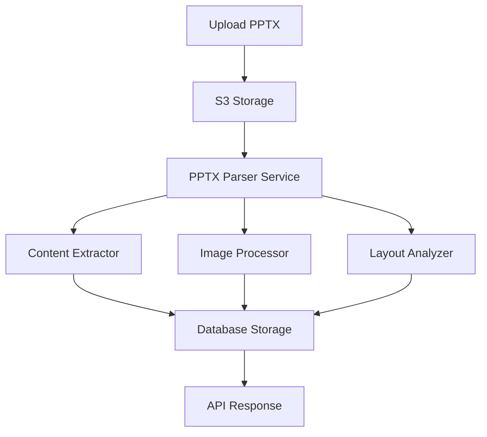
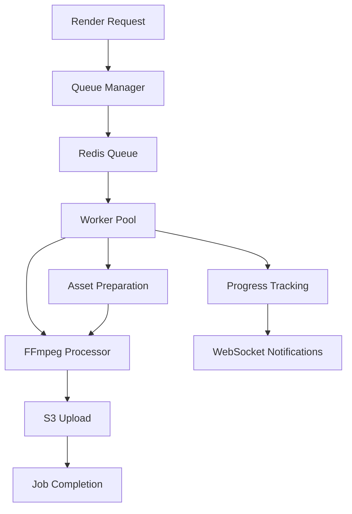
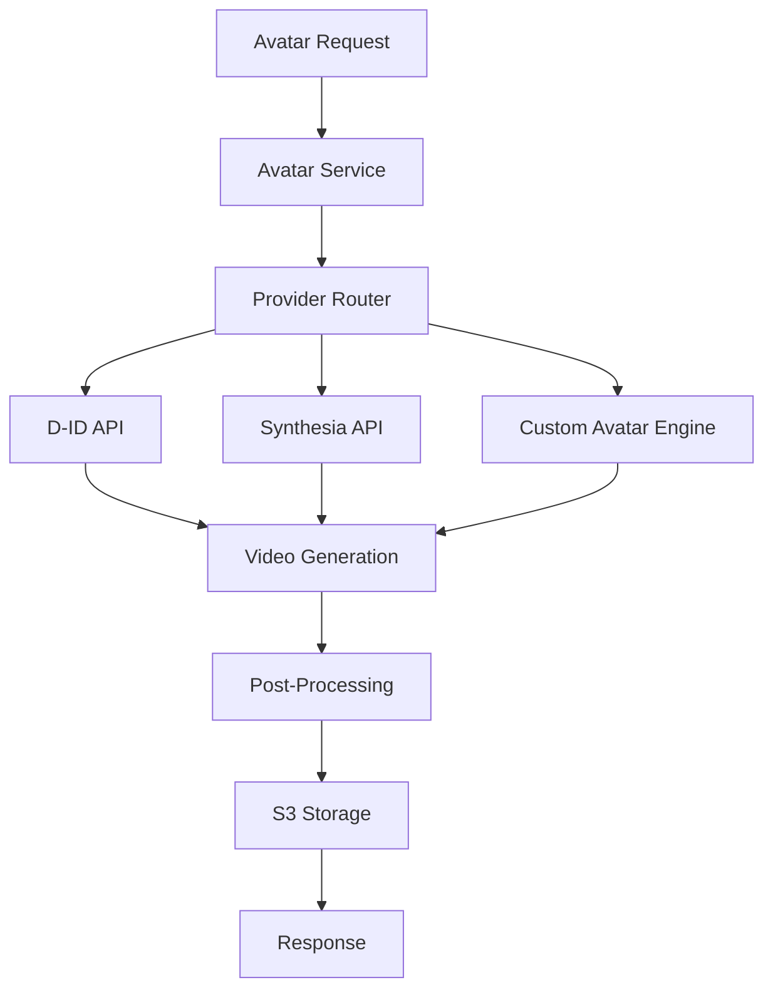
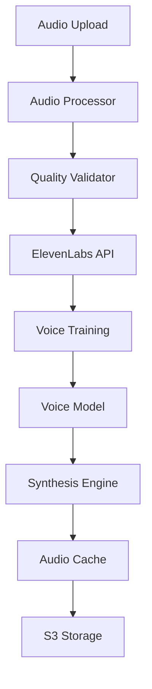
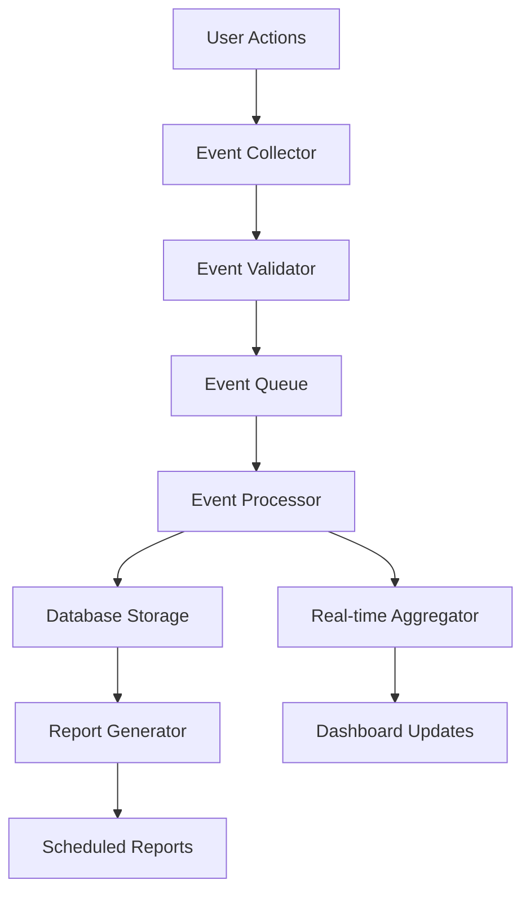

# Especificações Técnicas - Módulos do Sistema

## 1. Módulo PPTX Processing Real

### 1.1 Arquitetura do Módulo



### 1.2 Interfaces e Tipos

```typescript
// Tipos principais
interface PPTXSlide {
  slideNumber: number;
  title: string;
  content: TextBlock[];
  images: ImageElement[];
  layout: SlideLayout;
  speakerNotes: string;
  animations: Animation[];
  metadata: SlideMetadata;
}

interface TextBlock {
  id: string;
  text: string;
  position: Position;
  formatting: TextFormatting;
  hierarchy: number; // 1=title, 2=subtitle, 3=body
}

interface ImageElement {
  id: string;
  originalUrl: string;
  s3Url: string;
  position: Position;
  dimensions: Dimensions;
  altText?: string;
}

interface SlideLayout {
  type: 'title' | 'content' | 'two-column' | 'image-text' | 'blank';
  regions: LayoutRegion[];
}

interface Animation {
  type: 'entrance' | 'emphasis' | 'exit' | 'motion';
  element: string; // ID do elemento
  timing: AnimationTiming;
  effect: string;
}
```

### 1.3 Serviços Implementados

**PPTXParserService**
```typescript
export class PPTXParserService {
  async parseFromS3(s3Key: string): Promise<PPTXSlide[]> {
    // 1. Download do arquivo
    const buffer = await this.s3Service.downloadFile(s3Key);
    
    // 2. Parse com biblioteca real
    const pptx = new PptxGenJS();
    await pptx.load(buffer);
    
    // 3. Extrair slides
    const slides = await this.extractSlides(pptx);
    
    // 4. Processar imagens
    await this.processImages(slides);
    
    return slides;
  }
  
  private async extractSlides(pptx: any): Promise<PPTXSlide[]> {
    const slides: PPTXSlide[] = [];
    
    for (let i = 0; i < pptx.slides.length; i++) {
      const slide = pptx.slides[i];
      
      slides.push({
        slideNumber: i + 1,
        title: this.extractTitle(slide),
        content: this.extractTextBlocks(slide),
        images: this.extractImages(slide),
        layout: this.analyzeLayout(slide),
        speakerNotes: this.extractNotes(slide),
        animations: this.extractAnimations(slide),
        metadata: this.extractMetadata(slide)
      });
    }
    
    return slides;
  }
}
```

### 1.4 APIs Expostas

**POST /api/v1/pptx/upload**
```typescript
// Upload e processamento inicial
{
  "file": "multipart/form-data",
  "projectId": "string"
}

// Response
{
  "success": boolean,
  "uploadId": string,
  "s3Key": string,
  "processingStatus": "queued" | "processing" | "completed" | "failed"
}
```

**POST /api/v1/pptx/process**
```typescript
// Processar PPTX já uploadado
{
  "s3Key": "string",
  "projectId": "string",
  "options": {
    "extractImages": boolean,
    "analyzeLayout": boolean,
    "extractAnimations": boolean
  }
}

// Response
{
  "success": boolean,
  "slides": PPTXSlide[],
  "processingTime": number,
  "statistics": {
    "totalSlides": number,
    "imagesExtracted": number,
    "textBlocks": number
  }
}
```

---

## 2. Módulo Render Queue System

### 2.1 Arquitetura do Sistema



### 2.2 Estrutura de Jobs

```typescript
interface RenderJob {
  id: string;
  projectId: string;
  userId: string;
  type: 'video' | 'audio' | 'presentation';
  priority: 1 | 2 | 3 | 4 | 5; // 1 = highest
  status: 'queued' | 'processing' | 'completed' | 'failed' | 'cancelled';
  data: RenderJobData;
  progress: number; // 0-100
  createdAt: Date;
  startedAt?: Date;
  completedAt?: Date;
  error?: string;
  result?: RenderResult;
}

interface RenderJobData {
  slides: SlideRenderData[];
  audio: AudioRenderData;
  settings: RenderSettings;
  assets: AssetManifest;
}

interface RenderSettings {
  resolution: '720p' | '1080p' | '4k';
  fps: 24 | 30 | 60;
  format: 'mp4' | 'webm' | 'mov';
  quality: 'low' | 'medium' | 'high' | 'ultra';
  duration: number; // seconds
}
```

### 2.3 Worker Implementation

**RenderWorker**
```typescript
export class RenderWorker {
  private queue: Bull.Queue;
  private ffmpegPool: FFmpegPool;
  
  constructor() {
    this.queue = new Bull('render-queue', {
      redis: { host: process.env.REDIS_HOST }
    });
    
    this.ffmpegPool = new FFmpegPool(4); // 4 concurrent processes
    this.setupProcessors();
  }
  
  private setupProcessors() {
    this.queue.process('render-video', 2, async (job) => {
      const { data } = job;
      
      try {
        // 1. Preparar workspace
        const workspace = await this.prepareWorkspace(data);
        
        // 2. Processar assets
        await this.processAssets(workspace, data, (progress) => {
          job.progress(progress * 0.3); // 30% for asset preparation
        });
        
        // 3. Renderizar vídeo
        const videoPath = await this.renderVideo(workspace, data, (progress) => {
          job.progress(30 + (progress * 0.6)); // 60% for video rendering
        });
        
        // 4. Upload resultado
        const s3Url = await this.uploadResult(videoPath, data);
        job.progress(95);
        
        // 5. Cleanup
        await this.cleanup(workspace);
        job.progress(100);
        
        return { s3Url, duration: data.settings.duration };
        
      } catch (error) {
        await this.handleError(job, error);
        throw error;
      }
    });
  }
  
  private async renderVideo(
    workspace: string, 
    data: RenderJobData, 
    onProgress: (progress: number) => void
  ): Promise<string> {
    const ffmpeg = this.ffmpegPool.acquire();
    
    try {
      return await new Promise((resolve, reject) => {
        const outputPath = `${workspace}/output.${data.settings.format}`;
        
        ffmpeg
          .input(`${workspace}/slides/%d.png`)
          .input(`${workspace}/audio.wav`)
          .videoCodec('libx264')
          .audioCodec('aac')
          .fps(data.settings.fps)
          .size(this.getResolution(data.settings.resolution))
          .videoBitrate(this.getBitrate(data.settings.quality))
          .on('progress', (progress) => {
            onProgress(progress.percent || 0);
          })
          .on('end', () => resolve(outputPath))
          .on('error', reject)
          .save(outputPath);
      });
    } finally {
      this.ffmpegPool.release(ffmpeg);
    }
  }
}
```

### 2.4 APIs do Sistema

**POST /api/v1/render/queue**
```typescript
// Adicionar job à fila
{
  "projectId": "string",
  "type": "video" | "audio" | "presentation",
  "priority": 1-5,
  "settings": RenderSettings
}

// Response
{
  "jobId": "string",
  "queuePosition": number,
  "estimatedTime": number // seconds
}
```

**GET /api/v1/render/status/:jobId**
```typescript
// Status do job
{
  "jobId": "string",
  "status": "queued" | "processing" | "completed" | "failed",
  "progress": number,
  "estimatedTimeRemaining": number,
  "result": RenderResult | null,
  "error": string | null
}
```

---

## 3. Módulo Avatar 3D Integration

### 3.1 Arquitetura de Integração



### 3.2 Tipos e Interfaces

```typescript
interface Avatar {
  id: string;
  name: string;
  provider: 'did' | 'synthesia' | 'custom';
  thumbnailUrl: string;
  previewVideoUrl: string;
  gender: 'male' | 'female' | 'neutral';
  ethnicity: string;
  ageRange: string;
  languages: string[];
  voiceIds: string[];
  customization: AvatarCustomization;
}

interface AvatarCustomization {
  clothing: ClothingOption[];
  backgrounds: BackgroundOption[];
  poses: PoseOption[];
  expressions: ExpressionOption[];
}

interface AvatarGenerationRequest {
  avatarId: string;
  script: string;
  voiceId: string;
  settings: AvatarSettings;
  customization?: Partial<AvatarCustomization>;
}

interface AvatarSettings {
  resolution: '720p' | '1080p' | '4k';
  duration: number;
  background: string;
  pose: string;
  expression: string;
  lipSync: boolean;
  gestureIntensity: 'low' | 'medium' | 'high';
}
```

### 3.3 Serviço de Avatar

**AvatarService**
```typescript
export class AvatarService {
  private providers: Map<string, AvatarProvider>;
  
  constructor() {
    this.providers = new Map([
      ['did', new DIDProvider()],
      ['synthesia', new SynthesiaProvider()],
      ['custom', new CustomAvatarProvider()]
    ]);
  }
  
  async getAvailableAvatars(): Promise<Avatar[]> {
    const allAvatars: Avatar[] = [];
    
    for (const [providerName, provider] of this.providers) {
      try {
        const avatars = await provider.getAvatars();
        allAvatars.push(...avatars);
      } catch (error) {
        console.error(`Error fetching avatars from ${providerName}:`, error);
      }
    }
    
    return allAvatars;
  }
  
  async generateAvatarVideo(request: AvatarGenerationRequest): Promise<string> {
    const avatar = await this.getAvatarById(request.avatarId);
    const provider = this.providers.get(avatar.provider);
    
    if (!provider) {
      throw new Error(`Provider ${avatar.provider} not available`);
    }
    
    // Gerar vídeo com o provider
    const videoUrl = await provider.generateVideo(request);
    
    // Post-processing se necessário
    if (request.settings.lipSync) {
      return await this.enhanceLipSync(videoUrl, request.script);
    }
    
    return videoUrl;
  }
  
  private async enhanceLipSync(videoUrl: string, script: string): Promise<string> {
    // Implementar melhoria de sincronização labial
    const enhancedVideo = await this.lipSyncProcessor.process(videoUrl, script);
    return enhancedVideo;
  }
}
```

### 3.4 Providers Específicos

**DIDProvider**
```typescript
export class DIDProvider implements AvatarProvider {
  private apiKey: string;
  private baseUrl = 'https://api.d-id.com';
  
  async generateVideo(request: AvatarGenerationRequest): Promise<string> {
    const response = await fetch(`${this.baseUrl}/talks`, {
      method: 'POST',
      headers: {
        'Authorization': `Basic ${this.apiKey}`,
        'Content-Type': 'application/json'
      },
      body: JSON.stringify({
        source_url: request.avatarId,
        script: {
          type: 'text',
          input: request.script,
          provider: {
            type: 'elevenlabs',
            voice_id: request.voiceId
          }
        },
        config: {
          fluent: true,
          pad_audio: 0.0,
          stitch: true
        }
      })
    });
    
    const result = await response.json();
    
    // Aguardar processamento
    return await this.waitForCompletion(result.id);
  }
  
  private async waitForCompletion(talkId: string): Promise<string> {
    let attempts = 0;
    const maxAttempts = 60; // 5 minutes max
    
    while (attempts < maxAttempts) {
      const status = await this.getTalkStatus(talkId);
      
      if (status.status === 'done') {
        return status.result_url;
      } else if (status.status === 'error') {
        throw new Error(`Avatar generation failed: ${status.error}`);
      }
      
      await new Promise(resolve => setTimeout(resolve, 5000)); // Wait 5s
      attempts++;
    }
    
    throw new Error('Avatar generation timeout');
  }
}
```

---

## 4. Módulo Voice Cloning Real

### 4.1 Arquitetura do Sistema



### 4.2 Estruturas de Dados

```typescript
interface VoiceClone {
  id: string;
  userId: string;
  name: string;
  description: string;
  status: 'training' | 'ready' | 'failed';
  provider: 'elevenlabs' | 'azure' | 'google';
  providerVoiceId: string;
  originalAudioUrl: string;
  sampleAudioUrl: string;
  quality: VoiceQuality;
  metadata: VoiceMetadata;
  createdAt: Date;
  updatedAt: Date;
}

interface VoiceQuality {
  score: number; // 0-100
  clarity: number;
  consistency: number;
  naturalness: number;
  recommendations: string[];
}

interface VoiceMetadata {
  duration: number; // seconds
  sampleRate: number;
  bitrate: number;
  language: string;
  gender: 'male' | 'female' | 'neutral';
  ageEstimate: string;
  accent: string;
}

interface SynthesisRequest {
  voiceId: string;
  text: string;
  settings: SynthesisSettings;
}

interface SynthesisSettings {
  stability: number; // 0-1
  similarityBoost: number; // 0-1
  style: number; // 0-1
  useSpeakerBoost: boolean;
  speed: number; // 0.25-4.0
  pitch: number; // -1 to 1
}
```

### 4.3 Serviço de Clonagem

**VoiceCloningService**
```typescript
export class VoiceCloningService {
  private elevenLabs: ElevenLabsApi;
  private audioProcessor: AudioProcessor;
  private qualityValidator: VoiceQualityValidator;
  
  constructor() {
    this.elevenLabs = new ElevenLabsApi({
      apiKey: process.env.ELEVENLABS_API_KEY
    });
    this.audioProcessor = new AudioProcessor();
    this.qualityValidator = new VoiceQualityValidator();
  }
  
  async cloneVoice(audioFile: Buffer, metadata: VoiceMetadata): Promise<VoiceClone> {
    // 1. Validar qualidade do áudio
    const quality = await this.qualityValidator.analyze(audioFile);
    
    if (quality.score < 70) {
      throw new Error(`Audio quality too low: ${quality.score}/100`);
    }
    
    // 2. Processar áudio
    const processedAudio = await this.audioProcessor.optimize(audioFile);
    
    // 3. Enviar para ElevenLabs
    const voice = await this.elevenLabs.voices.add({
      name: metadata.name,
      files: [processedAudio],
      description: metadata.description,
      labels: {
        accent: metadata.accent,
        age: metadata.ageEstimate,
        gender: metadata.gender,
        language: metadata.language
      }
    });
    
    // 4. Salvar no banco
    const voiceClone = await prisma.voiceClone.create({
      data: {
        userId: metadata.userId,
        name: metadata.name,
        description: metadata.description,
        status: 'training',
        provider: 'elevenlabs',
        providerVoiceId: voice.voice_id,
        originalAudioUrl: metadata.originalAudioUrl,
        quality: quality,
        metadata: metadata
      }
    });
    
    // 5. Aguardar treinamento
    this.waitForTraining(voiceClone.id, voice.voice_id);
    
    return voiceClone;
  }
  
  async synthesizeSpeech(request: SynthesisRequest): Promise<Buffer> {
    // Verificar cache primeiro
    const cacheKey = this.generateCacheKey(request);
    const cached = await this.audioCache.get(cacheKey);
    
    if (cached) {
      return cached;
    }
    
    // Gerar novo áudio
    const audio = await this.elevenLabs.generate({
      voice: request.voiceId,
      text: request.text,
      model_id: "eleven_multilingual_v2",
      voice_settings: {
        stability: request.settings.stability,
        similarity_boost: request.settings.similarityBoost,
        style: request.settings.style,
        use_speaker_boost: request.settings.useSpeakerBoost
      }
    });
    
    const audioBuffer = Buffer.from(await audio.arrayBuffer());
    
    // Aplicar modificações de velocidade/pitch se necessário
    const processedAudio = await this.audioProcessor.adjustSpeedAndPitch(
      audioBuffer,
      request.settings.speed,
      request.settings.pitch
    );
    
    // Salvar no cache
    await this.audioCache.set(cacheKey, processedAudio, 3600); // 1 hour
    
    return processedAudio;
  }
}
```

### 4.4 Validador de Qualidade

**VoiceQualityValidator**
```typescript
export class VoiceQualityValidator {
  async analyze(audioBuffer: Buffer): Promise<VoiceQuality> {
    // 1. Análise técnica
    const technicalAnalysis = await this.analyzeTechnicalQuality(audioBuffer);
    
    // 2. Análise de conteúdo
    const contentAnalysis = await this.analyzeContentQuality(audioBuffer);
    
    // 3. Calcular score final
    const score = this.calculateOverallScore(technicalAnalysis, contentAnalysis);
    
    return {
      score,
      clarity: technicalAnalysis.clarity,
      consistency: contentAnalysis.consistency,
      naturalness: contentAnalysis.naturalness,
      recommendations: this.generateRecommendations(technicalAnalysis, contentAnalysis)
    };
  }
  
  private async analyzeTechnicalQuality(audioBuffer: Buffer): Promise<TechnicalAnalysis> {
    // Usar bibliotecas como node-ffmpeg para análise
    const analysis = await this.audioAnalyzer.analyze(audioBuffer);
    
    return {
      sampleRate: analysis.sampleRate,
      bitrate: analysis.bitrate,
      duration: analysis.duration,
      noiseLevel: analysis.noiseLevel,
      dynamicRange: analysis.dynamicRange,
      clarity: this.calculateClarity(analysis)
    };
  }
  
  private generateRecommendations(
    technical: TechnicalAnalysis, 
    content: ContentAnalysis
  ): string[] {
    const recommendations: string[] = [];
    
    if (technical.noiseLevel > 0.1) {
      recommendations.push("Reduzir ruído de fundo");
    }
    
    if (technical.sampleRate < 44100) {
      recommendations.push("Usar sample rate de pelo menos 44.1kHz");
    }
    
    if (content.consistency < 0.7) {
      recommendations.push("Manter tom e velocidade consistentes");
    }
    
    if (technical.duration < 60) {
      recommendations.push("Fornecer pelo menos 1 minuto de áudio");
    }
    
    return recommendations;
  }
}
```

---

## 5. Módulo Analytics System Real

### 5.1 Arquitetura de Analytics



### 5.2 Estrutura de Eventos

```typescript
interface AnalyticsEvent {
  id: string;
  userId: string;
  sessionId: string;
  projectId?: string;
  eventType: EventType;
  eventData: Record<string, any>;
  timestamp: Date;
  ipAddress: string;
  userAgent: string;
  referrer?: string;
  metadata: EventMetadata;
}

type EventType = 
  | 'page_view'
  | 'project_created'
  | 'slide_added'
  | 'video_rendered'
  | 'voice_cloned'
  | 'avatar_generated'
  | 'export_completed'
  | 'user_registered'
  | 'subscription_changed'
  | 'error_occurred';

interface EventMetadata {
  platform: 'web' | 'mobile' | 'api';
  version: string;
  feature: string;
  duration?: number;
  success: boolean;
  errorCode?: string;
}

interface AnalyticsMetrics {
  totalUsers: number;
  activeUsers: number;
  projectsCreated: number;
  videosRendered: number;
  averageSessionDuration: number;
  conversionRate: number;
  retentionRate: number;
  errorRate: number;
}
```

### 5.3 Coletor de Eventos

**AnalyticsCollector**
```typescript
export class AnalyticsCollector {
  private eventQueue: Bull.Queue;
  private validator: EventValidator;
  
  constructor() {
    this.eventQueue = new Bull('analytics-events', {
      redis: { host: process.env.REDIS_HOST }
    });
    this.validator = new EventValidator();
    this.setupProcessors();
  }
  
  async trackEvent(event: Partial<AnalyticsEvent>): Promise<void> {
    // 1. Validar evento
    const validatedEvent = await this.validator.validate(event);
    
    // 2. Enriquecer com metadados
    const enrichedEvent = await this.enrichEvent(validatedEvent);
    
    // 3. Adicionar à fila
    await this.eventQueue.add('process-event', enrichedEvent, {
      priority: this.getEventPriority(enrichedEvent.eventType),
      attempts: 3,
      backoff: 'exponential'
    });
  }
  
  private async enrichEvent(event: Partial<AnalyticsEvent>): Promise<AnalyticsEvent> {
    return {
      id: generateUUID(),
      timestamp: new Date(),
      sessionId: event.sessionId || await this.getSessionId(event.userId),
      metadata: {
        platform: 'web',
        version: process.env.APP_VERSION || '1.0.0',
        feature: this.extractFeature(event.eventType),
        success: true,
        ...event.metadata
      },
      ...event
    } as AnalyticsEvent;
  }
  
  private setupProcessors() {
    this.eventQueue.process('process-event', 10, async (job) => {
      const event = job.data as AnalyticsEvent;
      
      try {
        // 1. Salvar no banco principal
        await this.saveToDatabase(event);
        
        // 2. Atualizar métricas em tempo real
        await this.updateRealTimeMetrics(event);
        
        // 3. Enviar para serviços externos
        await this.sendToExternalServices(event);
        
        // 4. Trigger alertas se necessário
        await this.checkAlerts(event);
        
      } catch (error) {
        console.error('Error processing analytics event:', error);
        throw error;
      }
    });
  }
  
  private async updateRealTimeMetrics(event: AnalyticsEvent): Promise<void> {
    const redis = new Redis(process.env.REDIS_URL);
    
    // Atualizar contadores
    await redis.incr(`metrics:${event.eventType}:${this.getDateKey()}`);
    await redis.incr(`metrics:total:${this.getDateKey()}`);
    
    // Atualizar métricas por usuário
    if (event.userId) {
      await redis.sadd(`active_users:${this.getDateKey()}`, event.userId);
    }
    
    // Atualizar métricas por projeto
    if (event.projectId) {
      await redis.incr(`project_activity:${event.projectId}:${this.getDateKey()}`);
    }
  }
}
```

### 5.4 Gerador de Relatórios

**ReportGenerator**
```typescript
export class ReportGenerator {
  async generateDashboardData(
    userId: string, 
    dateRange: DateRange
  ): Promise<DashboardData> {
    const [
      userMetrics,
      projectMetrics,
      usageMetrics,
      performanceMetrics
    ] = await Promise.all([
      this.getUserMetrics(userId, dateRange),
      this.getProjectMetrics(userId, dateRange),
      this.getUsageMetrics(userId, dateRange),
      this.getPerformanceMetrics(userId, dateRange)
    ]);
    
    return {
      user: userMetrics,
      projects: projectMetrics,
      usage: usageMetrics,
      performance: performanceMetrics,
      generatedAt: new Date()
    };
  }
  
  private async getUserMetrics(userId: string, dateRange: DateRange): Promise<UserMetrics> {
    const events = await prisma.analyticsEvent.findMany({
      where: {
        userId,
        timestamp: {
          gte: dateRange.start,
          lte: dateRange.end
        }
      }
    });
    
    return {
      totalSessions: this.countUniqueSessions(events),
      averageSessionDuration: this.calculateAverageSessionDuration(events),
      totalActions: events.length,
      mostUsedFeatures: this.getMostUsedFeatures(events),
      activityByDay: this.getActivityByDay(events)
    };
  }
  
  async generateCustomReport(
    reportConfig: ReportConfig
  ): Promise<CustomReport> {
    const query = this.buildQuery(reportConfig);
    const data = await this.executeQuery(query);
    
    return {
      id: generateUUID(),
      name: reportConfig.name,
      config: reportConfig,
      data: data,
      charts: await this.generateCharts(data, reportConfig.chartTypes),
      generatedAt: new Date(),
      downloadUrl: await this.generateDownloadUrl(data, reportConfig.format)
    };
  }
}
```

---

## 6. Testes e Validação

### 6.1 Estratégia de Testes

```typescript
// Testes unitários para cada módulo
describe('PPTXParserService', () => {
  it('should extract slides correctly', async () => {
    const parser = new PPTXParserService();
    const slides = await parser.parseFromS3('test-file.pptx');
    
    expect(slides).toHaveLength(5);
    expect(slides[0].title).toBe('Introduction');
    expect(slides[0].content).toHaveLength(3);
  });
});

// Testes de integração
describe('Render Pipeline Integration', () => {
  it('should process complete render job', async () => {
    const jobData = createTestRenderJob();
    const result = await renderQueue.addJob(jobData);
    
    await waitForJobCompletion(result.jobId);
    
    const job = await renderQueue.getJob(result.jobId);
    expect(job.status).toBe('completed');
    expect(job.result.s3Url).toMatch(/^https:\/\/.*\.mp4$/);
  });
});

// Testes de performance
describe('Performance Tests', () => {
  it('should handle 100 concurrent render jobs', async () => {
    const jobs = Array.from({ length: 100 }, () => createTestRenderJob());
    const startTime = Date.now();
    
    const results = await Promise.all(
      jobs.map(job => renderQueue.addJob(job))
    );
    
    const endTime = Date.now();
    expect(endTime - startTime).toBeLessThan(5000); // 5 seconds max
  });
});
```

### 6.2 Monitoramento e Alertas

```typescript
// Sistema de monitoramento
export class SystemMonitor {
  async checkSystemHealth(): Promise<HealthStatus> {
    const checks = await Promise.all([
      this.checkDatabase(),
      this.checkRedis(),
      this.checkS3(),
      this.checkExternalAPIs(),
      this.checkRenderQueue()
    ]);
    
    return {
      status: checks.every(check => check.healthy) ? 'healthy' : 'unhealthy',
      checks,
      timestamp: new Date()
    };
  }
  
  private async checkRenderQueue(): Promise<HealthCheck> {
    try {
      const queueStats = await this.renderQueue.getStats();
      
      return {
        service: 'render-queue',
        healthy: queueStats.waiting < 100, // Alert if too many waiting
        metrics: queueStats,
        message: queueStats.waiting > 100 ? 'Queue backlog detected' : 'OK'
      };
    } catch (error) {
      return {
        service: 'render-queue',
        healthy: false,
        error: error.message
      };
    }
  }
}
```

Este documento fornece as especificações técnicas detalhadas para implementar cada módulo do sistema com funcionalidades reais, substituindo os mocks existentes. Cada seção inclui arquitetura, tipos, implementações e testes necessários para garantir um sistema robusto e escalável.