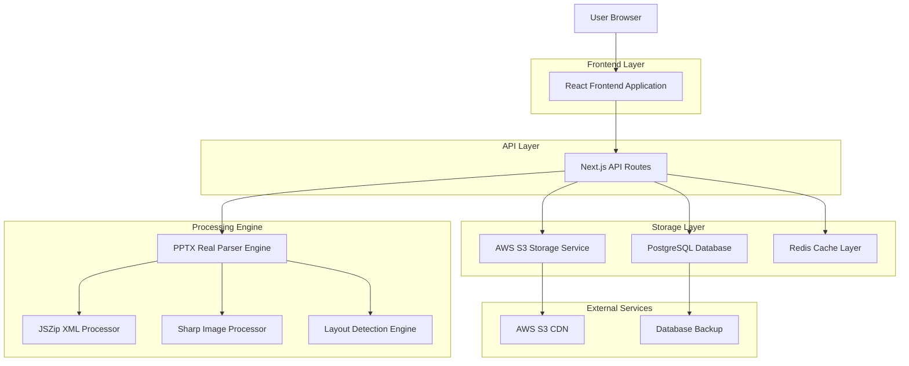
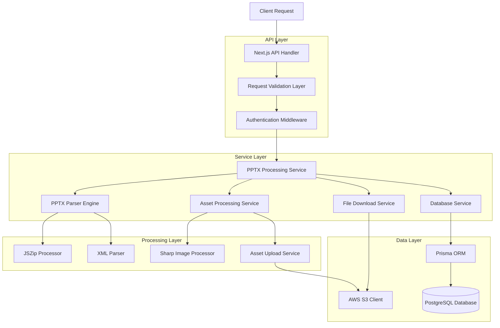
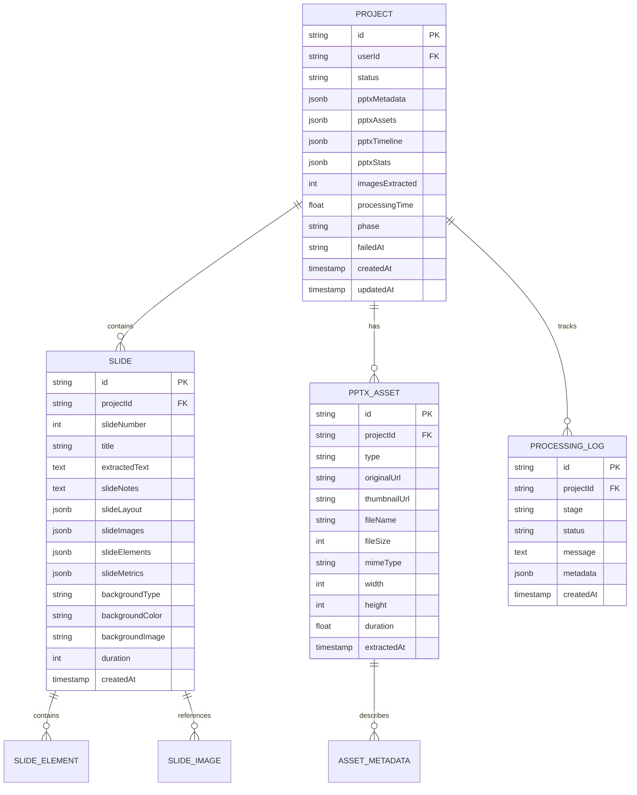

# 🏗️ FASE 1: PPTX Processing Real - Technical Architecture Document

## 1. Architecture Design



## 2. Technology Description

- Frontend: React@18 + Next.js@14 + TypeScript + Tailwind CSS + Shadcn UI
- Backend: Next.js API Routes + Prisma ORM + Node.js runtime
- Database: PostgreSQL (Supabase) with JSONB support
- Storage: AWS S3 for file storage and CDN delivery
- Processing: JSZip@3.10.1 + XML2JS@0.6.2 + Sharp@0.32.6
- Cache: Redis for processing queue and temporary data
- Validation: Zod for schema validation + File-type for MIME detection

## 3. Route Definitions

| Route | Purpose |
|-------|---------|
| /upload | PPTX file upload interface with real-time validation |
| /processing/:projectId | Live processing dashboard with WebSocket updates |
| /review/:projectId | Content review with extracted slides and assets |
| /projects | Project management with real processing statistics |
| /api/v1/pptx/upload | Secure PPTX upload to S3 with validation |
| /api/v1/pptx/process-real | Real PPTX processing with JSZip extraction |
| /api/v1/pptx/validate | PPTX structure validation and metadata extraction |
| /api/v1/pptx/assets/:assetId | Asset retrieval with S3 signed URLs |

## 4. API Definitions

### 4.1 Core API

**PPTX Real Processing Engine**
```
POST /api/v1/pptx/process-real
```

Request:
| Param Name | Param Type | isRequired | Description |
|------------|------------|------------|-------------|
| s3Key | string | true | S3 storage key for PPTX file |
| projectId | string | true | Unique project identifier |
| options | ProcessingOptions | false | Processing configuration |

ProcessingOptions:
| Param Name | Param Type | Default | Description |
|------------|------------|---------|-------------|
| extractImages | boolean | true | Extract and upload images to S3 |
| detectLayouts | boolean | true | Detect slide layout patterns |
| extractNotes | boolean | true | Extract speaker notes |
| generateThumbnails | boolean | true | Generate image thumbnails |
| maxImageSize | number | 1920 | Maximum image width in pixels |
| imageQuality | number | 85 | JPEG compression quality (1-100) |

Response:
| Param Name | Param Type | Description |
|------------|------------|-------------|
| success | boolean | Processing completion status |
| projectId | string | Project identifier |
| extractedContent | PPTXExtractionResult | Complete extracted content |
| processingTime | number | Processing duration in seconds |
| statistics | ProcessingStats | Extraction statistics |

Example Request:
```json
{
  "s3Key": "pptx/originals/proj_abc123/safety_training.pptx",
  "projectId": "proj_abc123",
  "options": {
    "extractImages": true,
    "detectLayouts": true,
    "extractNotes": true,
    "generateThumbnails": true,
    "maxImageSize": 1920,
    "imageQuality": 85
  }
}
```

Example Response:
```json
{
  "success": true,
  "projectId": "proj_abc123",
  "extractedContent": {
    "slides": [
      {
        "slideNumber": 1,
        "title": "NR-12: Segurança em Máquinas e Equipamentos",
        "content": [
          "Proteção de máquinas e equipamentos",
          "Dispositivos de segurança obrigatórios",
          "Procedimentos de trabalho seguro"
        ],
        "notes": "Apresentar os principais conceitos da NR-12 com foco em proteções coletivas",
        "layout": {
          "type": "title_content",
          "elements": [
            {
              "type": "title",
              "text": "NR-12: Segurança em Máquinas e Equipamentos",
              "position": { "x": 100, "y": 50, "width": 800, "height": 100 }
            }
          ]
        },
        "images": [
          {
            "original": "https://s3.amazonaws.com/bucket/pptx/extracted/proj_abc123/images/slide-1-image-1.jpg",
            "thumbnail": "https://s3.amazonaws.com/bucket/pptx/extracted/proj_abc123/images/thumbnails/slide-1-image-1-thumb.jpg",
            "metadata": {
              "width": 1920,
              "height": 1080,
              "fileSize": 245760,
              "mimeType": "image/jpeg"
            }
          }
        ],
        "duration": 8000
      }
    ],
    "metadata": {
      "slideCount": 15,
      "hasAnimations": true,
      "hasNotes": true,
      "fileSize": 2048576,
      "createdDate": "2025-01-15T10:30:00Z",
      "modifiedDate": "2025-01-15T14:45:00Z",
      "author": "Equipe de Segurança",
      "title": "Treinamento NR-12 - Segurança em Máquinas"
    },
    "assets": {
      "images": [
        {
          "id": "img_001",
          "slideNumber": 1,
          "originalUrl": "https://s3.../slide-1-image-1.jpg",
          "thumbnailUrl": "https://s3.../slide-1-image-1-thumb.jpg",
          "fileName": "safety_equipment.jpg",
          "fileSize": 245760,
          "dimensions": { "width": 1920, "height": 1080 }
        }
      ],
      "videos": [],
      "audio": []
    },
    "timeline": {
      "totalDuration": 120000,
      "slides": [
        {
          "slideNumber": 1,
          "startTime": 0,
          "duration": 8000,
          "transitions": ["fade_in"]
        }
      ]
    }
  },
  "processingTime": 12.5,
  "statistics": {
    "slidesProcessed": 15,
    "imagesExtracted": 8,
    "textElementsFound": 45,
    "layoutsDetected": {
      "title_slide": 1,
      "title_content": 10,
      "two_column": 3,
      "image_only": 1
    }
  }
}
```

**PPTX Validation API**
```
POST /api/v1/pptx/validate
```

Request:
| Param Name | Param Type | isRequired | Description |
|------------|------------|------------|-------------|
| s3Key | string | true | S3 key of PPTX file to validate |

Response:
| Param Name | Param Type | Description |
|------------|------------|-------------|
| isValid | boolean | File validation status |
| fileInfo | FileInfo | Basic file information |
| warnings | string[] | Non-critical issues found |
| errors | string[] | Critical errors that prevent processing |

Example Response:
```json
{
  "isValid": true,
  "fileInfo": {
    "size": 2048576,
    "slideCount": 15,
    "hasImages": true,
    "hasAnimations": true,
    "hasNotes": true,
    "version": "Microsoft Office PowerPoint 2019",
    "lastModified": "2025-01-15T14:45:00Z"
  },
  "warnings": [
    "Slide 5 contains unsupported animation effects",
    "Some fonts may not be available during processing"
  ],
  "errors": []
}
```

## 5. Server Architecture Diagram



## 6. Data Model

### 6.1 Data Model Definition



### 6.2 Data Definition Language

**Enhanced Project Table**
```sql
-- Add real PPTX processing fields to existing Project table
ALTER TABLE "Project" ADD COLUMN IF NOT EXISTS "pptxMetadata" JSONB;
ALTER TABLE "Project" ADD COLUMN IF NOT EXISTS "pptxAssets" JSONB;
ALTER TABLE "Project" ADD COLUMN IF NOT EXISTS "pptxTimeline" JSONB;
ALTER TABLE "Project" ADD COLUMN IF NOT EXISTS "pptxStats" JSONB;
ALTER TABLE "Project" ADD COLUMN IF NOT EXISTS "imagesExtracted" INTEGER NOT NULL DEFAULT 0;
ALTER TABLE "Project" ADD COLUMN IF NOT EXISTS "processingTime" DOUBLE PRECISION;
ALTER TABLE "Project" ADD COLUMN IF NOT EXISTS "phase" TEXT;
ALTER TABLE "Project" ADD COLUMN IF NOT EXISTS "failedAt" TEXT;

-- Performance indexes
CREATE INDEX IF NOT EXISTS "idx_project_status_phase" ON "Project"("status", "phase");
CREATE INDEX IF NOT EXISTS "idx_project_processing_time" ON "Project"("processingTime");
CREATE INDEX IF NOT EXISTS "idx_project_images_extracted" ON "Project"("imagesExtracted");

-- JSONB indexes for metadata queries
CREATE INDEX IF NOT EXISTS "idx_project_pptx_metadata" ON "Project" USING gin("pptxMetadata");
CREATE INDEX IF NOT EXISTS "idx_project_pptx_stats" ON "Project" USING gin("pptxStats");
```

**Enhanced Slide Table**
```sql
-- Add real extracted content fields to existing Slide table
ALTER TABLE "Slide" ADD COLUMN IF NOT EXISTS "extractedText" TEXT;
ALTER TABLE "Slide" ADD COLUMN IF NOT EXISTS "slideNotes" TEXT;
ALTER TABLE "Slide" ADD COLUMN IF NOT EXISTS "slideLayout" JSONB;
ALTER TABLE "Slide" ADD COLUMN IF NOT EXISTS "slideImages" JSONB;
ALTER TABLE "Slide" ADD COLUMN IF NOT EXISTS "slideElements" JSONB;
ALTER TABLE "Slide" ADD COLUMN IF NOT EXISTS "slideMetrics" JSONB;
ALTER TABLE "Slide" ADD COLUMN IF NOT EXISTS "backgroundType" TEXT;
ALTER TABLE "Slide" ADD COLUMN IF NOT EXISTS "backgroundColor" TEXT;
ALTER TABLE "Slide" ADD COLUMN IF NOT EXISTS "backgroundImage" TEXT;

-- Full-text search index for Portuguese content
CREATE INDEX IF NOT EXISTS "idx_slide_extracted_text_search" 
ON "Slide" USING gin(to_tsvector('portuguese', "extractedText"));

-- JSONB indexes for layout and element queries
CREATE INDEX IF NOT EXISTS "idx_slide_layout" ON "Slide" USING gin("slideLayout");
CREATE INDEX IF NOT EXISTS "idx_slide_elements" ON "Slide" USING gin("slideElements");

-- Composite indexes for common queries
CREATE INDEX IF NOT EXISTS "idx_slide_project_number" ON "Slide"("projectId", "slideNumber");
```

**New PPTX Asset Table**
```sql
-- Create table for extracted PPTX assets
CREATE TABLE IF NOT EXISTS "PPTXAsset" (
  "id" TEXT NOT NULL,
  "projectId" TEXT NOT NULL,
  "type" TEXT NOT NULL CHECK ("type" IN ('image', 'video', 'audio', 'document')),
  "originalUrl" TEXT NOT NULL,
  "thumbnailUrl" TEXT,
  "fileName" TEXT NOT NULL,
  "fileSize" INTEGER NOT NULL CHECK ("fileSize" > 0),
  "mimeType" TEXT NOT NULL,
  "width" INTEGER CHECK ("width" > 0),
  "height" INTEGER CHECK ("height" > 0),
  "duration" DOUBLE PRECISION CHECK ("duration" >= 0),
  "extractedAt" TIMESTAMP(3) NOT NULL DEFAULT CURRENT_TIMESTAMP,
  "metadata" JSONB,
  
  CONSTRAINT "PPTXAsset_pkey" PRIMARY KEY ("id"),
  CONSTRAINT "PPTXAsset_projectId_fkey" 
    FOREIGN KEY ("projectId") REFERENCES "Project"("id") ON DELETE CASCADE
);

-- Indexes for asset management
CREATE INDEX IF NOT EXISTS "PPTXAsset_projectId_type_idx" ON "PPTXAsset"("projectId", "type");
CREATE INDEX IF NOT EXISTS "PPTXAsset_fileSize_idx" ON "PPTXAsset"("fileSize");
CREATE INDEX IF NOT EXISTS "PPTXAsset_extractedAt_idx" ON "PPTXAsset"("extractedAt");
CREATE INDEX IF NOT EXISTS "PPTXAsset_metadata_idx" ON "PPTXAsset" USING gin("metadata");
```

**Processing Log Table**
```sql
-- Create table for detailed processing logs
CREATE TABLE IF NOT EXISTS "ProcessingLog" (
  "id" TEXT NOT NULL,
  "projectId" TEXT NOT NULL,
  "stage" TEXT NOT NULL,
  "status" TEXT NOT NULL CHECK ("status" IN ('started', 'progress', 'completed', 'error')),
  "message" TEXT NOT NULL,
  "metadata" JSONB,
  "createdAt" TIMESTAMP(3) NOT NULL DEFAULT CURRENT_TIMESTAMP,
  
  CONSTRAINT "ProcessingLog_pkey" PRIMARY KEY ("id"),
  CONSTRAINT "ProcessingLog_projectId_fkey" 
    FOREIGN KEY ("projectId") REFERENCES "Project"("id") ON DELETE CASCADE
);

-- Indexes for log queries
CREATE INDEX IF NOT EXISTS "ProcessingLog_projectId_createdAt_idx" 
ON "ProcessingLog"("projectId", "createdAt");
CREATE INDEX IF NOT EXISTS "ProcessingLog_stage_status_idx" 
ON "ProcessingLog"("stage", "status");
```

**Sample Data for Testing**
```sql
-- Insert sample project with real PPTX data
INSERT INTO "Project" (
  "id", "userId", "title", "status", "pptxMetadata", "imagesExtracted", "processingTime", "phase"
) VALUES (
  'proj_sample_001',
  'user_test_001', 
  'NR-12 Safety Training',
  'COMPLETED',
  '{"slideCount": 15, "hasAnimations": true, "fileSize": 2048576, "author": "Safety Team"}',
  8,
  12.5,
  'COMPLETED'
) ON CONFLICT ("id") DO NOTHING;

-- Insert sample slides with extracted content
INSERT INTO "Slide" (
  "id", "projectId", "slideNumber", "title", "extractedText", "slideNotes", "duration"
) VALUES 
  ('slide_001', 'proj_sample_001', 1, 'NR-12: Segurança em Máquinas', 'Proteção de máquinas e equipamentos. Dispositivos de segurança obrigatórios.', 'Apresentar conceitos principais da NR-12', 8),
  ('slide_002', 'proj_sample_001', 2, 'Dispositivos de Proteção', 'Proteções fixas, móveis e dispositivos de intertravamento.', 'Detalhar tipos de proteções', 10)
ON CONFLICT ("id") DO NOTHING;

-- Insert sample assets
INSERT INTO "PPTXAsset" (
  "id", "projectId", "type", "originalUrl", "thumbnailUrl", "fileName", "fileSize", "mimeType", "width", "height"
) VALUES 
  ('asset_001', 'proj_sample_001', 'image', 'https://s3.../safety-equipment.jpg', 'https://s3.../safety-equipment-thumb.jpg', 'safety-equipment.jpg', 245760, 'image/jpeg', 1920, 1080),
  ('asset_002', 'proj_sample_001', 'image', 'https://s3.../protection-devices.png', 'https://s3.../protection-devices-thumb.jpg', 'protection-devices.png', 189440, 'image/png', 1600, 900)
ON CONFLICT ("id") DO NOTHING;
```

**Database Performance Optimization**
```sql
-- Analyze tables for query optimization
ANALYZE "Project";
ANALYZE "Slide";
ANALYZE "PPTXAsset";
ANALYZE "ProcessingLog";

-- Create materialized view for project statistics
CREATE MATERIALIZED VIEW IF NOT EXISTS "ProjectStats" AS
SELECT 
  p."id" as "projectId",
  p."title",
  p."status",
  p."imagesExtracted",
  p."processingTime",
  COUNT(s."id") as "slideCount",
  COUNT(a."id") as "assetCount",
  AVG(s."duration") as "avgSlideDuration",
  SUM(a."fileSize") as "totalAssetSize"
FROM "Project" p
LEFT JOIN "Slide" s ON p."id" = s."projectId"
LEFT JOIN "PPTXAsset" a ON p."id" = a."projectId"
WHERE p."status" = 'COMPLETED'
GROUP BY p."id", p."title", p."status", p."imagesExtracted", p."processingTime";

-- Create unique index on materialized view
CREATE UNIQUE INDEX IF NOT EXISTS "ProjectStats_projectId_idx" ON "ProjectStats"("projectId");

-- Refresh materialized view (run periodically)
-- REFRESH MATERIALIZED VIEW "Project