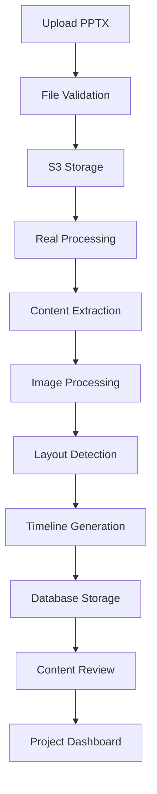
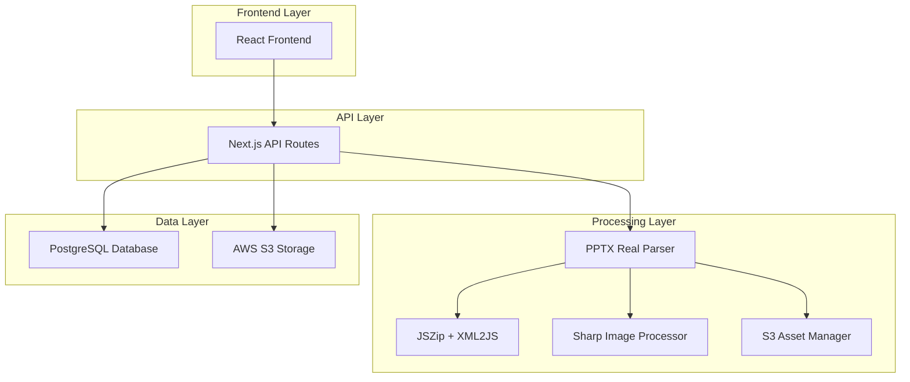
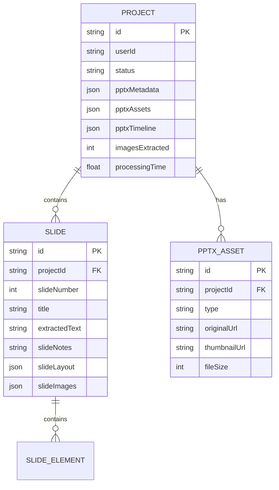

# 📋 PRD - FASE 1: PPTX Processing Real

## 1. Product Overview

Implementação de processamento real de arquivos PPTX para o Estúdio IA de Vídeos, substituindo completamente o sistema atual de dados mockados por extração real de conteúdo, imagens, layouts e metadados de apresentações PowerPoint.

O sistema atual opera com 70-75% de funcionalidade real, sendo que o processamento de PPTX é uma das principais áreas mockadas. Esta implementação elevará o sistema para 85-90% de funcionalidade real, estabelecendo a base sólida para conversão de apresentações em vídeos educacionais com avatares 3D e compliance NR.

Esta é uma plataforma brasileira especializada em criar vídeos de treinamento corporativo com foco em normas regulamentadoras (NR) de segurança do trabalho.

## 2. Core Features

### 2.1 User Roles

| Role | Registration Method | Core Permissions |
|------|---------------------|------------------|
| Usuário Corporativo | Email + empresa | Upload PPTX, criar projetos, gerar vídeos |
| Administrador | Convite interno | Gerenciar usuários, monitorar processamento |

### 2.2 Feature Module

Nossa implementação da FASE 1 consiste nas seguintes páginas principais:

1. **Upload Page**: interface de upload de PPTX, validação de arquivos, preview inicial.
2. **Processing Dashboard**: monitoramento em tempo real do processamento, logs de progresso, status de extração.
3. **Content Review Page**: visualização do conteúdo extraído, slides processados, imagens extraídas, timeline gerada.
4. **Project Management**: gerenciamento de projetos com dados reais extraídos, metadados do PPTX.

### 2.3 Page Details

| Page Name | Module Name | Feature description |
|-----------|-------------|---------------------|
| Upload Page | File Upload | Upload PPTX files, validate file format and size, display upload progress, show file metadata preview |
| Upload Page | File Validation | Validate PPTX structure, check for corrupted files, verify slide count, detect embedded media |
| Processing Dashboard | Real-time Monitor | Display processing progress, show extraction stages, log processing events, estimate completion time |
| Processing Dashboard | Error Handling | Display processing errors, show retry options, provide detailed error messages, log failure points |
| Content Review Page | Slide Viewer | Display extracted slides with real content, show slide titles and text, preview slide layouts, display speaker notes |
| Content Review Page | Asset Gallery | Show extracted images with S3 URLs, display image thumbnails, provide download links, show asset metadata |
| Content Review Page | Timeline Preview | Display generated timeline based on real content, show slide durations, preview transitions, edit timing |
| Project Management | Project Dashboard | List projects with real extraction data, show processing statistics, display project metadata, manage project status |
| Project Management | Data Export | Export extracted content to JSON, download processed assets, generate project reports, backup project data |

## 3. Core Process

### Fluxo Principal do Usuário

O usuário acessa a plataforma e faz upload de um arquivo PPTX. O sistema valida o arquivo e inicia o processamento real, extraindo texto, imagens, layouts e metadados. Durante o processamento, o usuário pode acompanhar o progresso em tempo real. Após a conclusão, o usuário visualiza o conteúdo extraído, revisa os slides processados e pode prosseguir para as próximas etapas de criação de vídeo.

### Fluxo de Processamento Técnico

O sistema recebe o arquivo PPTX, faz upload para S3, valida a estrutura do arquivo, extrai o conteúdo usando JSZip e XML parsing, processa imagens com Sharp, detecta layouts automaticamente, gera timeline baseada no conteúdo real, salva todos os dados no banco PostgreSQL e retorna os resultados para o frontend.



## 4. User Interface Design

### 4.1 Design Style

- **Primary Colors**: #2563eb (blue-600), #1d4ed8 (blue-700)
- **Secondary Colors**: #10b981 (emerald-500), #f59e0b (amber-500)
- **Button Style**: Rounded corners (8px), subtle shadows, hover animations
- **Font**: Inter, system fonts, 14px base size, 16px for headings
- **Layout Style**: Card-based design, clean spacing, top navigation with sidebar
- **Icons**: Lucide React icons, 20px standard size, consistent stroke width

### 4.2 Page Design Overview

| Page Name | Module Name | UI Elements |
|-----------|-------------|-------------|
| Upload Page | File Upload | Drag-and-drop zone with dashed border, progress bar with blue gradient, file preview cards with thumbnails, upload button with loading spinner |
| Upload Page | File Validation | Validation status badges (green/red), error message alerts with amber background, file info display with metadata table, retry button with outline style |
| Processing Dashboard | Real-time Monitor | Progress indicators with animated bars, stage status cards with icons, processing logs with monospace font, estimated time display with countdown |
| Processing Dashboard | Error Handling | Error alert banners with red background, detailed error modals with stack traces, retry buttons with loading states, support contact links |
| Content Review Page | Slide Viewer | Slide thumbnails in grid layout, full-size slide preview with zoom, navigation arrows, slide counter display |
| Content Review Page | Asset Gallery | Image grid with hover effects, lightbox modal for full view, download buttons with icons, metadata tooltips |
| Content Review Page | Timeline Preview | Horizontal timeline with drag handles, duration input fields, play/pause controls, timeline scrubber |
| Project Management | Project Dashboard | Project cards with status badges, search and filter controls, pagination with page numbers, action buttons with icons |

### 4.3 Responsiveness

O sistema é desktop-first com adaptação mobile responsiva. Otimizado para telas de 1920x1080 (desktop) e 768px+ (tablet). Inclui otimizações para touch interaction em dispositivos móveis, com botões maiores e gestos de swipe para navegação entre slides.

## 5. Technical Architecture

### 5.1 Architecture Design



### 5.2 Technology Description

- Frontend: React@18 + Next.js@14 + TypeScript + Tailwind CSS
- Backend: Next.js API Routes + Prisma ORM
- Database: PostgreSQL (via Supabase)
- Storage: AWS S3 for file storage
- Processing: JSZip + XML2JS + Sharp for PPTX parsing

### 5.3 Route Definitions

| Route | Purpose |
|-------|---------|
| /upload | PPTX file upload interface with drag-and-drop |
| /processing/:projectId | Real-time processing dashboard with progress tracking |
| /review/:projectId | Content review page with extracted slides and assets |
| /projects | Project management dashboard with real data |
| /api/v1/pptx/upload | API endpoint for PPTX file upload to S3 |
| /api/v1/pptx/process-real | API endpoint for real PPTX processing |
| /api/v1/pptx/validate | API endpoint for PPTX file validation |

### 5.4 API Definitions

#### Core API

**PPTX Upload**
```
POST /api/v1/pptx/upload
```

Request:
| Param Name | Param Type | isRequired | Description |
|------------|------------|------------|-------------|
| file | File | true | PPTX file to upload |
| projectId | string | true | Project identifier |

Response:
| Param Name | Param Type | Description |
|------------|------------|-------------|
| success | boolean | Upload status |
| s3Key | string | S3 storage key |
| fileSize | number | File size in bytes |

**PPTX Real Processing**
```
POST /api/v1/pptx/process-real
```

Request:
| Param Name | Param Type | isRequired | Description |
|------------|------------|------------|-------------|
| s3Key | string | true | S3 file key |
| projectId | string | true | Project identifier |
| options | object | false | Processing options |

Response:
| Param Name | Param Type | Description |
|------------|------------|-------------|
| success | boolean | Processing status |
| extractedContent | object | Real extracted content |
| processingTime | number | Processing duration |

Example Request:
```json
{
  "s3Key": "pptx/originals/proj123/presentation.pptx",
  "projectId": "proj123",
  "options": {
    "extractImages": true,
    "detectLayouts": true,
    "generateThumbnails": true
  }
}
```

Example Response:
```json
{
  "success": true,
  "extractedContent": {
    "slides": [
      {
        "slideNumber": 1,
        "title": "Segurança no Trabalho - NR12",
        "content": ["Proteção de máquinas e equipamentos"],
        "images": [
          {
            "original": "https://s3.../slide-1-image-1.jpg",
            "thumbnail": "https://s3.../slide-1-image-1-thumb.jpg"
          }
        ],
        "layout": {
          "type": "title_content",
          "elements": []
        }
      }
    ],
    "metadata": {
      "slideCount": 15,
      "hasAnimations": true,
      "fileSize": 2048576
    }
  },
  "processingTime": 12.5
}
```

### 5.5 Data Model

#### Data Model Definition



#### Data Definition Language

**Project Table (Enhanced)**
```sql
-- Enhanced Project table for real PPTX processing
ALTER TABLE "Project" ADD COLUMN "pptxMetadata" JSONB;
ALTER TABLE "Project" ADD COLUMN "pptxAssets" JSONB;
ALTER TABLE "Project" ADD COLUMN "pptxTimeline" JSONB;
ALTER TABLE "Project" ADD COLUMN "pptxStats" JSONB;
ALTER TABLE "Project" ADD COLUMN "imagesExtracted" INTEGER NOT NULL DEFAULT 0;
ALTER TABLE "Project" ADD COLUMN "processingTime" DOUBLE PRECISION;
ALTER TABLE "Project" ADD COLUMN "phase" TEXT;
ALTER TABLE "Project" ADD COLUMN "failedAt" TEXT;

-- Indexes for performance
CREATE INDEX idx_project_status_phase ON "Project"("status", "phase");
CREATE INDEX idx_project_processing_time ON "Project"("processingTime");
```

**Slide Table (Enhanced)**
```sql
-- Enhanced Slide table for real extracted content
ALTER TABLE "Slide" ADD COLUMN "extractedText" TEXT;
ALTER TABLE "Slide" ADD COLUMN "slideNotes" TEXT;
ALTER TABLE "Slide" ADD COLUMN "slideLayout" JSONB;
ALTER TABLE "Slide" ADD COLUMN "slideImages" JSONB;
ALTER TABLE "Slide" ADD COLUMN "slideElements" JSONB;
ALTER TABLE "Slide" ADD COLUMN "slideMetrics" JSONB;
ALTER TABLE "Slide" ADD COLUMN "backgroundType" TEXT;
ALTER TABLE "Slide" ADD COLUMN "backgroundColor" TEXT;
ALTER TABLE "Slide" ADD COLUMN "backgroundImage" TEXT;

-- Indexes for content search
CREATE INDEX idx_slide_extracted_text ON "Slide" USING gin(to_tsvector('portuguese', "extractedText"));
CREATE INDEX idx_slide_layout_type ON "Slide" USING gin(("slideLayout"->>'type'));
```

**PPTX Asset Table**
```sql
-- New table for extracted PPTX assets
CREATE TABLE "PPTXAsset" (
  "id" TEXT NOT NULL,
  "projectId" TEXT NOT NULL,
  "type" TEXT NOT NULL,
  "originalUrl" TEXT NOT NULL,
  "thumbnailUrl" TEXT,
  "fileName" TEXT NOT NULL,
  "fileSize" INTEGER NOT NULL,
  "mimeType" TEXT NOT NULL,
  "width" INTEGER,
  "height" INTEGER,
  "duration" DOUBLE PRECISION,
  "extractedAt" TIMESTAMP(3) NOT NULL DEFAULT CURRENT_TIMESTAMP,
  
  CONSTRAINT "PPTXAsset_pkey" PRIMARY KEY ("id"),
  CONSTRAINT "PPTXAsset_projectId_fkey" FOREIGN KEY ("projectId") REFERENCES "Project"("id") ON DELETE CASCADE
);

-- Indexes for asset management
CREATE INDEX "PPTXAsset_projectId_type_idx" ON "PPTXAsset"("projectId", "type");
CREATE INDEX "PPTXAsset_fileSize_idx" ON "PPTXAsset"("fileSize");

-- Initial data for testing
INSERT INTO "PPTXAsset" ("id", "projectId", "type", "originalUrl", "fileName", "fileSize", "mimeType")
VALUES 
  ('asset_001', 'test_project', 'image', 'https://s3.../test-image.jpg', 'safety-diagram.jpg', 245760, 'image/jpeg'),
  ('asset_002', 'test_project', 'image', 'https://s3.../test-image-2.png', 'nr12-equipment.png', 189440, 'image/png');
```