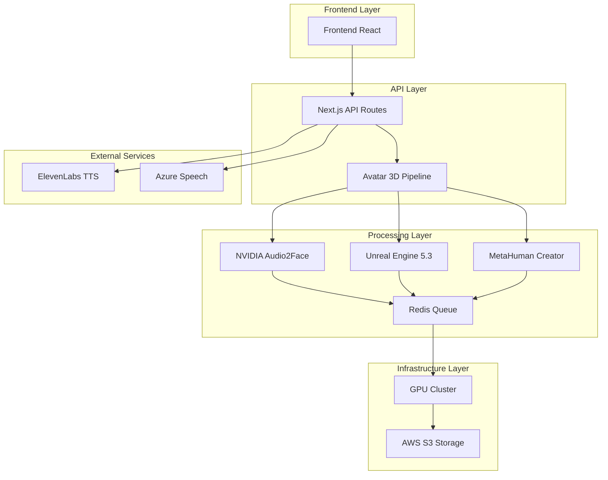
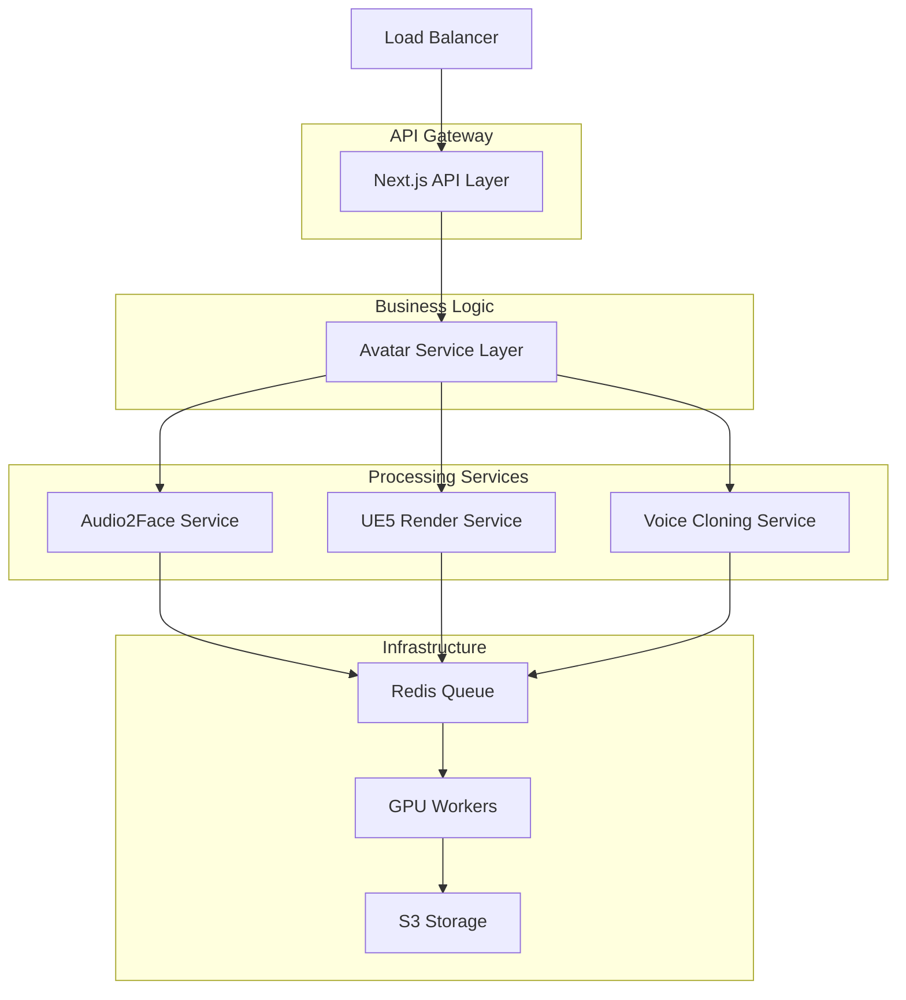
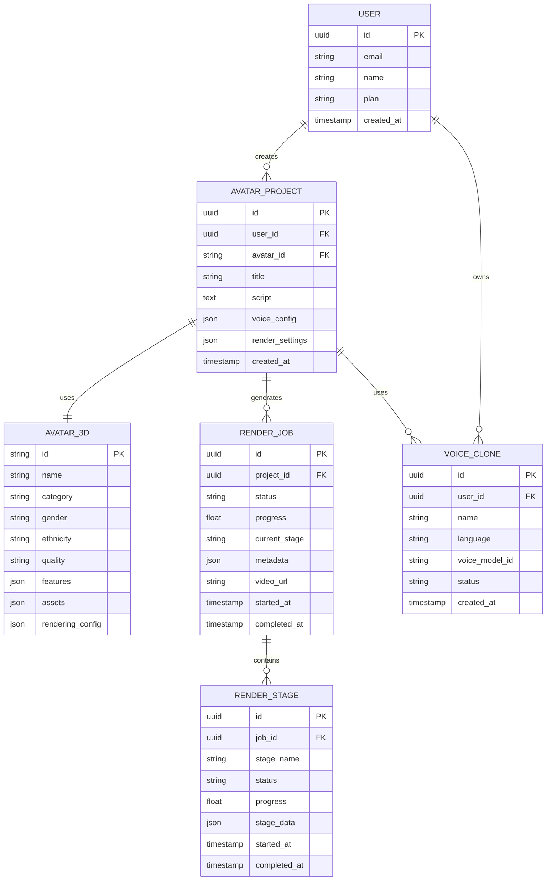

# FASE 2: Avatares 3D Hiper-Realistas - Arquitetura Técnica

## 1. Arquitetura do Sistema



## 2. Stack Tecnológico

- **Frontend**: React@18 + Next.js@14 + TypeScript + Tailwind CSS + Three.js
- **Backend**: Next.js API Routes + Prisma ORM + Redis + BullMQ
- **3D Pipeline**: NVIDIA Audio2Face OSS + Unreal Engine 5.3 + MetaHuman Creator
- **Storage**: AWS S3 + CloudFront CDN
- **Infrastructure**: Docker + NVIDIA Container Runtime + Kubernetes
- **Database**: PostgreSQL (Supabase) + Redis Cache

## 3. Definições de Rotas

| Rota | Propósito |
|------|-----------|
| /avatars/gallery | Galeria de avatares 3D, filtros e seleção |
| /avatars/studio | Studio de criação com editor 3D |
| /avatars/render | Pipeline de renderização e monitoramento |
| /avatars/settings | Configurações avançadas de qualidade |
| /avatars/voice-cloning | Sistema de clonagem de voz |
| /avatars/history | Histórico de vídeos criados |

## 4. APIs do Sistema

### 4.1 APIs Principais

**Gerenciamento de Avatares**
```
GET /api/v2/avatars/gallery
```

Request:
| Parâmetro | Tipo | Obrigatório | Descrição |
|-----------|------|-------------|-----------|
| category | string | false | Filtrar por categoria (business, safety, education) |
| gender | string | false | Filtrar por gênero (male, female, unisex) |
| quality | string | false | Filtrar por qualidade (standard, premium, hyperreal) |

Response:
| Parâmetro | Tipo | Descrição |
|-----------|------|-----------|
| avatars | Avatar3D[] | Lista de avatares disponíveis |
| total | number | Total de avatares |

Exemplo:
```json
{
  "avatars": [
    {
      "id": "br_corporate_ana",
      "name": "Ana Paula - Executiva",
      "category": "business",
      "gender": "female",
      "quality": "hyperreal",
      "preview_url": "https://cdn.example.com/avatars/ana_preview.mp4"
    }
  ],
  "total": 12
}
```

**Pipeline de Renderização**
```
POST /api/v2/avatars/render
```

Request:
| Parâmetro | Tipo | Obrigatório | Descrição |
|-----------|------|-------------|-----------|
| avatar_id | string | true | ID do avatar selecionado |
| script | string | true | Texto para síntese de voz |
| voice_config | object | true | Configurações de voz (TTS ou clonada) |
| render_settings | object | true | Configurações de renderização |

Response:
| Parâmetro | Tipo | Descrição |
|-----------|------|-----------|
| job_id | string | ID único do job de renderização |
| status | string | Status inicial (queued) |
| estimated_time | number | Tempo estimado em segundos |

**Status de Renderização**
```
GET /api/v2/avatars/render/status/{job_id}
```

Response:
| Parâmetro | Tipo | Descrição |
|-----------|------|-----------|
| job_id | string | ID do job |
| status | string | Status atual (queued, processing, completed, failed) |
| progress | number | Progresso de 0 a 1 |
| current_stage | string | Estágio atual (tts, audio2face, ue5, compositing) |
| video_url | string | URL do vídeo (quando completed) |

### 4.2 APIs de Voice Cloning

**Criar Voz Clonada**
```
POST /api/v2/voice-cloning/create
```

Request:
| Parâmetro | Tipo | Obrigatório | Descrição |
|-----------|------|-------------|-----------|
| name | string | true | Nome da voz personalizada |
| audio_file | File | true | Arquivo de áudio (30s mínimo, WAV/MP3) |
| language | string | true | Idioma (pt-BR, en-US, es-ES) |

Response:
| Parâmetro | Tipo | Descrição |
|-----------|------|-----------|
| voice_id | string | ID da voz clonada |
| status | string | Status do treinamento |
| training_progress | number | Progresso do treinamento |

## 5. Arquitetura do Servidor



## 6. Modelo de Dados

### 6.1 Diagrama de Entidades



### 6.2 DDL (Data Definition Language)

**Tabela de Avatares 3D**
```sql
-- Tabela de avatares 3D disponíveis
CREATE TABLE avatars_3d (
    id VARCHAR(50) PRIMARY KEY,
    name VARCHAR(100) NOT NULL,
    category VARCHAR(20) CHECK (category IN ('business', 'healthcare', 'education', 'casual', 'safety')),
    gender VARCHAR(10) CHECK (gender IN ('male', 'female', 'unisex')),
    ethnicity VARCHAR(20) CHECK (ethnicity IN ('caucasian', 'afro', 'asian', 'latino', 'mixed')),
    age VARCHAR(10) CHECK (age IN ('young', 'adult', 'senior')),
    quality VARCHAR(15) CHECK (quality IN ('standard', 'premium', 'cinematic', 'hyperreal')),
    features JSONB NOT NULL,
    assets JSONB NOT NULL,
    rendering_config JSONB NOT NULL,
    animations JSONB NOT NULL,
    voice_sync JSONB NOT NULL,
    is_active BOOLEAN DEFAULT true,
    created_at TIMESTAMP WITH TIME ZONE DEFAULT NOW(),
    updated_at TIMESTAMP WITH TIME ZONE DEFAULT NOW()
);

-- Tabela de projetos de avatar
CREATE TABLE avatar_projects (
    id UUID PRIMARY KEY DEFAULT gen_random_uuid(),
    user_id UUID NOT NULL REFERENCES users(id) ON DELETE CASCADE,
    avatar_id VARCHAR(50) NOT NULL REFERENCES avatars_3d(id),
    title VARCHAR(200) NOT NULL,
    script TEXT NOT NULL,
    voice_config JSONB NOT NULL,
    render_settings JSONB NOT NULL,
    thumbnail_url VARCHAR(500),
    created_at TIMESTAMP WITH TIME ZONE DEFAULT NOW(),
    updated_at TIMESTAMP WITH TIME ZONE DEFAULT NOW()
);

-- Tabela de jobs de renderização
CREATE TABLE render_jobs (
    id UUID PRIMARY KEY DEFAULT gen_random_uuid(),
    project_id UUID NOT NULL REFERENCES avatar_projects(id) ON DELETE CASCADE,
    status VARCHAR(20) DEFAULT 'queued' CHECK (status IN ('queued', 'processing', 'completed', 'failed', 'cancelled')),
    progress FLOAT DEFAULT 0 CHECK (progress >= 0 AND progress <= 1),
    current_stage VARCHAR(30),
    metadata JSONB,
    video_url VARCHAR(500),
    error_message TEXT,
    started_at TIMESTAMP WITH TIME ZONE,
    completed_at TIMESTAMP WITH TIME ZONE,
    created_at TIMESTAMP WITH TIME ZONE DEFAULT NOW()
);

-- Tabela de estágios de renderização
CREATE TABLE render_stages (
    id UUID PRIMARY KEY DEFAULT gen_random_uuid(),
    job_id UUID NOT NULL REFERENCES render_jobs(id) ON DELETE CASCADE,
    stage_name VARCHAR(30) NOT NULL,
    status VARCHAR(20) DEFAULT 'pending' CHECK (status IN ('pending', 'processing', 'completed', 'failed')),
    progress FLOAT DEFAULT 0 CHECK (progress >= 0 AND progress <= 1),
    stage_data JSONB,
    error_message TEXT,
    started_at TIMESTAMP WITH TIME ZONE,
    completed_at TIMESTAMP WITH TIME ZONE,
    created_at TIMESTAMP WITH TIME ZONE DEFAULT NOW()
);

-- Tabela de vozes clonadas
CREATE TABLE voice_clones (
    id UUID PRIMARY KEY DEFAULT gen_random_uuid(),
    user_id UUID NOT NULL REFERENCES users(id) ON DELETE CASCADE,
    name VARCHAR(100) NOT NULL,
    language VARCHAR(10) NOT NULL DEFAULT 'pt-BR',
    voice_model_id VARCHAR(100),
    status VARCHAR(20) DEFAULT 'training' CHECK (status IN ('training', 'ready', 'failed')),
    training_progress FLOAT DEFAULT 0 CHECK (training_progress >= 0 AND training_progress <= 1),
    audio_sample_url VARCHAR(500),
    created_at TIMESTAMP WITH TIME ZONE DEFAULT NOW(),
    updated_at TIMESTAMP WITH TIME ZONE DEFAULT NOW()
);

-- Índices para performance
CREATE INDEX idx_avatar_projects_user_id ON avatar_projects(user_id);
CREATE INDEX idx_avatar_projects_created_at ON avatar_projects(created_at DESC);
CREATE INDEX idx_render_jobs_project_id ON render_jobs(project_id);
CREATE INDEX idx_render_jobs_status ON render_jobs(status);
CREATE INDEX idx_render_jobs_created_at ON render_jobs(created_at DESC);
CREATE INDEX idx_render_stages_job_id ON render_stages(job_id);
CREATE INDEX idx_voice_clones_user_id ON voice_clones(user_id);

-- Dados iniciais - Avatares brasileiros
INSERT INTO avatars_3d (id, name, category, gender, ethnicity, age, quality, features, assets, rendering_config, animations, voice_sync) VALUES
('br_corporate_ana', 'Ana Paula - Executiva', 'business', 'female', 'latino', 'adult', 'hyperreal', 
 '{"facialDetails": "cinematic", "skinTexture": "photogrammetry", "hairSystem": "volumetric", "lipSyncAccuracy": 98}',
 '{"modelFile": "/avatars/3d/ana_corporate_8k.gltf", "textureFiles": ["/avatars/textures/ana_diffuse_8k.jpg"]}',
 '{"resolution": "8K", "rayTracing": true, "antiAliasing": "TAA"}',
 '{"idle": ["corporate_idle_01"], "talking": ["talk_confident"], "gestures": ["point_right"]}',
 '{"supportedLanguages": ["pt-BR"], "lipSyncEngine": "ml-driven"}'),
 
('br_safety_carlos', 'Carlos Silva - Segurança', 'safety', 'male', 'mixed', 'adult', 'hyperreal',
 '{"facialDetails": "cinematic", "skinTexture": "photogrammetry", "hairSystem": "volumetric", "lipSyncAccuracy": 97}',
 '{"modelFile": "/avatars/3d/carlos_safety_8k.gltf", "textureFiles": ["/avatars/textures/carlos_diffuse_8k.jpg"]}',
 '{"resolution": "8K", "rayTracing": true, "antiAliasing": "TAA"}',
 '{"idle": ["safety_stance"], "talking": ["explain_procedure"], "gestures": ["point_equipment"]}',
 '{"supportedLanguages": ["pt-BR"], "lipSyncEngine": "ml-driven"}');

-- Permissões Supabase
GRANT SELECT ON avatars_3d TO anon;
GRANT ALL PRIVILEGES ON avatar_projects TO authenticated;
GRANT ALL PRIVILEGES ON render_jobs TO authenticated;
GRANT ALL PRIVILEGES ON render_stages TO authenticated;
GRANT ALL PRIVILEGES ON voice_clones TO authenticated;
```