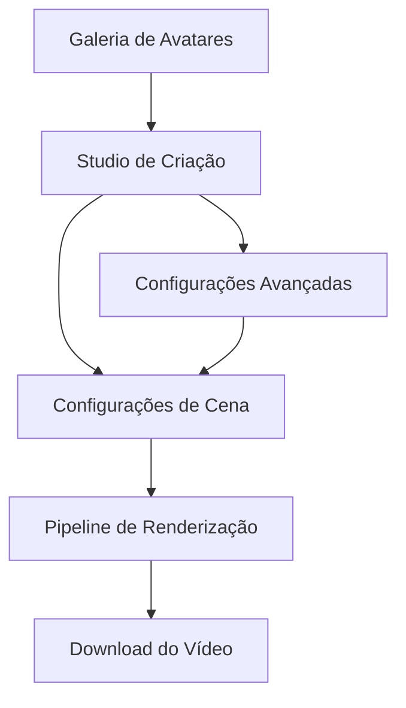

# FASE 2: Avatares 3D Hiper-Realistas - Requisitos do Produto

## 1. Visão Geral do Produto

O **Sistema de Avatares 3D Hiper-Realistas** é uma plataforma avançada que permite a criação de vídeos educacionais com avatares fotorrealistas falando em português brasileiro. O sistema utiliza tecnologias de ponta como NVIDIA Audio2Face, Unreal Engine 5 e MetaHuman Creator para entregar qualidade cinematográfica com lip-sync de precisão superior a 98%.

- **Objetivo Principal**: Democratizar a criação de conteúdo educacional de alta qualidade com avatares brasileiros realistas
- **Público-Alvo**: Empresas de treinamento, instituições educacionais, criadores de conteúdo corporativo
- **Valor de Mercado**: Redução de 80% no custo de produção de vídeos educacionais profissionais

## 2. Funcionalidades Principais

### 2.1 Papéis de Usuário

| Papel | Método de Registro | Permissões Principais |
|-------|-------------------|----------------------|
| Usuário Básico | Email + senha | Acesso a 3 avatares, renderização HD, 10 vídeos/mês |
| Usuário Premium | Upgrade via pagamento | Acesso completo a galeria, renderização 4K, vídeos ilimitados |
| Usuário Enterprise | Contrato corporativo | API completa, avatares customizados, renderização 8K, suporte prioritário |

### 2.2 Módulos Funcionais

O sistema de avatares 3D consiste nas seguintes páginas principais:

1. **Galeria de Avatares**: seleção de avatares brasileiros, preview em tempo real, customização básica
2. **Studio de Criação**: editor de texto/script, configuração de voz, ajustes de avatar, preview de lip-sync
3. **Pipeline de Renderização**: monitoramento em tempo real, fila de processamento, download de vídeos
4. **Configurações Avançadas**: ajustes de qualidade, configurações de voz, preferências de renderização

### 2.3 Detalhes das Páginas

| Nome da Página | Módulo | Descrição da Funcionalidade |
|----------------|--------|------------------------------|
| Galeria de Avatares | Seletor de Avatar | Exibir 10+ avatares brasileiros categorizados (corporativo, segurança, saúde, educação). Filtrar por gênero, etnia, idade. Preview 3D interativo com rotação 360°. |
| Studio de Criação | Editor de Script | Inserir texto em português, configurar pausas e ênfases. Integração com TTS (Azure, ElevenLabs). Preview de áudio em tempo real. |
| Studio de Criação | Configurador de Avatar | Ajustar expressões faciais, gestos, posicionamento. Configurar iluminação cinematográfica (key, fill, rim light). Escolher cenários 3D. |
| Pipeline de Renderização | Monitor de Progresso | Exibir status em tempo real (Audio2Face → UE5 → Composição). Estimativa de tempo restante. Cancelar renderização. |
| Pipeline de Renderização | Fila de Processamento | Visualizar fila de jobs, priorizar renderizações. Histórico de vídeos criados. |
| Configurações Avançadas | Qualidade de Renderização | Selecionar resolução (HD/4K/8K), ray tracing, anti-aliasing. Configurar taxa de quadros (24/30/60 fps). |
| Configurações Avançadas | Voice Cloning | Upload de amostra de voz (30s), treinamento de modelo personalizado. Gerenciar vozes clonadas. |

## 3. Fluxo Principal de Uso

### Fluxo do Usuário Premium

1. **Seleção de Avatar**: Usuário acessa galeria → filtra por categoria → seleciona avatar brasileiro → visualiza preview 3D
2. **Criação de Conteúdo**: Insere script em português → configura voz (TTS ou clonada) → ajusta expressões e gestos
3. **Configuração de Cena**: Escolhe cenário 3D → ajusta iluminação → posiciona câmera → define qualidade de renderização
4. **Renderização**: Inicia pipeline → monitora progresso → recebe notificação de conclusão → faz download do vídeo

## 4. Design da Interface

### 4.1 Estilo de Design

- **Cores Primárias**: #1a1a2e (azul escuro), #16213e (azul médio), #0f3460 (azul claro)
- **Cores Secundárias**: #e94560 (vermelho accent), #f39c12 (laranja), #2ecc71 (verde sucesso)
- **Estilo de Botões**: Rounded corners (8px), gradiente sutil, hover com elevação
- **Tipografia**: Inter (títulos), Source Sans Pro (corpo), tamanhos 14px-32px
- **Layout**: Grid responsivo, sidebar fixa, cards com sombra suave
- **Ícones**: Lucide React, estilo outline, 24px padrão

### 4.2 Visão Geral das Páginas

| Nome da Página | Módulo | Elementos de UI |
|----------------|--------|-----------------|
| Galeria de Avatares | Grid de Avatares | Cards 3D interativos com preview, filtros laterais, busca por nome. Botão "Selecionar" com animação. |
| Studio de Criação | Editor de Script | Textarea com syntax highlighting, contador de caracteres, botão "Gerar Áudio". Player de áudio integrado. |
| Studio de Criação | Configurador 3D | Viewport 3D com controles de câmera, painel de propriedades lateral, sliders para ajustes. |
| Pipeline de Renderização | Dashboard de Status | Progress bars animadas, logs em tempo real, cards de estatísticas. Botões de ação contextuais. |
| Configurações Avançadas | Painel de Qualidade | Toggle switches para recursos, sliders de qualidade, preview de configurações. |

### 4.3 Responsividade

- **Desktop-first**: Otimizado para telas 1920x1080+, viewport 3D em tela cheia
- **Tablet-adaptive**: Layout em duas colunas, controles touch-friendly
- **Mobile-responsive**: Stack vertical, gestos de pinch-to-zoom no viewport 3D