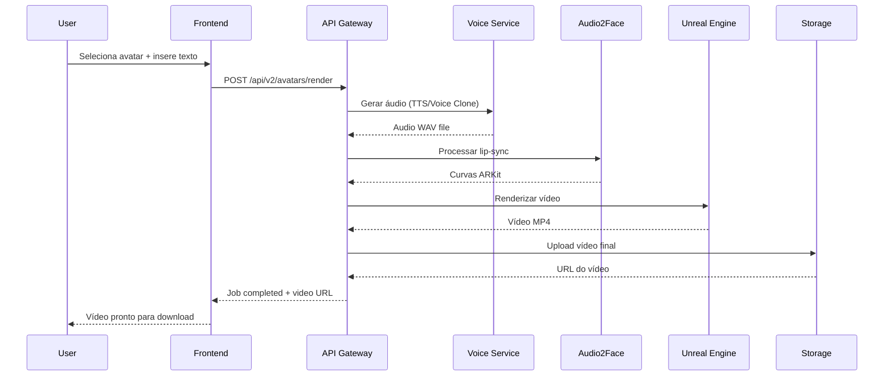

# FASE 2: Especificações Técnicas Detalhadas - Avatares 3D Hiper-Realistas

## 1. Pipeline Técnico Completo

### 1.1 Fluxo de Processamento



### 1.2 Especificações de Hardware

**Requisitos Mínimos por GPU Worker:**
- **GPU**: NVIDIA RTX 4090 (24GB VRAM) ou A100 (40GB)
- **CPU**: Intel i9-13900K ou AMD Ryzen 9 7950X
- **RAM**: 64GB DDR5-5600
- **Storage**: 2TB NVMe SSD (7000MB/s read)
- **Network**: 10Gbps ethernet

**Cluster de Produção:**
- **4x GPU Workers** para renderização paralela
- **1x Master Node** para orquestração
- **Load Balancer** com failover automático
- **Shared Storage** 10TB NFS para assets

## 2. Integração NVIDIA Audio2Face

### 2.1 Container Configuration

```dockerfile
# Dockerfile.audio2face
FROM nvcr.io/nvidia/audio2face:23.1.1-py3

# Instalar dependências Python
RUN pip install fastapi uvicorn redis celery

# Copiar scripts de integração
COPY scripts/a2f_api.py /app/
COPY scripts/arkit_processor.py /app/
COPY configs/a2f_config.json /app/

# Configurar Audio2Face headless
ENV A2F_HEADLESS=1
ENV A2F_GPU_MEMORY=8192

EXPOSE 5001
CMD ["python", "/app/a2f_api.py"]
```

### 2.2 API Audio2Face Service

```python
# scripts/a2f_api.py
from fastapi import FastAPI, UploadFile, File
from celery import Celery
import audio2face_api as a2f
import json

app = FastAPI()
celery_app = Celery('audio2face', broker='redis://redis:6379')

@app.post("/a2f/generate")
async def generate_lipsync(
    audio_file: UploadFile = File(...),
    smoothing: float = 0.3,
    intensity: float = 1.0
):
    # Salvar arquivo de áudio
    audio_path = f"/tmp/{audio_file.filename}"
    with open(audio_path, "wb") as f:
        f.write(await audio_file.read())
    
    # Iniciar job assíncrono
    job = process_audio_task.delay(audio_path, smoothing, intensity)
    
    return {
        "job_id": job.id,
        "status": "queued"
    }

@celery_app.task
def process_audio_task(audio_path: str, smoothing: float, intensity: float):
    # Configurar Audio2Face
    a2f.init()
    
    # Carregar áudio
    a2f.load_audio(audio_path)
    
    # Processar lip-sync
    arkit_data = a2f.generate_arkit_curves(
        smoothing=smoothing,
        intensity=intensity
    )
    
    # Salvar curvas ARKit
    output_path = f"/data/arkit_{job_id}.json"
    with open(output_path, "w") as f:
        json.dump(arkit_data, f)
    
    return {
        "status": "completed",
        "arkit_path": output_path,
        "duration": len(arkit_data["frames"]) / 30.0  # 30 FPS
    }
```

### 2.3 Configuração ARKit

```json
{
  "arkit_config": {
    "blend_shapes": [
      "eyeBlinkLeft", "eyeLookDownLeft", "eyeLookInLeft",
      "eyeLookOutLeft", "eyeLookUpLeft", "eyeSquintLeft",
      "eyeWideLeft", "eyeBlinkRight", "eyeLookDownRight",
      "jawForward", "jawLeft", "jawRight", "jawOpen",
      "mouthClose", "mouthFunnel", "mouthPucker",
      "mouthLeft", "mouthRight", "mouthSmileLeft",
      "mouthSmileRight", "mouthFrownLeft", "mouthFrownRight",
      "mouthDimpleLeft", "mouthDimpleRight", "mouthStretchLeft",
      "mouthStretchRight", "mouthRollLower", "mouthRollUpper",
      "mouthShrugLower", "mouthShrugUpper", "mouthPressLeft",
      "mouthPressRight", "mouthLowerDownLeft", "mouthLowerDownRight",
      "mouthUpperUpLeft", "mouthUpperUpRight"
    ],
    "frame_rate": 30,
    "smoothing_factor": 0.3,
    "intensity_multiplier": 1.0
  }
}
```

## 3. Unreal Engine 5 Integration

### 3.1 UE5 Headless Rendering

```python
# services/ue5/render_service.py
import subprocess
import json
import os
from pathlib import Path

class UE5RenderService:
    def __init__(self):
        self.ue5_path = "/opt/UnrealEngine/Engine/Binaries/Linux/UnrealEditor"
        self.project_path = "/app/AvatarProject/AvatarProject.uproject"
        
    async def render_avatar_video(
        self,
        avatar_id: str,
        arkit_data: dict,
        render_settings: dict
    ) -> str:
        # Preparar configuração de renderização
        render_config = {
            "avatar_id": avatar_id,
            "arkit_curves": arkit_data,
            "resolution": render_settings.get("resolution", "4K"),
            "fps": render_settings.get("fps", 30),
            "quality": render_settings.get("quality", "cinematic"),
            "output_path": f"/tmp/render_{avatar_id}_{timestamp}.mp4"
        }
        
        # Salvar configuração
        config_path = f"/tmp/render_config_{avatar_id}.json"
        with open(config_path, "w") as f:
            json.dump(render_config, f)
        
        # Executar renderização headless
        cmd = [
            self.ue5_path,
            self.project_path,
            "-game",
            "-MoviePipelineConfig=" + config_path,
            "-windowed",
            "-ResX=1920",
            "-ResY=1080",
            "-unattended",
            "-nothreading",
            "-nosplash",
            "-nullrhi"  # Para headless
        ]
        
        process = await asyncio.create_subprocess_exec(
            *cmd,
            stdout=asyncio.subprocess.PIPE,
            stderr=asyncio.subprocess.PIPE
        )
        
        stdout, stderr = await process.communicate()
        
        if process.returncode == 0:
            return render_config["output_path"]
        else:
            raise Exception(f"UE5 render failed: {stderr.decode()}")
```

### 3.2 Movie Render Queue Configuration

```cpp
// AvatarRenderPipeline.cpp
#include "MoviePipelineQueue.h"
#include "MoviePipelineExecutor.h"
#include "MovieRenderPipelineSettings.h"

class FAvatarRenderPipeline {
public:
    void SetupRenderQueue(const FString& ConfigPath) {
        // Carregar configuração JSON
        FString ConfigJson;
        FFileHelper::LoadFileToString(ConfigJson, *ConfigPath);
        
        TSharedPtr<FJsonObject> Config;
        TSharedRef<TJsonReader<>> Reader = TJsonReaderFactory<>::Create(ConfigJson);
        FJsonSerializer::Deserialize(Reader, Config);
        
        // Configurar Movie Render Queue
        UMoviePipelineQueue* Queue = NewObject<UMoviePipelineQueue>();
        UMoviePipelineExecutorJob* Job = Queue->AllocateNewJob();
        
        // Configurar resolução
        FString Resolution = Config->GetStringField("resolution");
        if (Resolution == "4K") {
            Job->GetConfiguration()->FindSetting<UMoviePipelineOutputSetting>()->OutputResolution = FIntPoint(3840, 2160);
        } else if (Resolution == "8K") {
            Job->GetConfiguration()->FindSetting<UMoviePipelineOutputSetting>()->OutputResolution = FIntPoint(7680, 4320);
        }
        
        // Configurar qualidade
        FString Quality = Config->GetStringField("quality");
        if (Quality == "cinematic") {
            // Ativar ray tracing
            Job->GetConfiguration()->FindSetting<UMoviePipelineConsoleVariableSetting>()->ConsoleVariables.Add("r.RayTracing", "1");
            Job->GetConfiguration()->FindSetting<UMoviePipelineConsoleVariableSetting>()->ConsoleVariables.Add("r.RayTracing.GlobalIllumination", "1");
        }
        
        // Executar renderização
        UMoviePipelineExecutor* Executor = NewObject<UMoviePipelineExecutor>();
        Executor->Execute(Queue);
    }
};
```

## 4. MetaHuman Creator Integration

### 4.1 MetaHuman API Wrapper

```typescript
// lib/metahuman/creator-api.ts
export interface MetaHumanConfig {
  id: string;
  name: string;
  gender: 'male' | 'female';
  ethnicity: string;
  age: number;
  bodyType: string;
  facialFeatures: {
    eyeShape: string;
    noseShape: string;
    mouthShape: string;
    jawShape: string;
  };
  hairStyle: string;
  skinTone: string;
}

export class MetaHumanCreator {
  private apiKey: string;
  private baseUrl = 'https://api.metahuman.unrealengine.com/v1';
  
  constructor(apiKey: string) {
    this.apiKey = apiKey;
  }
  
  async createAvatar(config: MetaHumanConfig): Promise<string> {
    const response = await fetch(`${this.baseUrl}/avatars`, {
      method: 'POST',
      headers: {
        'Authorization': `Bearer ${this.apiKey}`,
        'Content-Type': 'application/json'
      },
      body: JSON.stringify(config)
    });
    
    const result = await response.json();
    return result.avatar_id;
  }
  
  async downloadAvatar(avatarId: string): Promise<Buffer> {
    const response = await fetch(`${this.baseUrl}/avatars/${avatarId}/download`, {
      headers: {
        'Authorization': `Bearer ${this.apiKey}`
      }
    });
    
    return Buffer.from(await response.arrayBuffer());
  }
  
  async listPresets(): Promise<MetaHumanConfig[]> {
    const response = await fetch(`${this.baseUrl}/presets`, {
      headers: {
        'Authorization': `Bearer ${this.apiKey}`
      }
    });
    
    return await response.json();
  }
}
```

### 4.2 Avatar Gallery Component

```tsx
// components/avatars/avatar-gallery.tsx
import { Canvas } from '@react-three/fiber';
import { OrbitControls, useGLTF } from '@react-three/drei';
import { Suspense, useState } from 'react';

interface Avatar3DPreview {
  id: string;
  name: string;
  modelUrl: string;
  category: string;
  gender: string;
  ethnicity: string;
}

export function AvatarGallery() {
  const [selectedAvatar, setSelectedAvatar] = useState<string | null>(null);
  const [avatars, setAvatars] = useState<Avatar3DPreview[]>([]);
  const [filters, setFilters] = useState({
    category: 'all',
    gender: 'all',
    ethnicity: 'all'
  });
  
  return (
    <div className="grid grid-cols-1 lg:grid-cols-4 gap-6">
      {/* Filtros */}
      <div className="lg:col-span-1">
        <div className="bg-white rounded-lg shadow-lg p-6">
          <h3 className="text-lg font-semibold mb-4">Filtros</h3>
          
          <div className="space-y-4">
            <div>
              <label className="block text-sm font-medium mb-2">Categoria</label>
              <select 
                value={filters.category}
                onChange={(e) => setFilters({...filters, category: e.target.value})}
                className="w-full p-2 border rounded-md"
              >
                <option value="all">Todas</option>
                <option value="business">Corporativo</option>
                <option value="safety">Segurança</option>
                <option value="healthcare">Saúde</option>
                <option value="education">Educação</option>
              </select>
            </div>
            
            <div>
              <label className="block text-sm font-medium mb-2">Gênero</label>
              <select 
                value={filters.gender}
                onChange={(e) => setFilters({...filters, gender: e.target.value})}
                className="w-full p-2 border rounded-md"
              >
                <option value="all">Todos</option>
                <option value="male">Masculino</option>
                <option value="female">Feminino</option>
              </select>
            </div>
          </div>
        </div>
      </div>
      
      {/* Grid de Avatares */}
      <div className="lg:col-span-3">
        <div className="grid grid-cols-1 md:grid-cols-2 xl:grid-cols-3 gap-6">
          {avatars.map((avatar) => (
            <AvatarCard 
              key={avatar.id}
              avatar={avatar}
              isSelected={selectedAvatar === avatar.id}
              onSelect={() => setSelectedAvatar(avatar.id)}
            />
          ))}
        </div>
      </div>
    </div>
  );
}

function AvatarCard({ avatar, isSelected, onSelect }: {
  avatar: Avatar3DPreview;
  isSelected: boolean;
  onSelect: () => void;
}) {
  return (
    <div 
      className={`bg-white rounded-lg shadow-lg overflow-hidden cursor-pointer transition-all ${
        isSelected ? 'ring-2 ring-blue-500 shadow-xl' : 'hover:shadow-xl'
      }`}
      onClick={onSelect}
    >
      {/* Preview 3D */}
      <div className="h-64 bg-gray-100">
        <Canvas camera={{ position: [0, 0, 5], fov: 50 }}>
          <Suspense fallback={null}>
            <ambientLight intensity={0.5} />
            <directionalLight position={[10, 10, 5]} intensity={1} />
            <Avatar3DModel url={avatar.modelUrl} />
            <OrbitControls enableZoom={false} />
          </Suspense>
        </Canvas>
      </div>
      
      {/* Informações */}
      <div className="p-4">
        <h3 className="font-semibold text-lg">{avatar.name}</h3>
        <div className="flex gap-2 mt-2">
          <span className="px-2 py-1 bg-blue-100 text-blue-800 text-xs rounded">
            {avatar.category}
          </span>
          <span className="px-2 py-1 bg-green-100 text-green-800 text-xs rounded">
            {avatar.gender}
          </span>
        </div>
      </div>
    </div>
  );
}

function Avatar3DModel({ url }: { url: string }) {
  const { scene } = useGLTF(url);
  return <primitive object={scene} scale={[1, 1, 1]} />;
}
```

## 5. Voice Cloning com ElevenLabs

### 5.1 ElevenLabs Service

```typescript
// lib/services/elevenlabs-service.ts
export interface VoiceCloneConfig {
  name: string;
  description: string;
  files: File[];
  labels?: Record<string, string>;
}

export interface VoiceCloneResult {
  voice_id: string;
  name: string;
  status: 'training' | 'ready' | 'failed';
  progress: number;
}

export class ElevenLabsService {
  private apiKey: string;
  private baseUrl = 'https://api.elevenlabs.io/v1';
  
  constructor(apiKey: string) {
    this.apiKey = apiKey;
  }
  
  async cloneVoice(config: VoiceCloneConfig): Promise<VoiceCloneResult> {
    const formData = new FormData();
    formData.append('name', config.name);
    formData.append('description', config.description);
    
    // Adicionar arquivos de áudio
    config.files.forEach((file, index) => {
      formData.append(`files[${index}]`, file);
    });
    
    // Adicionar labels se fornecidos
    if (config.labels) {
      Object.entries(config.labels).forEach(([key, value]) => {
        formData.append(`labels[${key}]`, value);
      });
    }
    
    const response = await fetch(`${this.baseUrl}/voices/add`, {
      method: 'POST',
      headers: {
        'xi-api-key': this.apiKey
      },
      body: formData
    });
    
    if (!response.ok) {
      throw new Error(`ElevenLabs API error: ${response.statusText}`);
    }
    
    return await response.json();
  }
  
  async getVoiceStatus(voiceId: string): Promise<VoiceCloneResult> {
    const response = await fetch(`${this.baseUrl}/voices/${voiceId}`, {
      headers: {
        'xi-api-key': this.apiKey
      }
    });
    
    return await response.json();
  }
  
  async generateSpeech(
    text: string, 
    voiceId: string, 
    options: {
      stability?: number;
      similarity_boost?: number;
      style?: number;
    } = {}
  ): Promise<Buffer> {
    const response = await fetch(`${this.baseUrl}/text-to-speech/${voiceId}`, {
      method: 'POST',
      headers: {
        'xi-api-key': this.apiKey,
        'Content-Type': 'application/json'
      },
      body: JSON.stringify({
        text,
        voice_settings: {
          stability: options.stability ?? 0.5,
          similarity_boost: options.similarity_boost ?? 0.5,
          style: options.style ?? 0.0
        }
      })
    });
    
    if (!response.ok) {
      throw new Error(`TTS generation failed: ${response.statusText}`);
    }
    
    return Buffer.from(await response.arrayBuffer());
  }
  
  async listVoices(): Promise<any[]> {
    const response = await fetch(`${this.baseUrl}/voices`, {
      headers: {
        'xi-api-key': this.apiKey
      }
    });
    
    const data = await response.json();
    return data.voices;
  }
}
```

### 5.2 Voice Management UI

```tsx
// components/voice/voice-cloning-studio.tsx
import { useState, useCallback } from 'react';
import { useDropzone } from 'react-dropzone';
import { ElevenLabsService } from '@/lib/services/elevenlabs-service';

export function VoiceCloningStudio() {
  const [audioFiles, setAudioFiles] = useState<File[]>([]);
  const [voiceName, setVoiceName] = useState('');
  const [isTraining, setIsTraining] = useState(false);
  const [trainingProgress, setTrainingProgress] = useState(0);
  
  const onDrop = useCallback((acceptedFiles: File[]) => {
    setAudioFiles(prev => [...prev, ...acceptedFiles]);
  }, []);
  
  const { getRootProps, getInputProps, isDragActive } = useDropzone({
    onDrop,
    accept: {
      'audio/*': ['.wav', '.mp3', '.m4a']
    },
    maxFiles: 10
  });
  
  const handleStartTraining = async () => {
    if (audioFiles.length === 0 || !voiceName) return;
    
    setIsTraining(true);
    
    try {
      const elevenlabs = new ElevenLabsService(process.env.NEXT_PUBLIC_ELEVENLABS_API_KEY!);
      
      const result = await elevenlabs.cloneVoice({
        name: voiceName,
        description: `Voz clonada para ${voiceName}`,
        files: audioFiles
      });
      
      // Monitorar progresso
      const interval = setInterval(async () => {
        const status = await elevenlabs.getVoiceStatus(result.voice_id);
        setTrainingProgress(status.progress);
        
        if (status.status === 'ready') {
          clearInterval(interval);
          setIsTraining(false);
          // Notificar sucesso
        } else if (status.status === 'failed') {
          clearInterval(interval);
          setIsTraining(false);
          // Notificar erro
        }
      }, 5000);
      
    } catch (error) {
      console.error('Erro no treinamento:', error);
      setIsTraining(false);
    }
  };
  
  return (
    <div className="max-w-4xl mx-auto p-6">
      <h1 className="text-3xl font-bold mb-8">Clonagem de Voz</h1>
      
      {/* Upload de Arquivos */}
      <div className="bg-white rounded-lg shadow-lg p-6 mb-6">
        <h2 className="text-xl font-semibold mb-4">1. Upload de Amostras de Voz</h2>
        
        <div
          {...getRootProps()}
          className={`border-2 border-dashed rounded-lg p-8 text-center cursor-pointer transition-colors ${
            isDragActive ? 'border-blue-500 bg-blue-50' : 'border-gray-300 hover:border-gray-400'
          }`}
        >
          <input {...getInputProps()} />
          <div className="text-gray-600">
            <p className="text-lg mb-2">
              {isDragActive ? 'Solte os arquivos aqui...' : 'Arraste arquivos de áudio ou clique para selecionar'}
            </p>
            <p className="text-sm">
              Formatos aceitos: WAV, MP3, M4A (mínimo 30 segundos por arquivo)
            </p>
          </div>
        </div>
        
        {/* Lista de Arquivos */}
        {audioFiles.length > 0 && (
          <div className="mt-4">
            <h3 className="font-medium mb-2">Arquivos Selecionados:</h3>
            <ul className="space-y-2">
              {audioFiles.map((file, index) => (
                <li key={index} className="flex items-center justify-between bg-gray-50 p-2 rounded">
                  <span>{file.name}</span>
                  <button
                    onClick={() => setAudioFiles(files => files.filter((_, i) => i !== index))}
                    className="text-red-500 hover:text-red-700"
                  >
                    Remover
                  </button>
                </li>
              ))}
            </ul>
          </div>
        )}
      </div>
      
      {/* Configurações */}
      <div className="bg-white rounded-lg shadow-lg p-6 mb-6">
        <h2 className="text-xl font-semibold mb-4">2. Configurações da Voz</h2>
        
        <div className="space-y-4">
          <div>
            <label className="block text-sm font-medium mb-2">Nome da Voz</label>
            <input
              type="text"
              value={voiceName}
              onChange={(e) => setVoiceName(e.target.value)}
              placeholder="Ex: João Silva - Narrador"
              className="w-full p-3 border rounded-lg"
            />
          </div>
        </div>
      </div>
      
      {/* Treinamento */}
      <div className="bg-white rounded-lg shadow-lg p-6">
        <h2 className="text-xl font-semibold mb-4">3. Iniciar Treinamento</h2>
        
        {!isTraining ? (
          <button
            onClick={handleStartTraining}
            disabled={audioFiles.length === 0 || !voiceName}
            className="bg-blue-600 text-white px-6 py-3 rounded-lg hover:bg-blue-700 disabled:bg-gray-400 disabled:cursor-not-allowed"
          >
            Iniciar Clonagem de Voz
          </button>
        ) : (
          <div>
            <div className="mb-4">
              <div className="flex justify-between text-sm text-gray-600 mb-1">
                <span>Progresso do Treinamento</span>
                <span>{Math.round(trainingProgress * 100)}%</span>
              </div>
              <div className="w-full bg-gray-200 rounded-full h-2">
                <div 
                  className="bg-blue-600 h-2 rounded-full transition-all duration-300"
                  style={{ width: `${trainingProgress * 100}%` }}
                />
              </div>
            </div>
            <p className="text-gray-600">
              O treinamento pode levar até 30 minutos. Você será notificado quando estiver pronto.
            </p>
          </div>
        )}
      </div>
    </div>
  );
}
```

## 6. Monitoramento e Performance

### 6.1 Métricas de Sistema

```typescript
// lib/monitoring/metrics.ts
export interface RenderMetrics {
  job_id: string;
  avatar_id: string;
  start_time: Date;
  end_time?: Date;
  duration_seconds?: number;
  resolution: string;
  file_size_mb?: number;
  gpu_usage_percent: number[];
  memory_usage_mb: number[];
  stages: {
    tts: { duration: number; status: string };
    audio2face: { duration: number; status: string };
    ue5_render: { duration: number; status: string };
    compositing: { duration: number; status: string };
  };
}

export class MetricsCollector {
  private metrics: RenderMetrics[] = [];
  
  startJob(jobId: string, avatarId: string, resolution: string): void {
    this.metrics.push({
      job_id: jobId,
      avatar_id: avatarId,
      start_time: new Date(),
      resolution,
      gpu_usage_percent: [],
      memory_usage_mb: [],
      stages: {
        tts: { duration: 0, status: 'pending' },
        audio2face: { duration: 0, status: 'pending' },
        ue5_render: { duration: 0, status: 'pending' },
        compositing: { duration: 0, status: 'pending' }
      }
    });
  }
  
  updateStage(jobId: string, stage: string, duration: number, status: string): void {
    const metric = this.metrics.find(m => m.job_id === jobId);
    if (metric && metric.stages[stage as keyof typeof metric.stages]) {
      metric.stages[stage as keyof typeof metric.stages] = { duration, status };
    }
  }
  
  completeJob(jobId: string, fileSizeMb: number): void {
    const metric = this.metrics.find(m => m.job_id === jobId);
    if (metric) {
      metric.end_time = new Date();
      metric.duration_seconds = (metric.end_time.getTime() - metric.start_time.getTime()) / 1000;
      metric.file_size_mb = fileSizeMb;
    }
  }
  
  getAverageRenderTime(resolution: string): number {
    const relevantMetrics = this.metrics.filter(m => 
      m.resolution === resolution && m.duration_seconds
    );
    
    if (relevantMetrics.length === 0) return 0;
    
    const totalTime = relevantMetrics.reduce((sum, m) => sum + (m.duration_seconds || 0), 0);
    return totalTime / relevantMetrics.length;
  }
  
  getSystemHealth(): {
    averageGpuUsage: number;
    averageMemoryUsage: number;
    successRate: number;
    averageRenderTime: Record<string, number>;
  } {
    const completedJobs = this.metrics.filter(m => m.end_time);
    const successfulJobs = completedJobs.filter(m => 
      Object.values(m.stages).every(stage => stage.status === 'completed')
    );
    
    return {
      averageGpuUsage: this.calculateAverageGpuUsage(),
      averageMemoryUsage: this.calculateAverageMemoryUsage(),
      successRate: completedJobs.length > 0 ? successfulJobs.length / completedJobs.length : 0,
      averageRenderTime: {
        'HD': this.getAverageRenderTime('HD'),
        '4K': this.getAverageRenderTime('4K'),
        '8K': this.getAverageRenderTime('8K')
      }
    };
  }
  
  private calculateAverageGpuUsage(): number {
    const allGpuReadings = this.metrics.flatMap(m => m.gpu_usage_percent);
    return allGpuReadings.length > 0 ? 
      allGpuReadings.reduce((sum, usage) => sum + usage, 0) / allGpuReadings.length : 0;
  }
  
  private calculateAverageMemoryUsage(): number {
    const allMemoryReadings = this.metrics.flatMap(m => m.memory_usage_mb);
    return allMemoryReadings.length > 0 ? 
      allMemoryReadings.reduce((sum, usage) => sum + usage, 0) / allMemoryReadings.length : 0;
  }
}
```

### 6.2 Dashboard de Monitoramento

```tsx
// components/monitoring/render-dashboard.tsx
import { useEffect, useState } from 'react';
import { Line, Bar } from 'react-chartjs-2';

export function RenderDashboard() {
  const [metrics, setMetrics] = useState<any>(null);
  const [activeJobs, setActiveJobs] = useState<any[]>([]);
  
  useEffect(() => {
    const fetchMetrics = async () => {
      const response = await fetch('/api/v2/monitoring/metrics');
      const data = await response.json();
      setMetrics(data);
    };
    
    const fetchActiveJobs = async () => {
      const response = await fetch('/api/v2/render/active-jobs');
      const data = await response.json();
      setActiveJobs(data);
    };
    
    fetchMetrics();
    fetchActiveJobs();
    
    const interval = setInterval(() => {
      fetchMetrics();
      fetchActiveJobs();
    }, 5000);
    
    return () => clearInterval(interval);
  }, []);
  
  if (!metrics) return <div>Carregando...</div>;
  
  return (
    <div className="p-6 space-y-6">
      <h1 className="text-3xl font-bold">Dashboard de Renderização</h1>
      
      {/* Cards de Métricas */}
      <div className="grid grid-cols-1 md:grid-cols-4 gap-6">
        <MetricCard
          title="Taxa de Sucesso"
          value={`${Math.round(metrics.successRate * 100)}%`}
          color="green"
        />
        <MetricCard
          title="Uso Médio GPU"
          value={`${Math.round(metrics.averageGpuUsage)}%`}
          color="blue"
        />
        <MetricCard
          title="Tempo Médio 4K"
          value={`${Math.round(metrics.averageRenderTime['4K'] / 60)}min`}
          color="purple"
        />
        <MetricCard
          title="Jobs Ativos"
          value={activeJobs.length.toString()}
          color="orange"
        />
      </div>
      
      {/* Gráficos */}
      <div className="grid grid-cols-1 lg:grid-cols-2 gap-6">
        <div className="bg-white p-6 rounded-lg shadow-lg">
          <h3 className="text-lg font-semibold mb-4">Tempo de Renderização por Resolução</h3>
          <Bar
            data={{
              labels: ['HD', '4K', '8K'],
              datasets: [{
                label: 'Tempo (minutos)',
                data: [
                  metrics.averageRenderTime.HD / 60,
                  metrics.averageRenderTime['4K'] / 60,
                  metrics.averageRenderTime['8K'] / 60
                ],
                backgroundColor: ['#3B82F6', '#8B5CF6', '#EF4444']
              }]
            }}
            options={{
              responsive: true,
              scales: {
                y: {
                  beginAtZero: true
                }
              }
            }}
          />
        </div>
        
        <div className="bg-white p-6 rounded-lg shadow-lg">
          <h3 className="text-lg font-semibold mb-4">Jobs Ativos</h3>
          <div className="space-y-3">
            {activeJobs.map((job) => (
              <div key={job.id} className="flex items-center justify-between p-3 bg-gray-50 rounded">
                <div>
                  <div className="font-medium">{job.avatar_name}</div>
                  <div className="text-sm text-gray-600">{job.current_stage}</div>
                </div>
                <div className="text-right">
                  <div className="text-sm font-medium">{Math.round(job.progress * 100)}%</div>
                  <div className="w-20 bg-gray-200 rounded-full h-2">
                    <div 
                      className="bg-blue-600 h-2 rounded-full"
                      style={{ width: `${job.progress * 100}%` }}
                    />
                  </div>
                </div>
              </div>
            ))}
          </div>
        </div>
      </div>
    </div>
  );
}

function MetricCard({ title, value, color }: {
  title: string;
  value: string;
  color: 'green' | 'blue' | 'purple' | 'orange';
}) {
  const colorClasses = {
    green: 'bg-green-500',
    blue: 'bg-blue-500',
    purple: 'bg-purple-500',
    orange: 'bg-orange-500'
  };
  
  return (
    <div className="bg-white p-6 rounded-lg shadow-lg">
      <div className="flex items-center">
        <div className={`w-4 h-4 rounded-full ${colorClasses[color]} mr-3`} />
        <h3 className="text-sm font-medium text-gray-600">{title}</h3>
      </div>
      <div className="text-2xl font-bold mt-2">{value}</div>
    </div>
  );
}
```

## 7. Testes e Validação

### 7.1 Testes Automatizados

```typescript
// tests/avatar-pipeline.test.ts
import { describe, it, expect, beforeAll, afterAll } from '@jest/globals';
import { Avatar3DHyperRealisticPipeline } from '@/lib/avatar-3d-pipeline';
import { ElevenLabsService } from '@/lib/services/elevenlabs-service';

describe('Avatar 3D Pipeline', () => {
  let pipeline: Avatar3DHyperRealisticPipeline;
  let elevenlabs: ElevenLabsService;
  
  beforeAll(() => {
    pipeline = new Avatar3DHyperRealisticPipeline();
    elevenlabs = new ElevenLabsService(process.env.ELEVENLABS_API_KEY!);
  });
  
  describe('Avatar Gallery', () => {
    it('deve carregar avatares brasileiros', () => {
      const avatars = pipeline.getAvailableAvatars();
      
      expect(avatars.length).toBeGreaterThanOrEqual(10);
      expect(avatars.some(a => a.id === 'br_corporate_ana')).toBe(true);
      expect(avatars.some(a => a.id === 'br_safety_carlos')).toBe(true);
    });
    
    it('deve filtrar avatares por categoria', () => {
      const businessAvatars = pipeline.getAvatarsByCategory('business');
      const safetyAvatars = pipeline.getAvatarsByCategory('safety');
      
      expect(businessAvatars.every(a => a.category === 'business')).toBe(true);
      expect(safetyAvatars.every(a => a.category === 'safety')).toBe(true);
    });
  });
  
  describe('Voice Cloning', () => {
    it('deve clonar voz com ElevenLabs', async () => {
      const audioFile = new File(['mock audio data'], 'test.wav', { type: 'audio/wav' });
      
      const result = await elevenlabs.cloneVoice({
        name: 'Test Voice',
        description: 'Voice for testing',
        files: [audioFile]
      });
      
      expect(result.voice_id).toBeDefined();
      expect(result.status).toBe('training');
    }, 30000);
    
    it('deve gerar fala com voz clonada', async () => {
      const voiceId = 'test-voice-id';
      const text = 'Olá, este é um teste de síntese de voz em português brasileiro.';
      
      const audioBuffer = await elevenlabs.generateSpeech(text, voiceId);
      
      expect(audioBuffer).toBeInstanceOf(Buffer);
      expect(audioBuffer.length).toBeGreaterThan(0);
    });
  });
  
  describe('Rendering Pipeline', () => {
    it('deve renderizar vídeo 4K em menos de 5 minutos', async () => {
      const startTime = Date.now();
      
      const result = await pipeline.renderVideo({
        avatar_id: 'br_corporate_ana',
        script: 'Este é um teste de renderização de avatar 3D hiper-realista.',
        voice_config: {
          provider: 'azure',
          voice: 'pt-BR-FranciscaNeural'
        },
        render_settings: {
          resolution: '4K',
          quality: 'cinematic',
          fps: 30
        }
      });
      
      const duration = (Date.now() - startTime) / 1000;
      
      expect(result.success).toBe(true);
      expect(result.video_url).toBeDefined();
      expect(duration).toBeLessThan(300); // 5 minutos
    }, 300000);
    
    it('deve ter lip-sync com precisão >= 98%', async () => {
      const result = await pipeline.renderVideo({
        avatar_id: 'br_corporate_ana',
        script: 'Teste de precisão de sincronização labial.',
        voice_config: {
          provider: 'elevenlabs',
          voice_id: 'test-voice-id'
        }
      });
      
      expect(result.lip_sync_accuracy).toBeGreaterThanOrEqual(0.98);
    });
  });
  
  describe('Performance', () => {
    it('deve suportar renderizações simultâneas', async () => {
      const jobs = Array.from({ length: 4 }, (_, i) => 
        pipeline.renderVideo({
          avatar_id: 'br_corporate_ana',
          script: `Teste de renderização simultânea número ${i + 1}.`,
          voice_config: {
            provider: 'azure',
            voice: 'pt-BR-FranciscaNeural'
          }
        })
      );
      
      const results = await Promise.all(jobs);
      
      expect(results.every(r => r.success)).toBe(true);
    }, 600000);
  });
});
```

### 7.2 Testes de Qualidade Visual

```typescript
// tests/visual-quality.test.ts
import { describe, it, expect } from '@jest/globals';
import { analyzeVideoQuality } from '@/lib/testing/quality-analyzer';

describe('Visual Quality Tests', () => {
  it('deve passar no teste de Turing visual', async () => {
    const videoUrl = 'https://example.com/test-video.mp4';
    
    const analysis = await analyzeVideoQuality(videoUrl);
    
    expect(analysis.realism_score).toBeGreaterThanOrEqual(0.9);
    expect(analysis.lip_sync_score).toBeGreaterThanOrEqual(0.98);
    expect(analysis.facial_animation_score).toBeGreaterThanOrEqual(0.95);
  });
  
  it('deve ter qualidade cinematográfica', async () => {
    const videoUrl = 'https://example.com/cinematic-test.mp4';
    
    const analysis = await analyzeVideoQuality(videoUrl);
    
    expect(analysis.lighting_quality).toBeGreaterThanOrEqual(0.9);
    expect(analysis.texture_quality).toBeGreaterThanOrEqual(0.95);
    expect(analysis.animation_smoothness).toBeGreaterThanOrEqual(0.9);
  });
});
```

Esta documentação técnica detalhada fornece todas as especificações necessárias para implementar a **FASE 2: Avatares 3D Hiper-Realistas** com qualidade profissional e performance otimizada para o mercado brasileiro.