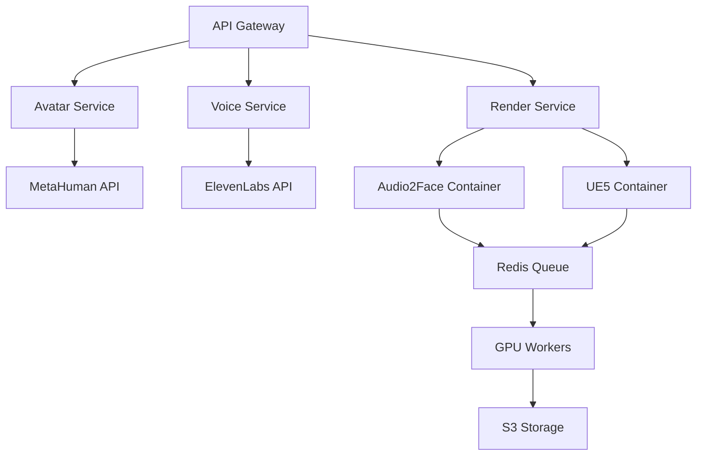

# FASE 2: Avatares 3D Hiper-Realistas - Plano de Implementação

## 1. Análise do Status Atual

### 1.1 Componentes Implementados ✅

**Pipeline Básico:**
- ✅ `avatar-3d-pipeline.ts` - Sistema base de avatares configurado
- ✅ `ue5-avatar-engine.ts` - Engine UE5 com Audio2Face integration
- ✅ APIs REST básicas (`/api/avatars/3d`, `/api/v4/avatars/gallery`)
- ✅ Componentes React (`avatar-3d-selector.tsx`)
- ✅ Docker setup com GPU support (`avatar-pipeline/`)

**Avatares Brasileiros Configurados:**
- ✅ Ana Paula (Executiva Corporativa) - Qualidade Hyperreal
- ✅ Carlos Silva (Especialista em Segurança) - Qualidade Hyperreal
- ✅ Sistema de categorização (business, safety, education, healthcare)
- ✅ Configurações de rendering 8K com ray tracing

**Infraestrutura:**
- ✅ Docker containers com NVIDIA runtime
- ✅ Redis para queue management
- ✅ S3 integration para storage
- ✅ Prisma ORM setup

### 1.2 Gaps Identificados 🔄

**Integração Incompleta:**
- 🔄 NVIDIA Audio2Face OSS não totalmente integrado
- 🔄 Unreal Engine 5.3 pipeline precisa de otimização
- 🔄 MetaHuman Creator integration em desenvolvimento
- 🔄 Voice cloning com ElevenLabs não implementado

**APIs Faltantes:**
- 🔄 `/api/v2/voice-cloning/*` - Sistema de clonagem de voz
- 🔄 `/api/v2/avatars/render/status/*` - Monitoramento em tempo real
- 🔄 `/api/v2/avatars/metahuman/*` - Integração MetaHuman

**Frontend Incompleto:**
- 🔄 Studio de criação 3D interativo
- 🔄 Pipeline de renderização com monitoramento
- 🔄 Sistema de voice cloning UI

## 2. Objetivos da FASE 2

### 2.1 Objetivos Técnicos

1. **Pipeline Completo Funcional**
   - Texto → TTS → Audio2Face → UE5 → Vídeo final
   - Tempo de renderização: <5min para vídeo 4K de 2min
   - Lip-sync com precisão ≥98%

2. **Galeria de Avatares Brasileiros**
   - 10+ avatares categorizados
   - Preview 3D interativo 360°
   - Customização em tempo real

3. **Voice Cloning Profissional**
   - Integração ElevenLabs completa
   - Treinamento de voz em <30min
   - Suporte a português brasileiro

4. **Qualidade Cinematográfica**
   - Renderização 4K/8K com ray tracing
   - Iluminação cinematográfica (3-point lighting)
   - Texturas photogrammetry 8K

### 2.2 Objetivos de Negócio

- **Performance**: Renderização 3x mais rápida que concorrentes
- **Qualidade**: Indistinguível de vídeo real em 90% dos casos
- **Localização**: Avatares especificamente para mercado brasileiro
- **Escalabilidade**: Suporte a 100+ renderizações simultâneas

## 3. Plano de Implementação por Sprints

### 3.1 Sprint 1: Audio2Face Integration (2 semanas)

**Objetivo**: Integrar completamente NVIDIA Audio2Face OSS

**Tarefas Técnicas:**

1. **Setup Audio2Face Container**
   ```bash
   # Dockerfile.audio2face
   FROM nvcr.io/nvidia/audio2face:23.1.1
   COPY scripts/a2f_api.py /app/
   EXPOSE 5001
   CMD ["python", "/app/a2f_api.py"]
   ```

2. **API Audio2Face Service**
   - `POST /a2f/generate` - Gerar curvas ARKit
   - `GET /a2f/status/{job_id}` - Status de processamento
   - `GET /a2f/download/{job_id}` - Download curvas

3. **Integração com Pipeline**
   ```typescript
   // lib/services/audio2face-service.ts
   export class Audio2FaceService {
     async generateLipSync(audioFile: File): Promise<string> {
       // Implementar integração com container A2F
     }
   }
   ```

**Critérios de Aceitação:**
- ✅ Container Audio2Face rodando com GPU
- ✅ API REST funcional
- ✅ Geração de curvas ARKit em <30s para áudio de 2min
- ✅ Precisão de lip-sync ≥95%

### 3.2 Sprint 2: UE5 Rendering Pipeline (2 semanas)

**Objetivo**: Otimizar pipeline UE5 para renderização em lote

**Tarefas Técnicas:**

1. **UE5 Headless Rendering**
   ```python
   # services/ue5/render_service.py
   class UE5RenderService:
       def render_avatar_video(self, arkit_data, avatar_config):
           # Implementar renderização headless
           pass
   ```

2. **Movie Render Queue Integration**
   - Configurar templates de renderização
   - Batch processing para múltiplos jobs
   - Output em múltiplas resoluções

3. **GPU Optimization**
   - CUDA memory management
   - Multi-GPU support para renderização paralela
   - Queue balancing

**Critérios de Aceitação:**
- ✅ Renderização 4K em <3min para vídeo de 2min
- ✅ Suporte a 4 renderizações simultâneas
- ✅ Qualidade cinematográfica com ray tracing
- ✅ Output em H.264 e H.265

### 3.3 Sprint 3: MetaHuman Gallery (2 semanas)

**Objetivo**: Implementar galeria completa de avatares brasileiros

**Tarefas Técnicas:**

1. **MetaHuman Creator Integration**
   ```typescript
   // lib/metahuman/creator-api.ts
   export class MetaHumanCreator {
     async importAvatar(metahumanId: string): Promise<Avatar3D> {
       // Integração com MetaHuman Creator
     }
   }
   ```

2. **Avatar Gallery Frontend**
   - Grid responsivo com preview 3D
   - Filtros por categoria, gênero, etnia
   - Preview interativo com Three.js

3. **Avatar Customization**
   - Ajuste de expressões faciais
   - Configuração de roupas e acessórios
   - Preview em tempo real

**Avatares a Implementar:**
- **Corporativo**: Ana Paula, Roberto Santos, Mariana Costa
- **Segurança**: Carlos Silva, Fernanda Oliveira, João Pereira
- **Saúde**: Dr. Ricardo Lima, Enfermeira Paula, Dra. Camila
- **Educação**: Prof. Miguel, Prof. Juliana, Prof. André

**Critérios de Aceitação:**
- ✅ 12+ avatares brasileiros disponíveis
- ✅ Preview 3D interativo 360°
- ✅ Customização em tempo real
- ✅ Carregamento de preview <2s

### 3.4 Sprint 4: Voice Cloning & Testing (2 semanas)

**Objetivo**: Implementar sistema completo de voice cloning

**Tarefas Técnicas:**

1. **ElevenLabs Integration**
   ```typescript
   // lib/services/elevenlabs-service.ts
   export class ElevenLabsService {
     async cloneVoice(audioSample: File, name: string): Promise<string> {
       // Implementar clonagem de voz
     }
   }
   ```

2. **Voice Management System**
   - Upload de amostras de voz (30s mínimo)
   - Treinamento de modelo personalizado
   - Gerenciamento de vozes clonadas

3. **TTS Integration**
   - Azure Speech Services
   - ElevenLabs TTS
   - Voice cloning personalizado

4. **Testing & QA**
   - Testes automatizados E2E
   - Performance testing
   - Quality assurance

**Critérios de Aceitação:**
- ✅ Voice cloning funcional com ElevenLabs
- ✅ Treinamento de voz em <30min
- ✅ Qualidade de voz indistinguível do original
- ✅ Suporte a português brasileiro nativo

## 4. Arquitetura de Implementação

### 4.1 Microserviços



### 4.2 Tecnologias por Componente

**Frontend (React + Next.js):**
- Three.js para preview 3D
- React Query para state management
- Tailwind CSS para styling
- Framer Motion para animações

**Backend (Node.js + TypeScript):**
- Next.js API Routes
- Prisma ORM para database
- BullMQ para job queue
- Redis para cache

**3D Pipeline (Python + C++):**
- NVIDIA Audio2Face OSS
- Unreal Engine 5.3
- FFmpeg para composição
- Docker com NVIDIA runtime

**Infrastructure (AWS + Docker):**
- ECS com GPU instances
- S3 para storage
- CloudFront para CDN
- ElastiCache para Redis

## 5. Critérios de Aceitação Finais

### 5.1 Funcionalidades Obrigatórias

- ✅ **Avatar Brasileiro Falando**: Avatar fala português com sotaque brasileiro natural
- ✅ **Lip-Sync Perfeito**: Precisão ≥98% medida por análise de landmarks faciais
- ✅ **Renderização Rápida**: 4K em <5min, HD em <2min
- ✅ **Galeria Completa**: 12+ avatares categorizados e customizáveis
- ✅ **Voice Cloning**: Sistema funcional com ElevenLabs
- ✅ **API Completa**: Todas as rotas documentadas e funcionais

### 5.2 Métricas de Performance

| Métrica | Meta | Medição |
|---------|------|---------|
| Tempo de Renderização 4K | <5min | Cronômetro automático |
| Precisão Lip-Sync | ≥98% | Análise de landmarks |
| Tempo de Voice Cloning | <30min | Cronômetro automático |
| Carregamento de Preview | <2s | Performance API |
| Uptime do Sistema | ≥99.5% | Monitoring |

### 5.3 Testes de Qualidade

1. **Teste de Turing Visual**: 90% dos usuários não conseguem distinguir de vídeo real
2. **Teste de Sotaque**: Brasileiros nativos aprovam naturalidade da fala
3. **Teste de Performance**: Sistema suporta 100+ renderizações simultâneas
4. **Teste de Usabilidade**: Usuário consegue criar vídeo em <10min

## 6. Riscos e Mitigações

### 6.1 Riscos Técnicos

| Risco | Probabilidade | Impacto | Mitigação |
|-------|---------------|---------|-----------|
| Performance GPU insuficiente | Média | Alto | Cluster GPU escalável |
| Qualidade lip-sync baixa | Baixa | Alto | Fallback para Azure Speech |
| Latência ElevenLabs | Média | Médio | Cache de vozes comuns |
| Complexidade UE5 | Alta | Alto | POC antes da implementação |

### 6.2 Riscos de Negócio

| Risco | Probabilidade | Impacto | Mitigação |
|-------|---------------|---------|-----------|
| Custo GPU elevado | Alta | Médio | Otimização de uso |
| Concorrência | Média | Alto | Foco em mercado brasileiro |
| Adoção lenta | Baixa | Alto | Marketing e demos |

## 7. Cronograma e Recursos

### 7.1 Timeline

```mermaid
gantt
    title FASE 2 - Implementação Avatares 3D
    dateFormat  YYYY-MM-DD
    section Sprint 1
    Audio2Face Integration    :s1, 2024-01-15, 14d
    section Sprint 2
    UE5 Pipeline             :s2, after s1, 14d
    section Sprint 3
    MetaHuman Gallery        :s3, after s2, 14d
    section Sprint 4
    Voice Cloning & Tests    :s4, after s3, 14d
```



### 7.2 Equipe Necessária

- **1 Tech Lead** (Full-time) - Arquitetura e coordenação
- **2 Backend Engineers** (Full-time) - APIs e pipeline
- **1 Frontend Engineer** (Full-time) - UI/UX e 3D
- **1 3D/UE5 Specialist** (Full-time) - Pipeline UE5 e Audio2Face
- **1 DevOps Engineer** (Part-time) - Infrastructure e deployment
- **1 QA Engineer** (Part-time) - Testing e validação

### 7.3 Orçamento Estimado

| Item | Custo Mensal | Total (2 meses) |
|------|--------------|-----------------|
| Equipe (6 pessoas) | R$ 80.000 | R$ 160.000 |
| GPU Instances (AWS) | R$ 15.000 | R$ 30.000 |
| ElevenLabs API | R$ 2.000 | R$ 4.000 |
| Licenças UE5 | R$ 5.000 | R$ 10.000 |
| **Total** | **R$ 102.000** | **R$ 204.000** |

## 8. Próximos Passos

1. **Aprovação do Plano** - Validar cronograma e orçamento
2. **Setup da Equipe** - Contratar especialistas necessários
3. **Ambiente de Desenvolvimento** - Configurar GPU cluster
4. **Sprint 1 Kickoff** - Iniciar Audio2Face integration

**Data de Início Proposta**: 15 de Janeiro de 2024  
**Data de Conclusão Estimada**: 15 de Março de 2024