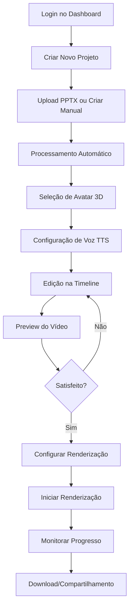
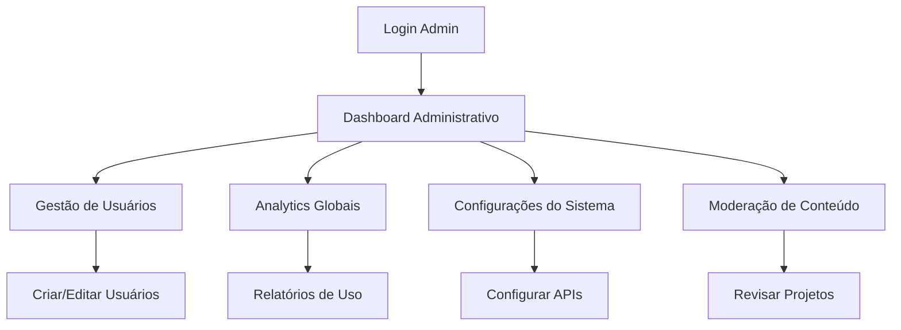

# PRD - Estúdio IA Vídeos v7 - Documento de Requisitos do Produto

## 1. Visão Geral do Produto

O **Estúdio IA Vídeos v7** é uma plataforma avançada para criação automatizada de vídeos educacionais utilizando inteligência artificial, avatares 3D hiper-realistas e processamento inteligente de apresentações PowerPoint. A plataforma permite transformar conteúdo estático em experiências de aprendizado dinâmicas e envolventes.

### 1.1 Objetivos Principais
- Democratizar a criação de vídeos educacionais de alta qualidade
- Reduzir o tempo de produção de vídeos de horas para minutos
- Oferecer avatares 3D realistas com sincronização labial perfeita
- Processar automaticamente apresentações PPTX em vídeos interativos
- Fornecer analytics detalhados sobre engajamento e performance

### 1.2 Público-Alvo
- **Educadores e Professores**: Criação de aulas online e materiais educacionais
- **Empresas**: Treinamentos corporativos e onboarding
- **Criadores de Conteúdo**: Produção de cursos online e tutoriais
- **Instituições de Ensino**: Digitalização de conteúdo educacional

## 2. Funcionalidades Principais

### 2.1 Roles de Usuário

| Role | Método de Registro | Permissões Principais |
|------|-------------------|----------------------|
| Usuário Básico | Email + senha | Criar projetos, usar avatares básicos, exportar em qualidade padrão |
| Usuário Premium | Upgrade via pagamento | Avatares premium, qualidade 4K, TTS avançado, analytics detalhados |
| Administrador | Convite interno | Gestão completa do sistema, analytics globais, moderação |
| Organizador | Convite de admin | Gestão de equipe, projetos colaborativos, relatórios organizacionais |

### 2.2 Páginas e Módulos Principais

Nossa plataforma consiste nas seguintes páginas essenciais:

1. **Dashboard Principal**: visão geral de projetos, estatísticas de uso, acesso rápido às funcionalidades
2. **Editor de Projetos**: interface principal de criação, timeline visual, configurações de avatar e voz
3. **Biblioteca de Avatares**: galeria de avatares 3D, customização, preview em tempo real
4. **Processador PPTX**: upload de apresentações, extração de conteúdo, configuração de slides
5. **Centro de Renderização**: fila de renderização, monitoramento de progresso, downloads
6. **Analytics e Relatórios**: métricas de engajamento, performance de vídeos, insights de audiência
7. **Configurações e Perfil**: preferências do usuário, configurações de conta, billing

### 2.3 Detalhes das Funcionalidades por Página

| Página | Módulo | Descrição da Funcionalidade |
|--------|--------|----------------------------|
| Dashboard Principal | Visão Geral | Exibir estatísticas de projetos, tempo de renderização, uso de recursos. Cards com métricas principais |
| Dashboard Principal | Projetos Recentes | Listar últimos projetos editados com preview, status e ações rápidas |
| Dashboard Principal | Acesso Rápido | Botões para criar novo projeto, upload PPTX, acessar biblioteca de avatares |
| Editor de Projetos | Timeline Visual | Interface drag-and-drop para organizar slides, áudio e elementos visuais |
| Editor de Projetos | Configuração de Avatar | Seleção de avatar 3D, ajustes de aparência, configurações de animação |
| Editor de Projetos | Configuração de Voz | Seleção de voz TTS, ajustes de velocidade, tom e emoção |
| Editor de Projetos | Preview em Tempo Real | Visualização instantânea das alterações, player de vídeo integrado |
| Biblioteca de Avatares | Galeria de Avatares | Grid de avatares disponíveis com filtros por gênero, estilo e categoria |
| Biblioteca de Avatares | Customização | Editor de aparência, roupas, acessórios e expressões faciais |
| Biblioteca de Avatares | Integração Ready Player Me | Importar avatares personalizados, validação e otimização |
| Processador PPTX | Upload de Arquivos | Drag-and-drop de PPTX, validação de formato, barra de progresso |
| Processador PPTX | Extração de Conteúdo | Análise automática de slides, extração de texto, imagens e layouts |
| Processador PPTX | Configuração de Slides | Ajustar duração, transições, adicionar narração por slide |
| Centro de Renderização | Fila de Renderização | Lista de projetos em processamento com prioridade e tempo estimado |
| Centro de Renderização | Configurações de Export | Seleção de qualidade, formato, resolução e configurações avançadas |
| Centro de Renderização | Downloads e Compartilhamento | Links de download, compartilhamento direto, integração com cloud storage |
| Analytics | Métricas de Engajamento | Visualizações, tempo de assistência, pontos de abandono, heatmaps |
| Analytics | Performance de Vídeos | Comparação entre projetos, métricas de conversão, feedback de audiência |
| Analytics | Relatórios Customizados | Geração de relatórios personalizados, exportação em PDF/Excel |
| Configurações | Perfil do Usuário | Edição de dados pessoais, foto de perfil, preferências de notificação |
| Configurações | Configurações de Conta | Gestão de assinatura, billing, histórico de pagamentos |
| Configurações | Integrações | Conexão com APIs externas, webhooks, configurações de TTS |

## 3. Fluxo Principal do Usuário

### 3.1 Fluxo de Criação de Vídeo



### 3.2 Fluxo de Administração



## 4. Design e Interface do Usuário

### 4.1 Estilo de Design

**Paleta de Cores**:
- Primária: #2563EB (Azul moderno)
- Secundária: #7C3AED (Roxo vibrante)
- Accent: #F59E0B (Laranja energético)
- Neutros: #1F2937, #6B7280, #F9FAFB
- Sucesso: #10B981
- Erro: #EF4444

**Tipografia**:
- Fonte Principal: Inter (Google Fonts)
- Tamanhos: 12px (small), 14px (body), 16px (large), 20px (h3), 24px (h2), 32px (h1)
- Peso: 400 (regular), 500 (medium), 600 (semibold), 700 (bold)

**Estilo de Componentes**:
- Botões: Rounded corners (8px), hover effects, loading states
- Cards: Subtle shadows, 12px border radius, hover elevations
- Inputs: Clean borders, focus states, validation feedback
- Layout: Grid-based, responsive breakpoints, consistent spacing

### 4.2 Componentes de Interface por Página

| Página | Módulo | Elementos de UI |
|--------|--------|-----------------|
| Dashboard | Cards de Estatísticas | Cards com ícones, números grandes, gráficos sparkline, cores de status |
| Dashboard | Lista de Projetos | Grid responsivo, thumbnails de preview, badges de status, ações hover |
| Editor | Timeline | Linha temporal horizontal, tracks coloridos, elementos arrastáveis, zoom controls |
| Editor | Painel de Avatar | Preview 3D em tempo real, sliders de customização, paleta de cores |
| Editor | Controles de Voz | Dropdown de vozes, player de sample, sliders de velocidade/tom |
| Biblioteca | Grid de Avatares | Cards com preview, filtros laterais, search bar, paginação |
| Renderização | Fila de Processos | Lista com progress bars, estimativas de tempo, botões de ação |
| Analytics | Dashboards | Gráficos interativos, filtros de data, métricas em tempo real |

### 4.3 Responsividade

**Estratégia**: Mobile-first design com breakpoints adaptativos
- **Mobile** (320px-768px): Layout em coluna única, navegação em hambúrguer, controles touch-friendly
- **Tablet** (768px-1024px): Layout híbrido, sidebar colapsável, gestos touch otimizados
- **Desktop** (1024px+): Layout completo, sidebar fixa, atalhos de teclado, multi-painel

**Otimizações Touch**:
- Botões mínimo 44px de altura
- Espaçamento adequado entre elementos clicáveis
- Gestos de swipe para navegação
- Feedback visual imediato para interações

## 5. Especificações Técnicas Detalhadas

### 5.1 Processamento de PPTX

**Funcionalidades Implementadas**:
- Upload de arquivos até 50MB
- Suporte a formatos .pptx e .ppt
- Extração automática de texto, imagens e layouts
- Preservação de formatação e estilos
- Detecção de speaker notes
- Análise de estrutura de slides

**Metadados Extraídos**:
```json
{
  "title": "Título da apresentação",
  "author": "Autor",
  "slideCount": 25,
  "dimensions": { "width": 1920, "height": 1080 },
  "theme": "Corporate Blue",
  "extractedAssets": {
    "images": ["image1.jpg", "image2.png"],
    "fonts": ["Arial", "Calibri"],
    "colors": ["#2563EB", "#F59E0B"]
  },
  "processingStats": {
    "textBlocks": 45,
    "imageCount": 12,
    "processingTime": 3.2
  }
}
```

### 5.2 Sistema de Avatares 3D

**Integração Ready Player Me**:
- Importação de avatares personalizados
- Validação automática de modelos
- Otimização para renderização web
- Cache de assets para performance

**Tipos de Avatar Suportados**:
- **Full Body**: Avatar completo com animações corporais
- **Half Body**: Busto com gestos de mãos e braços
- **Head Only**: Apenas cabeça com expressões faciais

**Configurações Disponíveis**:
```typescript
interface AvatarConfig {
  id: string
  name: string
  readyPlayerMeUrl: string
  avatarType: 'full_body' | 'half_body' | 'head_only'
  gender: 'male' | 'female' | 'other'
  style: 'realistic' | 'cartoon' | 'anime'
  animations: Animation[]
  voiceSettings: VoiceConfig
  customProperties: Record<string, any>
}
```

### 5.3 Sistema de Text-to-Speech

**Provedores Integrados**:
- **ElevenLabs**: Vozes ultra-realistas, clonagem de voz
- **Azure Speech Services**: Múltiplos idiomas, SSML support
- **Google Cloud TTS**: Vozes neurais, WaveNet

**Configurações de Voz**:
```typescript
interface VoiceConfig {
  provider: 'elevenlabs' | 'azure' | 'google'
  voiceId: string
  language: string
  speed: number // 0.5 - 2.0
  pitch: number // -20 - +20
  volume: number // 0.0 - 1.0
  emotion?: 'neutral' | 'happy' | 'sad' | 'excited'
  stability?: number // ElevenLabs specific
  similarityBoost?: number // ElevenLabs specific
}
```

### 5.4 Sistema de Renderização

**Engine de Renderização**:
- **Remotion**: Para composição de vídeos React-based
- **FFmpeg**: Para processamento de vídeo e áudio
- **Three.js**: Para renderização 3D dos avatares

**Configurações de Export**:
```typescript
interface RenderConfig {
  resolution: '720p' | '1080p' | '4k'
  fps: 24 | 30 | 60
  quality: 'low' | 'medium' | 'high' | 'ultra'
  format: 'mp4' | 'mov' | 'webm'
  audioBitrate: number // 64-320 kbps
  videoBitrate?: number // Auto-calculated based on quality
  watermark?: boolean
  subtitles?: boolean
}
```

**Fila de Renderização**:
- Sistema de prioridades (low, normal, high)
- Processamento assíncrono
- Monitoramento em tempo real
- Estimativas de tempo baseadas em histórico

## 6. Analytics e Métricas

### 6.1 Métricas de Usuário

**Engagement Metrics**:
- Tempo de sessão médio
- Projetos criados por usuário
- Taxa de conclusão de projetos
- Frequência de uso de funcionalidades

**Performance Metrics**:
- Tempo médio de renderização
- Taxa de sucesso de uploads
- Uso de recursos por projeto
- Satisfação do usuário (NPS)

### 6.2 Métricas de Sistema

**Technical Metrics**:
- Uptime do sistema
- Latência de APIs
- Uso de storage
- Performance de banco de dados

**Business Metrics**:
- Conversão de trial para paid
- Churn rate
- Revenue per user
- Crescimento de usuários ativos

### 6.3 Dashboard de Analytics

```typescript
interface AnalyticsDashboard {
  userMetrics: {
    totalUsers: number
    activeUsers: number
    newUsers: number
    churnRate: number
  }
  projectMetrics: {
    totalProjects: number
    completedProjects: number
    averageRenderTime: number
    successRate: number
  }
  systemMetrics: {
    uptime: number
    apiLatency: number
    storageUsed: number
    errorRate: number
  }
  revenueMetrics: {
    mrr: number
    arpu: number
    conversionRate: number
    ltv: number
  }
}
```

## 7. Integrações e APIs Externas

### 7.1 APIs de TTS

**ElevenLabs Integration**:
```typescript
interface ElevenLabsConfig {
  apiKey: string
  baseUrl: 'https://api.elevenlabs.io/v1'
  endpoints: {
    voices: '/voices'
    generate: '/text-to-speech/{voice_id}'
    clone: '/voice-cloning'
  }
  limits: {
    charactersPerMonth: 10000
    requestsPerMinute: 20
  }
}
```

**Azure Speech Integration**:
```typescript
interface AzureSpeechConfig {
  subscriptionKey: string
  region: string
  endpoint: string
  supportedLanguages: string[]
  voiceTypes: ('neural' | 'standard')[]
}
```

### 7.2 Ready Player Me Integration

```typescript
interface ReadyPlayerMeConfig {
  subdomain: string
  apiKey?: string
  avatarConfig: {
    bodyType: 'halfbody' | 'fullbody'
    meshLod: 0 | 1 | 2
    textureAtlas: 256 | 512 | 1024
    morphTargets: string[]
  }
}
```

### 7.3 Cloud Storage Integration

**Supabase Storage**:
- Upload de arquivos PPTX
- Storage de assets de avatar
- Cache de áudio TTS
- Backup de projetos

## 8. Segurança e Compliance

### 8.1 Autenticação e Autorização

**Métodos de Autenticação**:
- Email/senha com verificação
- OAuth (Google, Microsoft, GitHub)
- SSO para empresas (SAML)
- 2FA opcional

**Controle de Acesso**:
```typescript
interface AccessControl {
  user: {
    permissions: Permission[]
    role: UserRole
    organizationId?: string
  }
  project: {
    owner: string
    collaborators: string[]
    visibility: 'private' | 'organization' | 'public'
    permissions: ProjectPermission[]
  }
}
```

### 8.2 Proteção de Dados

**LGPD/GDPR Compliance**:
- Consentimento explícito para coleta de dados
- Direito ao esquecimento
- Portabilidade de dados
- Logs de auditoria

**Segurança de Dados**:
- Criptografia em trânsito (TLS 1.3)
- Criptografia em repouso (AES-256)
- Backup automático com retenção
- Monitoramento de segurança

## 9. Performance e Escalabilidade

### 9.1 Otimizações de Performance

**Frontend**:
- Code splitting por rota
- Lazy loading de componentes
- Image optimization automática
- Service Worker para cache

**Backend**:
- Cache Redis para queries frequentes
- CDN para assets estáticos
- Database indexing otimizado
- Connection pooling

### 9.2 Escalabilidade

**Horizontal Scaling**:
- Load balancer para múltiplas instâncias
- Microserviços para funcionalidades específicas
- Queue system para processamento assíncrono
- Auto-scaling baseado em métricas

**Vertical Scaling**:
- Otimização de queries SQL
- Compressão de assets
- Memory management eficiente
- CPU optimization para renderização

## 10. Roadmap de Desenvolvimento

### 10.1 Fase 1: Core TTS e Avatar Integration (3-4 semanas)
- [ ] Implementar APIs completas de TTS
- [ ] Integração funcional com ElevenLabs
- [ ] Sistema de cache para áudio
- [ ] Sincronização básica avatar + áudio
- [ ] Testes de qualidade de voz

### 10.2 Fase 2: Timeline Editor Avançado (4-5 semanas)
- [ ] Interface visual de timeline
- [ ] Drag & drop de elementos
- [ ] Sistema de preview em tempo real
- [ ] Controles de reprodução
- [ ] Sincronização áudio/vídeo

### 10.3 Fase 3: Renderização 3D Completa (5-6 semanas)
- [ ] Engine de renderização 3D
- [ ] Animações faciais sincronizadas
- [ ] Qualidade de renderização 4K
- [ ] Otimização de performance
- [ ] Sistema de watermarks

### 10.4 Fase 4: Templates e Bibliotecas (3-4 semanas)
- [ ] Biblioteca de templates
- [ ] Sistema de categorização
- [ ] Preview automático
- [ ] Aplicação de templates
- [ ] Marketplace de assets

### 10.5 Fase 5: Analytics Avançados (2-3 semanas)
- [ ] Dashboard de métricas avançadas
- [ ] Relatórios customizados
- [ ] Integração com Google Analytics
- [ ] Heatmaps de engajamento
- [ ] A/B testing framework

## 11. Critérios de Sucesso

### 11.1 Métricas de Produto
- **Tempo de criação de vídeo**: < 10 minutos para vídeo de 5 minutos
- **Qualidade de renderização**: 95% de satisfação do usuário
- **Uptime do sistema**: 99.9%
- **Tempo de resposta**: < 2 segundos para operações principais

### 11.2 Métricas de Negócio
- **Retenção de usuários**: 80% após 30 dias
- **Conversão trial-to-paid**: 25%
- **NPS Score**: > 50
- **Crescimento mensal**: 20% de novos usuários

### 11.3 Métricas Técnicas
- **Performance Score**: > 90 (Lighthouse)
- **Cobertura de testes**: > 85%
- **Tempo de deploy**: < 10 minutos
- **MTTR (Mean Time to Recovery)**: < 1 hora

## 12. Considerações Finais

O Estúdio IA Vídeos v7 representa uma evolução significativa na criação de conteúdo educacional, combinando tecnologias de ponta em IA, 3D e processamento de vídeo. A implementação seguirá uma abordagem iterativa, priorizando funcionalidades core e expandindo gradualmente para features avançadas.

O sucesso do produto dependerá da execução técnica de qualidade, experiência do usuário intuitiva e integração seamless entre todos os componentes do sistema. O roadmap proposto permite entregas incrementais de valor, mantendo o foco na satisfação do usuário e objetivos de negócio.