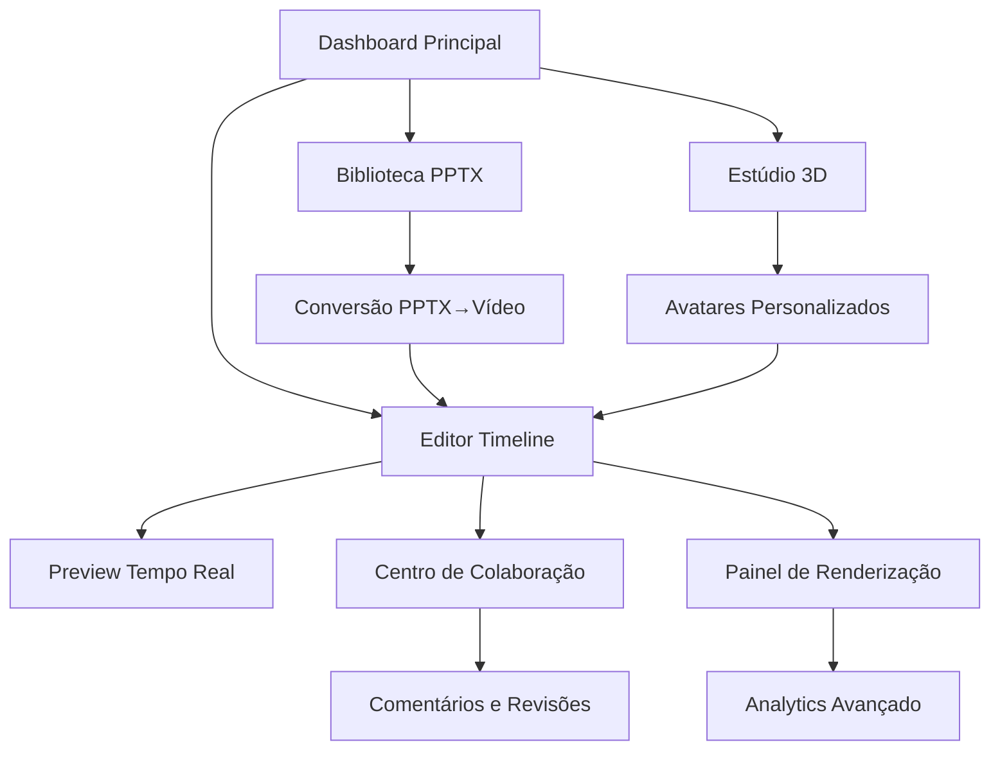

# Documento de Requisitos do Produto - Editor de Vídeo e Módulo PPTX

## 1. Visão Geral do Produto

O Editor de Vídeo e Módulo PPTX é uma plataforma profissional de criação de conteúdo que combina edição de vídeo avançada com automação inteligente de apresentações. O sistema aproveita tecnologias de ponta para oferecer uma experiência de edição colaborativa, renderização de alta qualidade e integração seamless entre vídeos e slides.

- **Problema a resolver**: Editores de vídeo enfrentam dificuldades com uploads pesados, cortes repetitivos e sincronização manual entre PPTX e vídeo, resultando em workflows ineficientes e perda de produtividade.
- **Público-alvo**: Criadores de conteúdo educacional, profissionais de marketing, equipes corporativas e estúdios de produção que necessitam de ferramentas avançadas de edição e automação.
- **Valor de mercado**: Redução de 70% no tempo de produção de vídeos educacionais e corporativos através de automação inteligente e colaboração em tempo real.

## 2. Funcionalidades Principais

### 2.1 Perfis de Usuário

| Perfil | Método de Registro | Permissões Principais |
|--------|-------------------|----------------------|
| Editor Básico | Email + senha | Edição de timeline, upload de mídia, exportação básica |
| Editor Profissional | Convite organizacional | Acesso completo ao editor, colaboração, templates avançados |
| Administrador | Configuração manual | Gestão de usuários, configurações de sistema, analytics |

### 2.2 Módulos Funcionais

O sistema é composto pelos seguintes módulos essenciais:

1. **Editor Timeline Profissional**: Interface de edição baseada em Motionity com timeline multi-track, keyframes e layers
2. **Sistema PPTX Inteligente**: Geração, conversão e sincronização automática de apresentações
3. **Renderização Avançada**: Pipeline Remotion + FFmpeg para exportação em múltiplos formatos
4. **Avatares 3D Hiper-realistas**: Criação e animação de personagens com lip-sync automático
5. **Colaboração Tempo Real**: Edição simultânea com presença de usuários e comentários
6. **Automação IA**: Cortes automáticos, transcrição e geração de legendas

### 2.3 Detalhamento das Páginas

| Página | Módulo | Descrição da Funcionalidade |
|--------|--------|----------------------------|
| **Dashboard Principal** | Visão Geral | Exibe projetos recentes, estatísticas de uso, notificações e acesso rápido às ferramentas principais |
| **Editor Timeline** | Editor Principal | Interface de edição com timeline multi-track, biblioteca de assets, preview em tempo real, ferramentas de corte e efeitos |
| **Biblioteca PPTX** | Gestão PPTX | Upload, visualização e edição de apresentações, conversão para vídeo, templates inteligentes |
| **Estúdio 3D** | Avatares 3D | Criação e customização de avatares, configuração de lip-sync, biblioteca de expressões e gestos |
| **Centro de Colaboração** | Colaboração | Gestão de projetos compartilhados, comentários por timestamp, histórico de versões, aprovações |
| **Painel de Renderização** | Exportação | Configuração de formatos de saída, fila de renderização, monitoramento de progresso, downloads |
| **Analytics Avançado** | Métricas | Relatórios de performance, uso de recursos, métricas de colaboração, insights de produtividade |

## 3. Fluxos Principais do Sistema

### Fluxo do Editor Profissional:
1. Login → Dashboard → Criar/Abrir Projeto → Editor Timeline → Adicionar Mídia → Editar → Colaborar → Renderizar → Exportar

### Fluxo de Automação PPTX:
1. Upload PPTX → Análise Automática → Geração de Storyboard → Conversão para Vídeo → Sincronização com Timeline → Exportação Final

## 4. Design e Interface do Usuário

### 4.1 Estilo de Design

- **Cores Primárias**: #1a1a1a (fundo escuro), #3b82f6 (azul primário), #10b981 (verde sucesso)
- **Cores Secundárias**: #6b7280 (cinza texto), #f59e0b (amarelo alerta), #ef4444 (vermelho erro)
- **Estilo de Botões**: Rounded corners (8px), gradientes sutis, estados hover/active bem definidos
- **Tipografia**: Inter (títulos), Source Code Pro (código), tamanhos 12px-24px
- **Layout**: Design modular baseado em cards, navegação lateral fixa, timeline horizontal expansível
- **Ícones**: Lucide React com estilo outline, suporte a animações micro-interações

### 4.2 Visão Geral das Interfaces

| Página | Módulo | Elementos de UI |
|--------|--------|-----------------|
| **Dashboard Principal** | Visão Geral | Grid responsivo de cards de projeto, sidebar de navegação, header com notificações, widgets de estatísticas em tempo real |
| **Editor Timeline** | Editor Principal | Timeline horizontal com zoom, painel de layers vertical, preview centralizado, toolbar flutuante, biblioteca de assets lateral |
| **Biblioteca PPTX** | Gestão PPTX | Grid de thumbnails de slides, preview modal, drag-and-drop para timeline, filtros por categoria e tags |
| **Estúdio 3D** | Avatares 3D | Canvas 3D interativo, painel de customização lateral, biblioteca de assets 3D, controles de animação |
| **Centro de Colaboração** | Colaboração | Lista de colaboradores online, thread de comentários por timestamp, diff visual de mudanças |
| **Painel de Renderização** | Exportação | Fila de jobs com progress bars, configurações de qualidade, preview de saída, histórico de exports |

### 4.3 Responsividade

O sistema é **desktop-first** com adaptações para tablets (1024px+). Inclui otimizações para touch em dispositivos híbridos, com gestos de pinch-to-zoom na timeline e drag-and-drop otimizado para telas sensíveis ao toque.