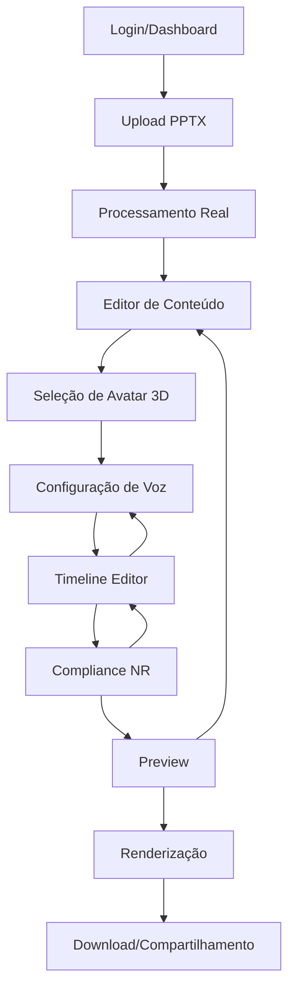

# Documento de Requisitos do Produto - Estúdio IA de Vídeos

## 1. Visão Geral do Produto

O Estúdio IA de Vídeos é uma plataforma completa para criação automatizada de vídeos educacionais e corporativos, com foco em treinamentos de Normas Regulamentadoras (NR) brasileiras. A plataforma permite transformar apresentações PowerPoint em vídeos profissionais com avatares 3D, narração por IA e elementos interativos.

**Objetivo Principal**: Substituir todas as implementações mockadas por funcionalidades reais e operacionais, tornando o sistema production-ready para uso comercial.

**Público-Alvo**: Empresas de treinamento corporativo, consultores em segurança do trabalho, departamentos de RH e instituições educacionais.

**Valor de Mercado**: Automatização de 90% do processo de criação de vídeos educacionais, reduzindo custos de produção em até 80% e tempo de entrega de semanas para horas.

## 2. Funcionalidades Principais

### 2.1 Papéis de Usuário

| Papel | Método de Registro | Permissões Principais |
|-------|-------------------|----------------------|
| Usuário Básico | Email + senha | Upload PPTX, criação de vídeos básicos, biblioteca de templates |
| Usuário Premium | Upgrade via pagamento | Voice cloning, avatares premium, exportação HD, analytics avançados |
| Administrador | Convite interno | Gestão de usuários, métricas do sistema, configurações globais |
| Empresa | Contrato corporativo | Multi-usuários, white-label, integrações API, suporte prioritário |

### 2.2 Módulos de Funcionalidades

Nossa plataforma consiste nas seguintes páginas principais:

1. **Dashboard Principal**: métricas em tempo real, projetos recentes, status de renderização
2. **Editor PPTX**: upload e processamento real de apresentações, extração de conteúdo
3. **Studio de Avatar 3D**: seleção e personalização de avatares hiper-realistas
4. **Editor de Timeline**: edição profissional multi-track com sincronização de áudio
5. **Voice Cloning Studio**: clonagem e síntese de voz com IA avançada
6. **Canvas Editor Pro**: editor visual avançado com elementos interativos
7. **Compliance NR**: validação automática de normas regulamentadoras brasileiras
8. **Render Pipeline**: sistema de fila de renderização com monitoramento
9. **Analytics Avançado**: métricas detalhadas de engajamento e performance
10. **Collaboration Hub**: colaboração em tempo real via WebSocket

### 2.3 Detalhes das Páginas

| Página | Módulo | Descrição da Funcionalidade |
|--------|--------|----------------------------|
| Dashboard Principal | Métricas em Tempo Real | Exibir estatísticas de projetos, status de renderização, uso de recursos, alertas do sistema |
| Dashboard Principal | Projetos Recentes | Listar últimos projetos editados com preview, progresso e ações rápidas |
| Editor PPTX | Upload de Arquivo | Processar arquivos PPTX reais, extrair texto, imagens, layouts e metadados |
| Editor PPTX | Parser de Conteúdo | Converter slides em elementos editáveis, detectar estrutura e hierarquia |
| Studio Avatar 3D | Biblioteca de Avatares | Catálogo de avatares 3D com preview, filtros por estilo, gênero e profissão |
| Studio Avatar 3D | Personalização | Customizar aparência, roupas, expressões e gestos dos avatares |
| Editor Timeline | Multi-track Editor | Edição profissional com múltiplas faixas de áudio, vídeo e efeitos |
| Editor Timeline | Sincronização | Sincronizar automaticamente narração com movimentos labiais do avatar |
| Voice Cloning Studio | Clonagem de Voz | Criar vozes personalizadas a partir de amostras de áudio |
| Voice Cloning Studio | Síntese TTS | Gerar narração com vozes clonadas ou biblioteca premium |
| Canvas Editor Pro | Editor Visual | Interface drag-and-drop para elementos gráficos, textos e animações |
| Canvas Editor Pro | Biblioteca de Assets | Banco de imagens, ícones, formas e templates profissionais |
| Compliance NR | Validação Automática | Verificar conformidade com normas NR usando IA e base de conhecimento |
| Compliance NR | Sugestões Inteligentes | Recomendar melhorias e correções baseadas nas regulamentações |
| Render Pipeline | Fila de Renderização | Gerenciar jobs de renderização com priorização e balanceamento |
| Render Pipeline | Monitoramento | Acompanhar progresso, logs detalhados e métricas de performance |
| Analytics Avançado | Métricas de Engajamento | Rastrear visualizações, tempo de retenção e interações |
| Analytics Avançado | Relatórios Customizados | Gerar relatórios detalhados com insights e recomendações |
| Collaboration Hub | Edição Colaborativa | Permitir múltiplos usuários editarem simultaneamente via WebSocket |
| Collaboration Hub | Comentários e Revisões | Sistema de feedback com threads de comentários e aprovações |

## 3. Fluxo Principal do Usuário

O usuário segue o seguinte fluxo para criar um vídeo:

1. **Login/Registro** → Autenticação via NextAuth com sessões persistentes
2. **Dashboard** → Visualiza projetos e métricas, acessa ferramentas
3. **Upload PPTX** → Carrega apresentação e inicia processamento real
4. **Edição de Conteúdo** → Revisa e edita texto extraído, ajusta estrutura
5. **Seleção de Avatar** → Escolhe avatar 3D e personaliza aparência
6. **Configuração de Voz** → Seleciona voz ou clona voz personalizada
7. **Timeline Editor** → Ajusta timing, adiciona efeitos e transições
8. **Compliance Check** → Valida conformidade com normas NR
9. **Preview e Ajustes** → Visualiza resultado e faz correções finais
10. **Renderização** → Inicia processo de geração do vídeo final
11. **Download/Compartilhamento** → Acessa vídeo renderizado e compartilha

## 4. Design da Interface

### 4.1 Estilo de Design

- **Cores Primárias**: #2563eb (azul profissional), #1e40af (azul escuro)
- **Cores Secundárias**: #f8fafc (cinza claro), #64748b (cinza médio)
- **Estilo de Botões**: Rounded corners (8px), gradientes sutis, estados hover/active
- **Tipografia**: Inter (títulos), Source Sans Pro (corpo), tamanhos 14px-24px
- **Layout**: Grid responsivo, sidebar fixa, cards com sombras suaves
- **Ícones**: Lucide React, estilo outline, 20px-24px padrão

### 4.2 Visão Geral do Design das Páginas

| Página | Módulo | Elementos de UI |
|--------|--------|-----------------|
| Dashboard Principal | Métricas | Cards com gráficos Chart.js, indicadores KPI coloridos, tabelas responsivas |
| Editor PPTX | Upload | Drag-and-drop zone, progress bar animada, preview thumbnails |
| Studio Avatar 3D | Galeria | Grid de cards com preview 3D, filtros laterais, modal de personalização |
| Timeline Editor | Multi-track | Interface estilo DAW, waveforms visuais, controles de zoom temporal |
| Voice Cloning | Gravação | Waveform recorder, controles de áudio, preview player integrado |
| Canvas Editor | Visual | Toolbar lateral, canvas central, painel de propriedades direito |
| Compliance NR | Validação | Checklist interativo, badges de status, tooltips explicativos |
| Render Pipeline | Monitoramento | Lista de jobs, progress bars, logs em tempo real |
| Analytics | Relatórios | Dashboards com gráficos interativos, filtros de data, export CSV/PDF |
| Collaboration | Chat | Sidebar de comentários, cursores de usuários, notificações push |

### 4.3 Responsividade

A plataforma é **desktop-first** com adaptação mobile para visualização. Funcionalidades de edição são otimizadas para desktop (1920x1080+), com interface touch para tablets. Mobile foca em visualização de projetos e aprovações rápidas.