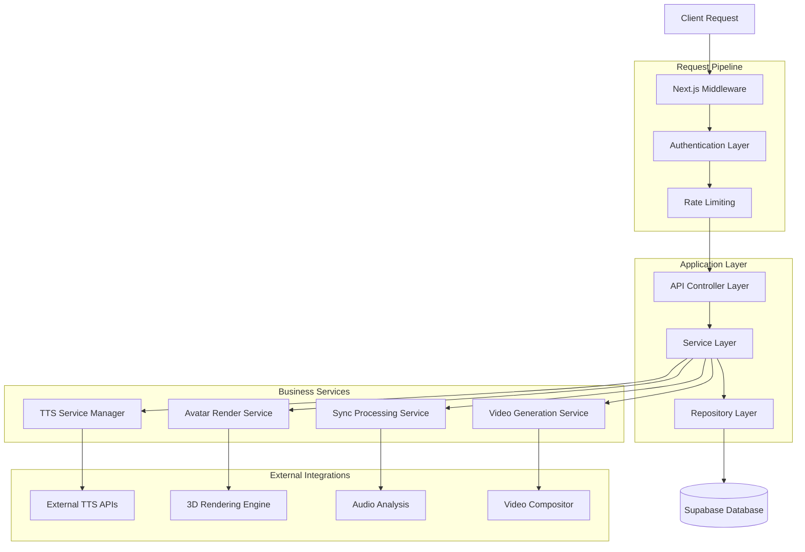
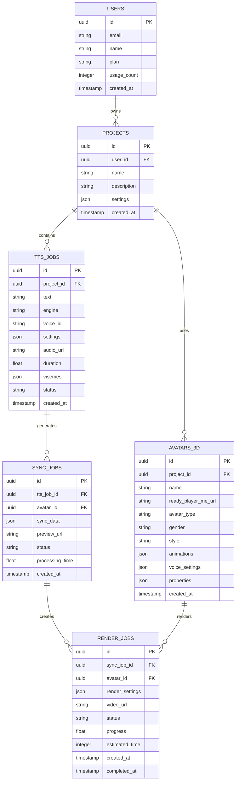

# Fase 1: Arquitetura Técnica - Sistema TTS e Integração com Avatares

## 1. Design da Arquitetura

```mermaid
graph TD
    A[User Browser] --> B[React Frontend Application]
    B --> C[Next.js API Routes]
    C --> D[TTS Engine Manager]
    C --> E[Avatar Render Engine]
    C --> F[Lip-Sync Processor]
    
    D --> G[ElevenLabs API]
    D --> H[Azure Cognitive Services]
    D --> I[Google Cloud TTS]
    D --> J[AWS Polly]
    
    E --> K[Ready Player Me API]
    E --> L[3D Avatar Renderer]
    
    F --> M[Audio Analysis Engine]
    F --> N[Viseme Generator]
    
    C --> O[Supabase Database]
    C --> P[Redis Cache]
    C --> Q[File Storage (Supabase)]
    
    subgraph "Frontend Layer"
        B
    end
    
    subgraph "API Layer"
        C
        D
        E
        F
    end
    
    subgraph "External TTS Services"
        G
        H
        I
        J
    end
    
    subgraph "Avatar Services"
        K
        L
    end
    
    subgraph "Processing Layer"
        M
        N
    end
    
    subgraph "Data Layer"
        O
        P
        Q
    end
```

## 2. Descrição das Tecnologias

- **Frontend**: React@18 + TypeScript + Tailwind CSS + Framer Motion + Three.js
- **Backend**: Next.js@14 + API Routes + Middleware
- **Database**: Supabase (PostgreSQL) + Redis Cache
- **TTS Engines**: ElevenLabs SDK + Azure Cognitive + Google Cloud + AWS SDK
- **Avatar Rendering**: Three.js + Ready Player Me + WebGL
- **Audio Processing**: Web Audio API + FFmpeg.wasm
- **File Storage**: Supabase Storage + CDN
- **Monitoring**: Custom Analytics + Performance API

## 3. Definições de Rotas

| Rota | Propósito |
|------|-----------|
| /dashboard/tts | Dashboard principal do sistema TTS |
| /avatars/library | Biblioteca de avatares 3D disponíveis |
| /avatars/customize | Editor de customização de avatares |
| /editor/sync | Editor de sincronização lip-sync |
| /render/video | Gerador e fila de renderização de vídeo |
| /monitoring | Dashboard de monitoramento e analytics |
| /api/tts/generate | API para geração de TTS multi-engine |
| /api/avatars/render | API para renderização de avatares |
| /api/sync/process | API para processamento de sincronização |
| /api/video/generate | API para geração de vídeo final |

## 4. Definições de API

### 4.1 Core TTS API

**Geração de TTS Multi-Engine**
```
POST /api/tts/generate
```

Request:
| Nome do Parâmetro | Tipo | Obrigatório | Descrição |
|-------------------|------|-------------|-----------|
| text | string | true | Texto para síntese (máx 5000 chars) |
| engine | string | true | Engine TTS (elevenlabs, azure, google, aws) |
| voice_id | string | true | ID da voz selecionada |
| settings | object | false | Configurações específicas do engine |
| project_id | string | true | ID do projeto |

Response:
| Nome do Parâmetro | Tipo | Descrição |
|-------------------|------|-----------|
| audio_url | string | URL do arquivo de áudio gerado |
| duration | number | Duração em segundos |
| visemes | array | Array de visemas para lip-sync |
| job_id | string | ID do job para tracking |

Exemplo:
```json
{
  "text": "Olá, bem-vindos ao nosso curso!",
  "engine": "elevenlabs",
  "voice_id": "21m00Tcm4TlvDq8ikWAM",
  "settings": {
    "stability": 0.75,
    "similarity_boost": 0.85,
    "style": 0.5
  },
  "project_id": "proj_123"
}
```

**Sincronização de Avatar**
```
POST /api/avatars/sync
```

Request:
| Nome do Parâmetro | Tipo | Obrigatório | Descrição |
|-------------------|------|-------------|-----------|
| audio_url | string | true | URL do áudio TTS |
| avatar_id | string | true | ID do avatar 3D |
| sync_mode | string | false | Modo de sincronização (auto, manual) |

Response:
| Nome do Parâmetro | Tipo | Descrição |
|-------------------|------|-----------|
| sync_data | object | Dados de sincronização lip-sync |
| preview_url | string | URL do preview 3D |
| estimated_render_time | number | Tempo estimado de renderização |

**Renderização de Vídeo**
```
POST /api/video/render
```

Request:
| Nome do Parâmetro | Tipo | Obrigatório | Descrição |
|-------------------|------|-------------|-----------|
| audio_url | string | true | URL do áudio sincronizado |
| avatar_id | string | true | ID do avatar configurado |
| sync_data | object | true | Dados de sincronização |
| render_settings | object | true | Configurações de renderização |

Response:
| Nome do Parâmetro | Tipo | Descrição |
|-------------------|------|-----------|
| job_id | string | ID do job de renderização |
| estimated_completion | string | Tempo estimado de conclusão |
| webhook_url | string | URL para notificações de status |

## 5. Arquitetura do Servidor



## 6. Modelo de Dados

### 6.1 Definição do Modelo de Dados



### 6.2 Linguagem de Definição de Dados

**Tabela de Jobs TTS (tts_jobs)**
```sql
-- Criar tabela
CREATE TABLE tts_jobs (
    id UUID PRIMARY KEY DEFAULT gen_random_uuid(),
    project_id UUID NOT NULL REFERENCES projects(id) ON DELETE CASCADE,
    text TEXT NOT NULL CHECK (length(text) <= 5000),
    engine VARCHAR(20) NOT NULL CHECK (engine IN ('elevenlabs', 'azure', 'google', 'aws')),
    voice_id VARCHAR(100) NOT NULL,
    settings JSONB DEFAULT '{}',
    audio_url TEXT,
    duration FLOAT,
    visemes JSONB,
    status VARCHAR(20) DEFAULT 'pending' CHECK (status IN ('pending', 'processing', 'completed', 'failed')),
    error_message TEXT,
    created_at TIMESTAMP WITH TIME ZONE DEFAULT NOW(),
    updated_at TIMESTAMP WITH TIME ZONE DEFAULT NOW()
);

-- Criar índices
CREATE INDEX idx_tts_jobs_project_id ON tts_jobs(project_id);
CREATE INDEX idx_tts_jobs_status ON tts_jobs(status);
CREATE INDEX idx_tts_jobs_engine ON tts_jobs(engine);
CREATE INDEX idx_tts_jobs_created_at ON tts_jobs(created_at DESC);

-- Permissões Supabase
GRANT SELECT ON tts_jobs TO anon;
GRANT ALL PRIVILEGES ON tts_jobs TO authenticated;
```

**Tabela de Avatares 3D (avatars_3d)**
```sql
-- Criar tabela
CREATE TABLE avatars_3d (
    id UUID PRIMARY KEY DEFAULT gen_random_uuid(),
    project_id UUID NOT NULL REFERENCES projects(id) ON DELETE CASCADE,
    name VARCHAR(100) NOT NULL,
    ready_player_me_url TEXT NOT NULL,
    avatar_type VARCHAR(20) DEFAULT 'realistic' CHECK (avatar_type IN ('realistic', 'cartoon', 'anime')),
    gender VARCHAR(10) CHECK (gender IN ('male', 'female', 'neutral')),
    style VARCHAR(20) DEFAULT 'casual',
    animations JSONB DEFAULT '[]',
    voice_settings JSONB DEFAULT '{}',
    properties JSONB DEFAULT '{}',
    is_active BOOLEAN DEFAULT true,
    created_at TIMESTAMP WITH TIME ZONE DEFAULT NOW(),
    updated_at TIMESTAMP WITH TIME ZONE DEFAULT NOW(),
    UNIQUE(project_id, name)
);

-- Criar índices
CREATE INDEX idx_avatars_3d_project_id ON avatars_3d(project_id);
CREATE INDEX idx_avatars_3d_type_gender ON avatars_3d(avatar_type, gender);
CREATE INDEX idx_avatars_3d_active ON avatars_3d(is_active);

-- Permissões Supabase
GRANT SELECT ON avatars_3d TO anon;
GRANT ALL PRIVILEGES ON avatars_3d TO authenticated;
```

**Tabela de Jobs de Sincronização (sync_jobs)**
```sql
-- Criar tabela
CREATE TABLE sync_jobs (
    id UUID PRIMARY KEY DEFAULT gen_random_uuid(),
    tts_job_id UUID NOT NULL REFERENCES tts_jobs(id) ON DELETE CASCADE,
    avatar_id UUID NOT NULL REFERENCES avatars_3d(id) ON DELETE CASCADE,
    sync_data JSONB NOT NULL,
    preview_url TEXT,
    status VARCHAR(20) DEFAULT 'pending' CHECK (status IN ('pending', 'processing', 'completed', 'failed')),
    processing_time FLOAT,
    error_message TEXT,
    created_at TIMESTAMP WITH TIME ZONE DEFAULT NOW(),
    updated_at TIMESTAMP WITH TIME ZONE DEFAULT NOW()
);

-- Criar índices
CREATE INDEX idx_sync_jobs_tts_job_id ON sync_jobs(tts_job_id);
CREATE INDEX idx_sync_jobs_avatar_id ON sync_jobs(avatar_id);
CREATE INDEX idx_sync_jobs_status ON sync_jobs(status);

-- Permissões Supabase
GRANT SELECT ON sync_jobs TO anon;
GRANT ALL PRIVILEGES ON sync_jobs TO authenticated;
```

**Tabela de Jobs de Renderização (render_jobs)**
```sql
-- Criar tabela
CREATE TABLE render_jobs (
    id UUID PRIMARY KEY DEFAULT gen_random_uuid(),
    sync_job_id UUID NOT NULL REFERENCES sync_jobs(id) ON DELETE CASCADE,
    avatar_id UUID NOT NULL REFERENCES avatars_3d(id) ON DELETE CASCADE,
    render_settings JSONB NOT NULL DEFAULT '{
        "resolution": "1920x1080",
        "fps": 30,
        "quality": "high",
        "format": "mp4"
    }',
    video_url TEXT,
    status VARCHAR(20) DEFAULT 'queued' CHECK (status IN ('queued', 'processing', 'completed', 'failed')),
    progress FLOAT DEFAULT 0 CHECK (progress >= 0 AND progress <= 100),
    estimated_time INTEGER,
    actual_time INTEGER,
    error_message TEXT,
    created_at TIMESTAMP WITH TIME ZONE DEFAULT NOW(),
    updated_at TIMESTAMP WITH TIME ZONE DEFAULT NOW(),
    completed_at TIMESTAMP WITH TIME ZONE
);

-- Criar índices
CREATE INDEX idx_render_jobs_sync_job_id ON render_jobs(sync_job_id);
CREATE INDEX idx_render_jobs_status ON render_jobs(status);
CREATE INDEX idx_render_jobs_created_at ON render_jobs(created_at DESC);
CREATE INDEX idx_render_jobs_progress ON render_jobs(progress);

-- Permissões Supabase
GRANT SELECT ON render_jobs TO anon;
GRANT ALL PRIVILEGES ON render_jobs TO authenticated;
```

**Dados Iniciais**
```sql
-- Inserir avatares padrão do sistema
INSERT INTO avatars_3d (project_id, name, ready_player_me_url, avatar_type, gender, style, animations, voice_settings, properties) VALUES
('00000000-0000-0000-0000-000000000000', 'Avatar Masculino Profissional', 'https://models.readyplayer.me/64bfa15f0e72c63d7c3f5a1e.glb', 'realistic', 'male', 'professional', '["idle", "talking", "gesturing"]', '{"pitch": 0, "speed": 1.0}', '{"hair_color": "brown", "skin_tone": "medium"}'),
('00000000-0000-0000-0000-000000000000', 'Avatar Feminino Casual', 'https://models.readyplayer.me/64bfa15f0e72c63d7c3f5a2f.glb', 'realistic', 'female', 'casual', '["idle", "talking", "smiling"]', '{"pitch": 2, "speed": 1.1}', '{"hair_color": "blonde", "skin_tone": "light"}'),
('00000000-0000-0000-0000-000000000000', 'Avatar Cartoon Neutro', 'https://models.readyplayer.me/64bfa15f0e72c63d7c3f5a3g.glb', 'cartoon', 'neutral', 'fun', '["idle", "talking", "waving"]', '{"pitch": 1, "speed": 1.0}', '{"style": "colorful", "expression": "friendly"}');
```