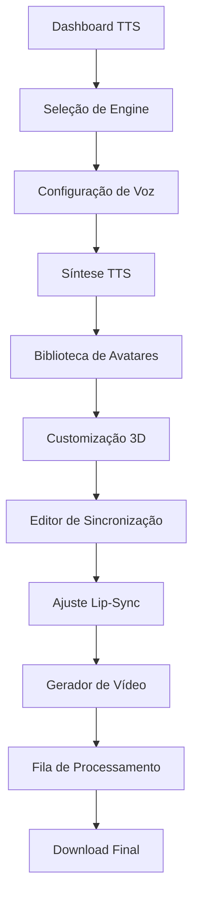

# Fase 1: Sistema TTS Completo e Integração com Avatares - PRD

## 1. Visão Geral do Produto

Sistema avançado de Text-to-Speech (TTS) integrado com renderização de avatares 3D, oferecendo sincronização labial em tempo real e pipeline de geração de vídeo otimizado. O sistema permite a criação de conteúdo audiovisual com avatares hiper-realistas sincronizados com múltiplos engines de TTS.

- **Objetivo Principal**: Estabelecer a base tecnológica para geração automatizada de vídeos com avatares 3D e narração sincronizada de alta qualidade.
- **Valor de Mercado**: Redução de 80% no tempo de produção de conteúdo educacional e corporativo com avatares realistas.

## 2. Funcionalidades Principais

### 2.1 Papéis de Usuário

| Papel | Método de Registro | Permissões Principais |
|-------|-------------------|----------------------|
| Usuário Básico | Email + senha | Acesso a TTS básico, avatares padrão, 10 min/mês |
| Usuário Premium | Upgrade via pagamento | TTS premium, avatares customizados, 100 min/mês |
| Desenvolvedor | API Key + documentação | Acesso completo à API, webhooks, analytics |
| Administrador | Convite interno | Gestão completa, monitoramento, configurações |

### 2.2 Módulos de Funcionalidade

Nosso sistema de TTS e Avatar consiste nas seguintes páginas principais:

1. **Dashboard TTS**: painel de controle, seleção de engines, histórico de sínteses
2. **Biblioteca de Avatares**: galeria 3D, customização, upload Ready Player Me
3. **Editor de Sincronização**: timeline de áudio, ajuste lip-sync, preview em tempo real
4. **Gerador de Vídeo**: configurações de renderização, fila de processamento, download
5. **Monitoramento**: métricas de performance, logs de sistema, analytics de uso

### 2.3 Detalhes das Páginas

| Nome da Página | Nome do Módulo | Descrição da Funcionalidade |
|----------------|----------------|----------------------------|
| Dashboard TTS | Painel de Controle | Selecionar engine TTS (ElevenLabs, Azure, Google, AWS), configurar voz, inserir texto, iniciar síntese |
| Dashboard TTS | Histórico de Sínteses | Visualizar sínteses anteriores, reproduzir áudio, baixar arquivos, reutilizar configurações |
| Biblioteca de Avatares | Galeria 3D | Navegar avatares disponíveis, filtrar por estilo/gênero, preview 3D interativo |
| Biblioteca de Avatares | Customização | Upload Ready Player Me, ajustar propriedades, configurar animações, salvar perfis |
| Editor de Sincronização | Timeline de Áudio | Importar áudio TTS, visualizar forma de onda, marcar pontos de sincronização |
| Editor de Sincronização | Ajuste Lip-Sync | Algoritmo automático de sincronização, ajustes manuais, preview em tempo real |
| Gerador de Vídeo | Configurações | Definir resolução, FPS, qualidade, formato de saída, configurações de avatar |
| Gerador de Vídeo | Fila de Processamento | Visualizar jobs de renderização, status em tempo real, estimativa de conclusão |
| Monitoramento | Métricas de Performance | CPU/GPU usage, tempo de renderização, taxa de sucesso, latência de API |
| Monitoramento | Analytics de Uso | Estatísticas de usuário, engines mais utilizados, tipos de avatar populares |

## 3. Processo Principal

### Fluxo do Usuário Premium:
1. **Login** → Dashboard TTS
2. **Seleção de Engine** → Configuração de voz e parâmetros
3. **Inserção de Texto** → Síntese TTS com preview
4. **Seleção de Avatar** → Biblioteca 3D com customização
5. **Sincronização** → Editor automático com ajustes manuais
6. **Renderização** → Configurações e fila de processamento
7. **Download** → Vídeo final com avatar sincronizado

### Fluxo do Desenvolvedor:
1. **Autenticação API** → Obtenção de token
2. **Chamada TTS** → Endpoint com parâmetros
3. **Seleção Avatar** → API de biblioteca 3D
4. **Processamento** → Pipeline automatizado
5. **Webhook** → Notificação de conclusão

## 4. Design da Interface do Usuário

### 4.1 Estilo de Design

- **Cores Primárias**: #1a1a2e (azul escuro), #16213e (azul médio), #0f3460 (azul claro)
- **Cores Secundárias**: #e94560 (vermelho accent), #f39c12 (laranja warning), #27ae60 (verde success)
- **Estilo de Botões**: Rounded corners (8px), gradient backgrounds, hover animations
- **Fontes**: Inter (títulos), Source Sans Pro (corpo), tamanhos 14px-24px
- **Layout**: Card-based design, sidebar navigation, grid responsivo
- **Ícones**: Lucide React icons, estilo outline, animações micro-interações

### 4.2 Visão Geral do Design das Páginas

| Nome da Página | Nome do Módulo | Elementos da UI |
|----------------|----------------|-----------------|
| Dashboard TTS | Painel de Controle | Cards com gradiente, dropdowns animados, waveform visualizer, botões CTA prominentes |
| Dashboard TTS | Histórico | Lista com thumbnails, filtros avançados, paginação infinita, ações rápidas |
| Biblioteca de Avatares | Galeria 3D | Grid responsivo, preview 3D interativo, filtros laterais, modal de detalhes |
| Editor de Sincronização | Timeline | Waveform canvas, markers drag-and-drop, zoom controls, playback controls |
| Gerador de Vídeo | Configurações | Form wizard, progress indicators, preview thumbnail, estimativa de tempo |
| Monitoramento | Métricas | Charts interativos (Chart.js), real-time updates, color-coded status |

### 4.3 Responsividade

- **Desktop-first** com adaptação mobile completa
- **Breakpoints**: 1920px (XL), 1280px (L), 768px (M), 480px (S)
- **Touch optimization** para controles de timeline e 3D
- **Progressive Web App** com offline capabilities para configurações